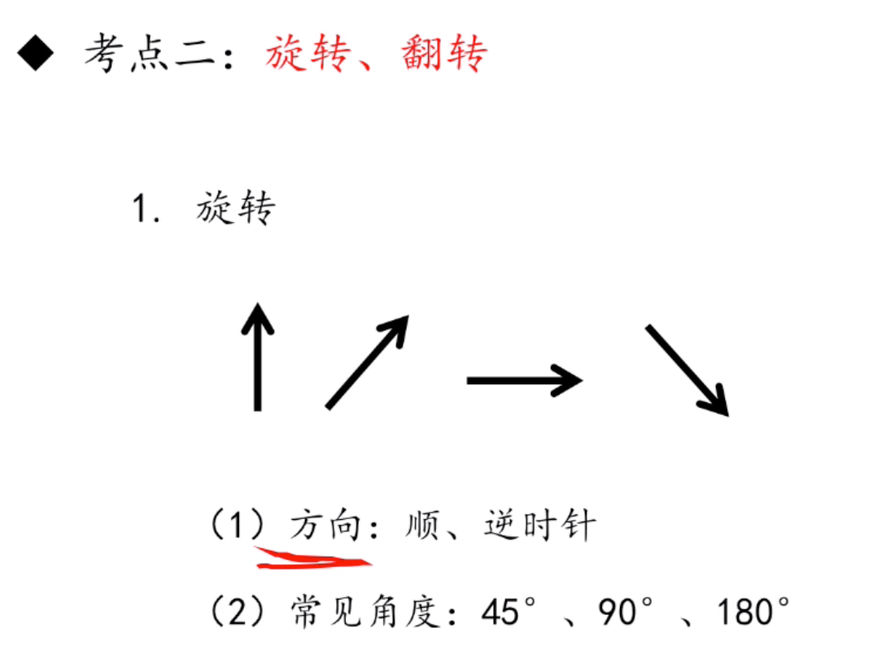
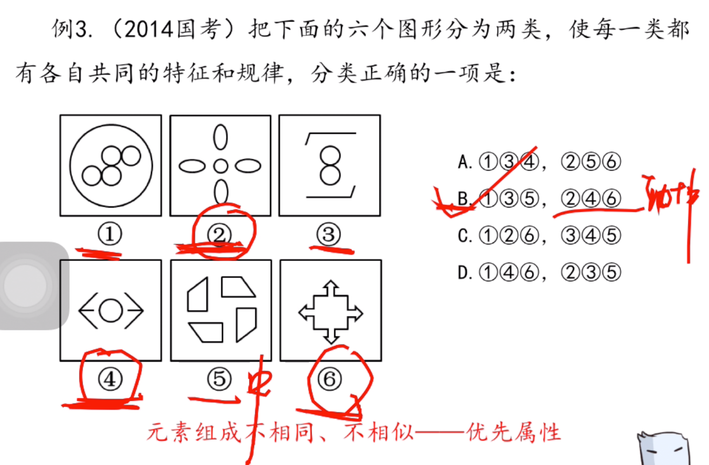
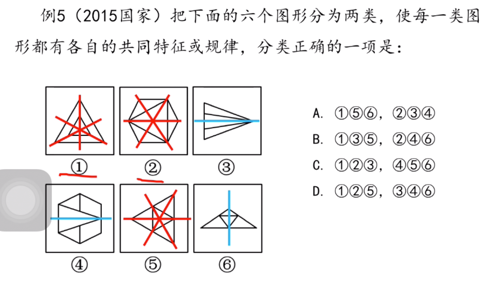
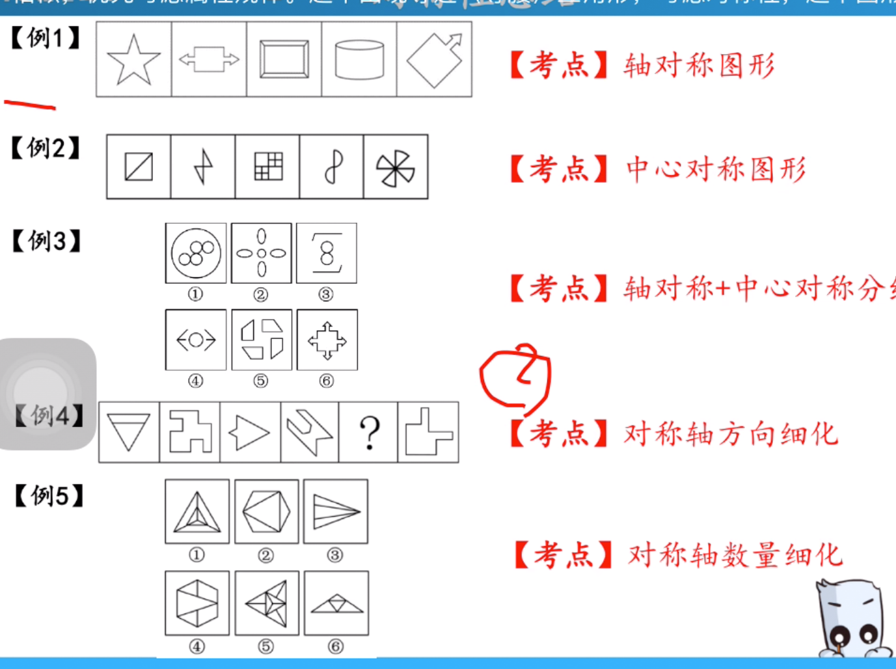

###  第一节 位置规律


> 元素组成相同

- 考点1：位置（与原图形完全相同只是位置不同）


- 考点2：旋转（时针法：1.确定两个相同点 2.确定方向一致不一致 3.一致是旋转，不一致时翻转）、翻转（以图形中某一条直线为轴进行翻转）


```
考场上因为时间不够：可以看选项发现小三角的位置不一样，从而去上面题干找，规律。然后秒答案
```


```
一行一行找规律，第三行验证
1，2旋转，2，3翻转
```


> 位置规律思维导图


### 第二节 样式规律


> 考点1：加减同异


- 例子


```
快速技巧：挑1-2条线排除选项，没必要一个一个画出来，浪费时间。
```


> 黑白运算


```
黑+白 不一定等于 白+黑

```


- 例子


```
做题技巧：边找边验证！先从第三行找到白+黑，然后回第一行，第二行验证，判处b,d选项。一分钟一道题速度才最重要！
然后看a,c不一样的地方，黑+白 = 黑。选a
```

- 总结


### 第三节 属性规律（先考虑数量再考虑属性）

- 概念


> 考点1：对称性


```
技巧：有Z,S的图形出现，考虑中心对称
```
- 例子

```
1,3,5是中心对称，2，4，6既是中心对称也是轴对称
```
- 例子

```
等边等腰三角形，往往也是考查对称性图形
```

- 总结


> 考点2：曲直性


- 例子


```
全曲线，全直线。算特征比较严谨。
而是中心对称，和非中心对称不是很严谨
```

> 开闭性


- 例子


- 总结


### 特殊规律-功能元素


```
1. 常见的功能元素：实心圈和空心圈，箭头，五角星和正方形或者三角形

2.功能元素在图形外边：标记方位，曲直，线段长短

3.功能元素在图形边上：标记曲直，线和点，点的类型可以是交点或者顶点

4. 功能元素在图形内部：标记图形的空间或者面积大小。


```


- 例子
  

```
小黑点标记，相重合的部分

两个小黑点可以连线，比较对称性

```
- 总结
  
  

