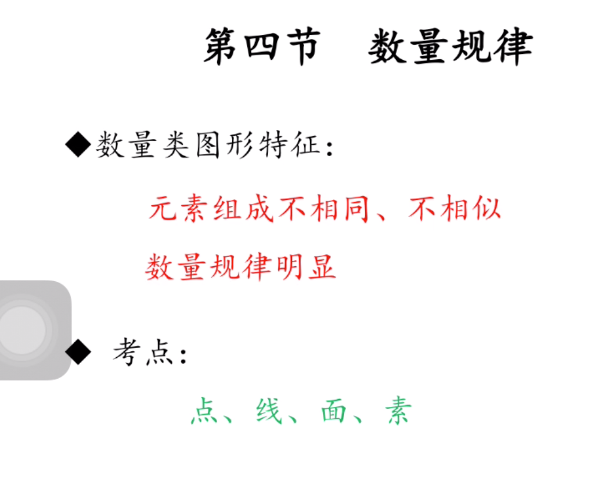
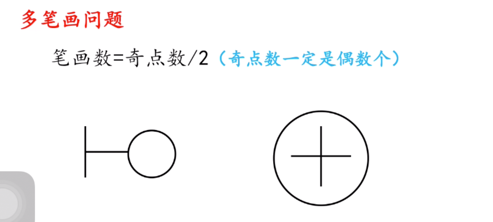
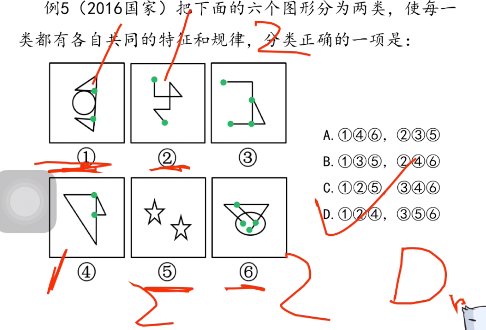
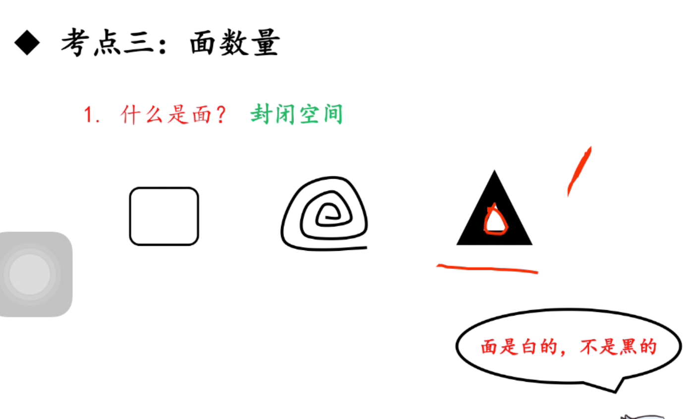
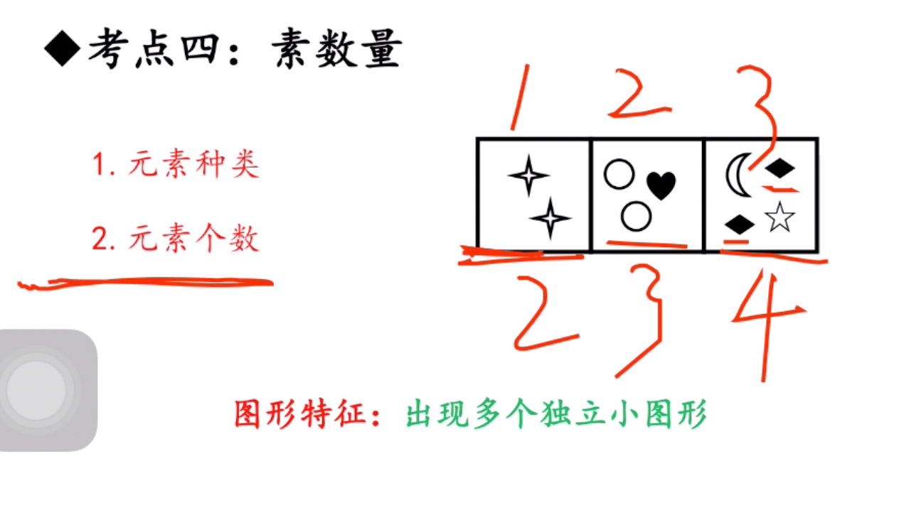
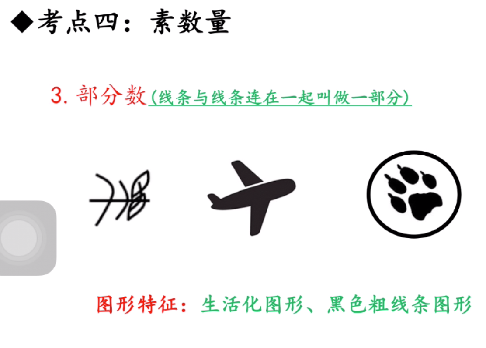
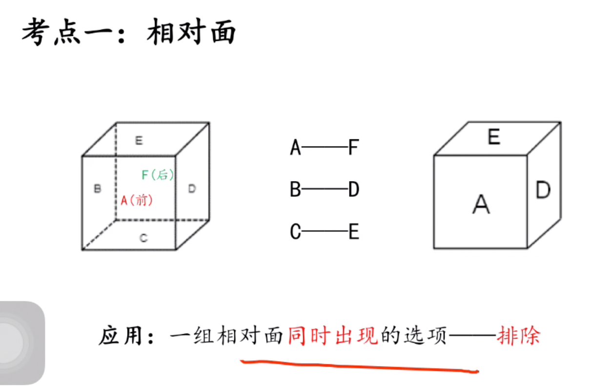
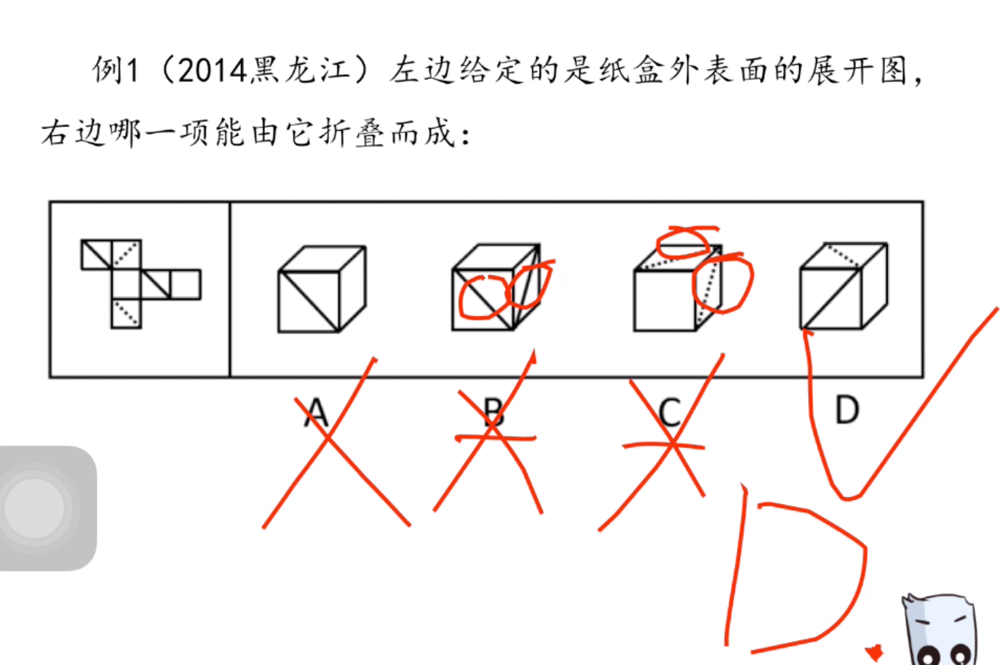
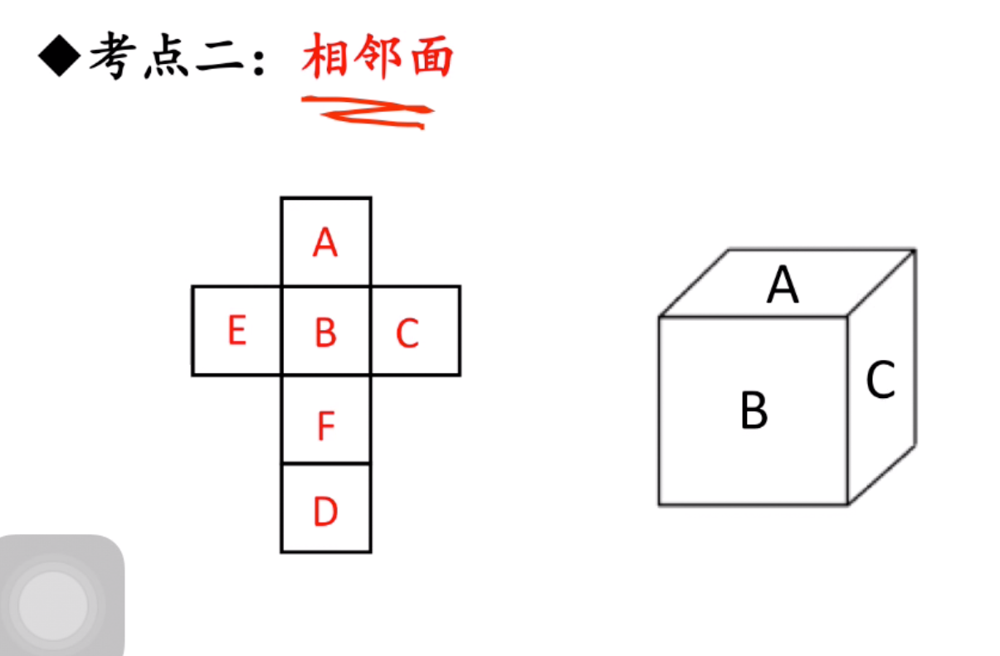
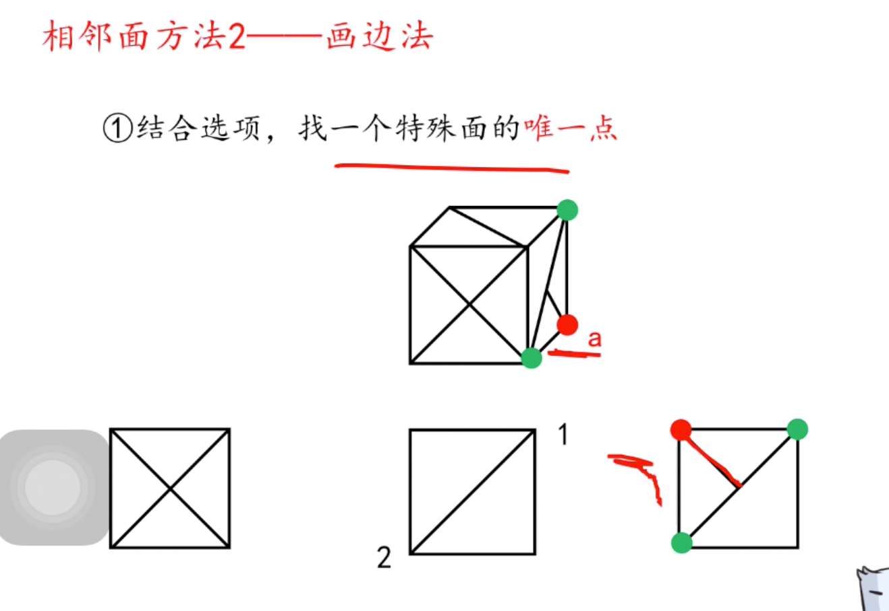

###  第四节 数量规律



> 点线面素

- 考点1：点数量（线与线的交点）


```
曲直交点，细化
```


- 考点2：线数量


```
五角星是10条线
```
- 线的特殊考点：笔画数




> 笔画常见的特征图


- 例子

- 例子（走投无路一笔画可以试试，明显的两个五角星也可以试试）



- 总结


> 考点3：面数量



```
上图：面的数量为：1，0，1
```


- 例子


```
选7个面，外边6条边，现在会复合考点加大面的难度。
```


```
曲直性会复合考。

面数量+属性（曲直性）

```

> 素数量




```
上图：1，2，6部分
```

- 面是数白色的封闭空间，部分是数黑色的封闭空间


- 总结


### 第五节 空间重构


> 考点1：相对面

- 如何判断相对面



- 例子1（通过相对面排除A，B,C：不能有相同的图案相邻）



> 考点2：相邻面

- 构成直角的两个边是同一条边


- 相邻面方法1-看相对位置（图形指向明显）


- 相邻面方法2-画边法




