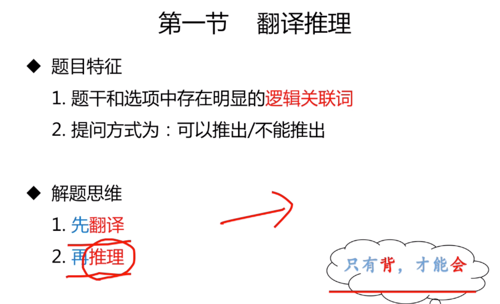
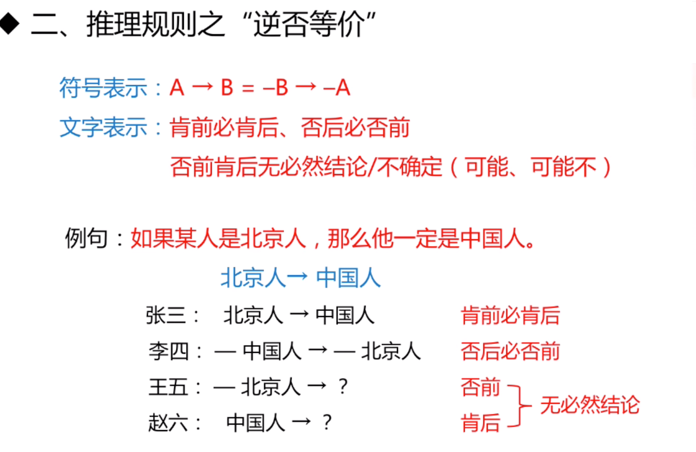
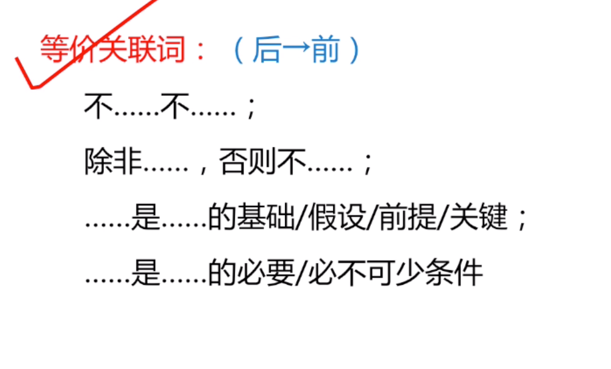
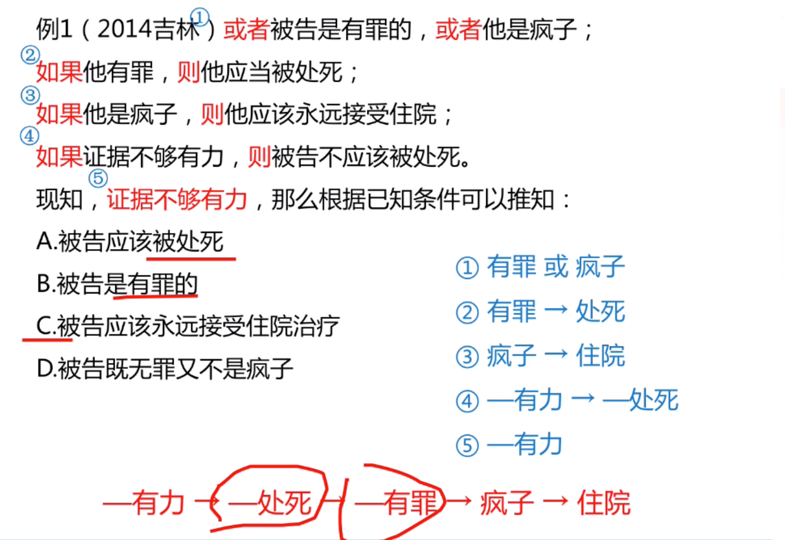
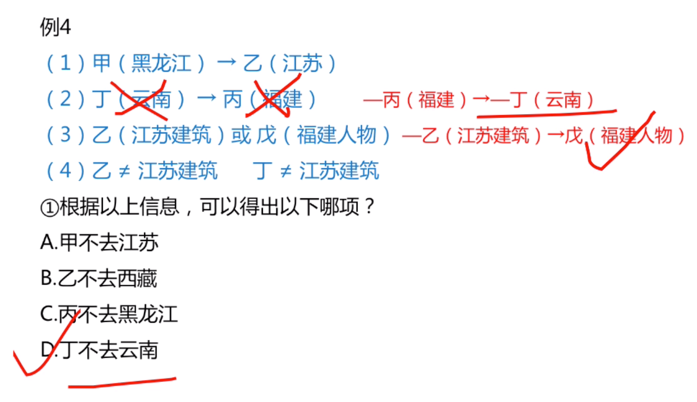
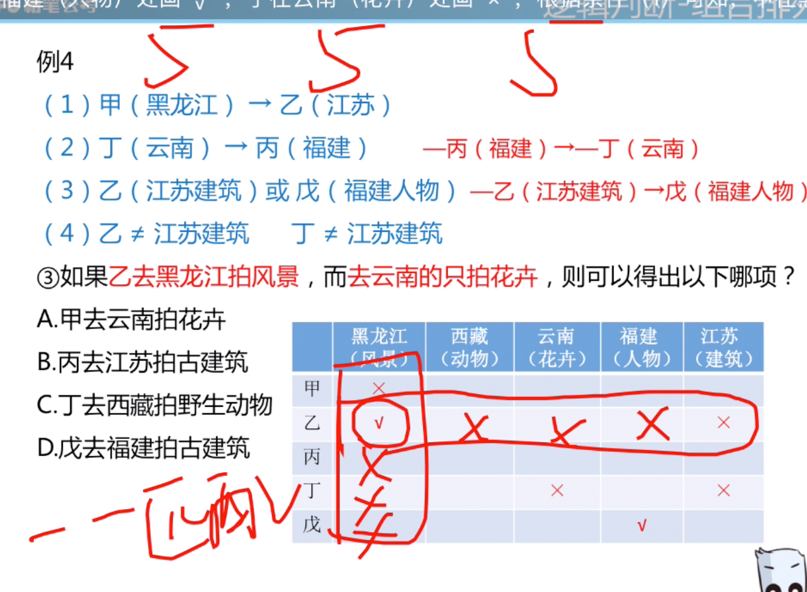
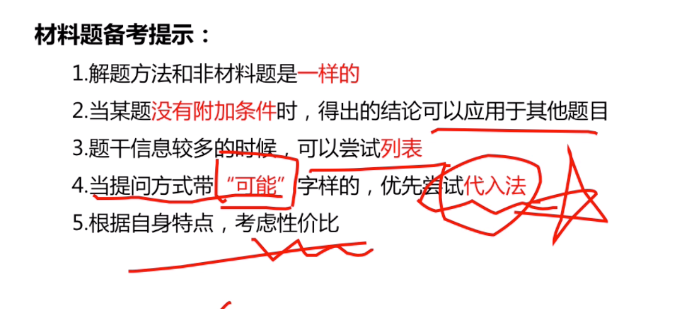

# 逻辑判断

## 翻译推理
----

```
1. 肯前必肯后，否后必否前，肯前否后不必然
2. 甲 或者 乙 -》 非甲 则 乙真，非乙则甲真

```

- 真假推理

```

矛盾关系

1. A是B 与 A不是B

2. 所有的S都是P 与 有的S不是P 。 所有的S都不是P 与 有的S是P

4. A且B 与 非A或非B 

5. A-》B 和 非A 且 非B 
```

- 反对关系

```


比如：

1. 所有S都是P和所有都不是P

2. 有的S是p，有的s不是p


反对关系：

1. 两个所有必定有一假，并且可以同时为假

2. 两个所有必定有一真，并且可以同时为真
```




> 逆否等价



- 例子

<!--  -->

```
选b
```
```

只要...就...

A -> B

B-> C

==>  A->C
```

> 后推前




- 例子


> 且和或


```
A或者B:两者至少一个成立

```




```
要么...要么...：两者只有1个
等价关键词：..和..只能有一个


```

> 德摩根定律

```
(1) -(A且B) = -A或-B
(2) -(A或B) = -A且-B
```

> 总结


## 归纳推理四大原则

1. 话题一致

2. 整体优先原则（最好往大的方向概括。不要只概括一方面）

3. 可能优先原则（可能性词语的句子）

4. 慎选敏感词（更，最，越，首，比）

### 三段论法（问推理形式相同）：需要标出A，B，C 然后画出箭头，看关系。
## 排列组合
----


> 考点1：1.排除代入法（读一句排一句）
> 考点1：2.代入法，选项代入题干验证（题干条件确定优先排除，题干条件不确定尝试代入）

> 考点2：辅助技巧

1. 最大信息（题干条件中出现次数最多的词），以此作为推理起点


> 考点2：辅助技巧
2. 符号：>,<,=,往往涉及年龄，成绩，收入，身高等大小比较

> 考点2：辅助技巧
3. 列表格：多个对象以及信息匹配（往往三个以上）


- 例子

```
一个省只去一个，
（2）没推出，于是从（3）开始
假设戊去福建，则-乙（江苏建筑）
仅仅题干得出的信息可以用于全部
```



```
信息多可用表格，答案选C
,一个为勾，一行的其他为叉

```
> 总结


