### 高频考点：翻译推理


- 前推后
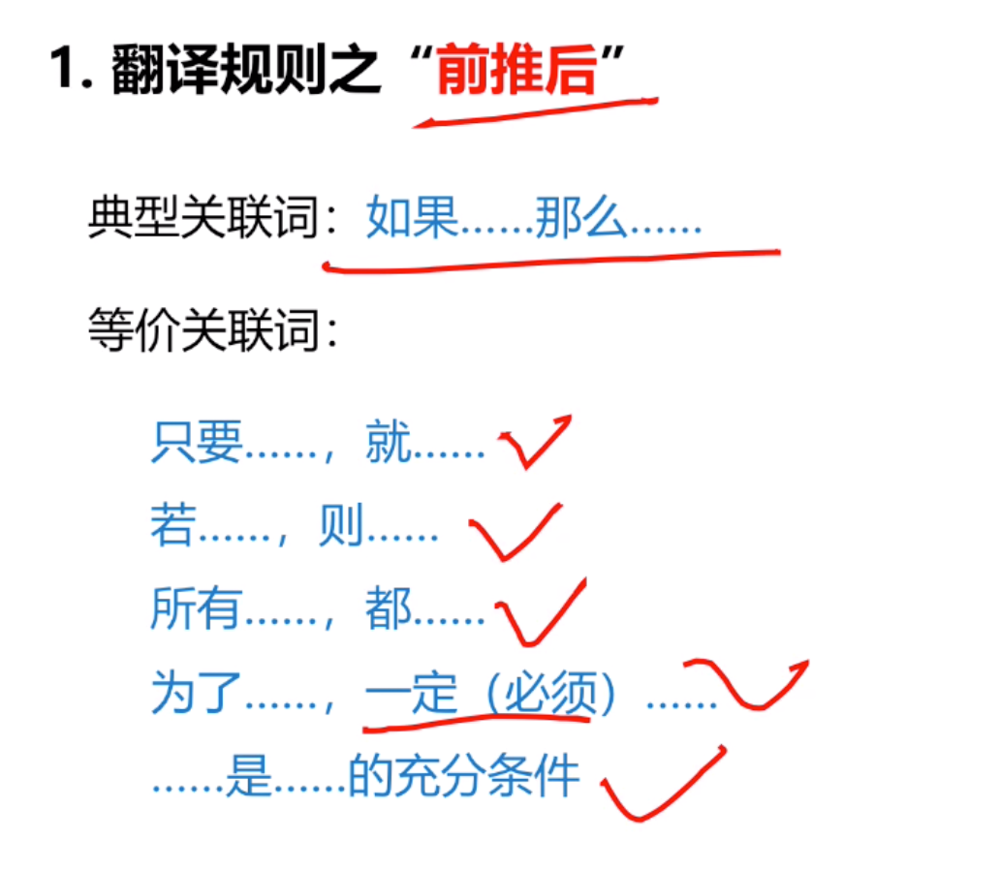

- 后推前


- 且和或

```
或：推不出确定的答案。只能否一推一。
```

- 例子


```
或不能推出确定的答案，只是一种可能性。所以排除CD
```

- 提问(两种提问方式是等同的。)
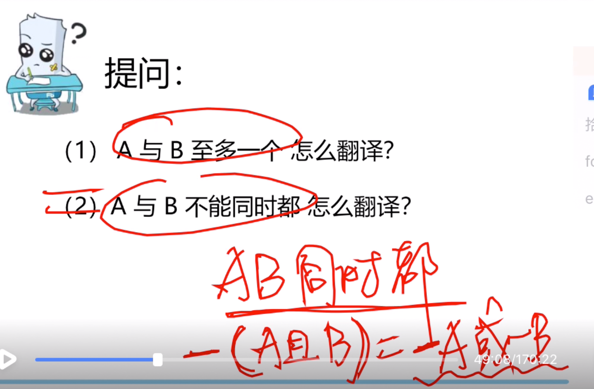

- 例子
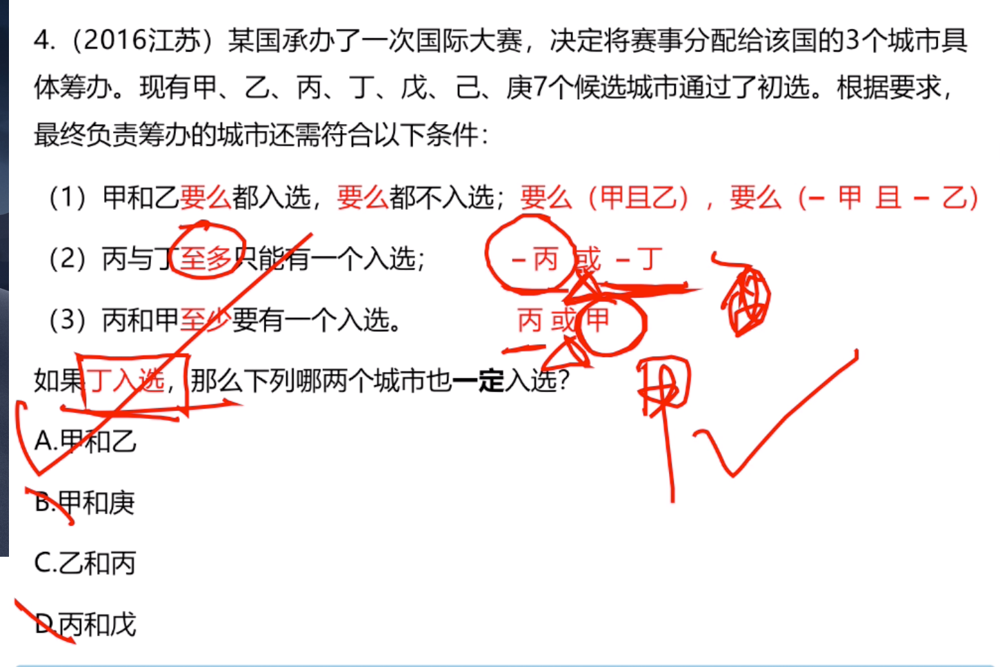


- 总结


### 可翻译之论证


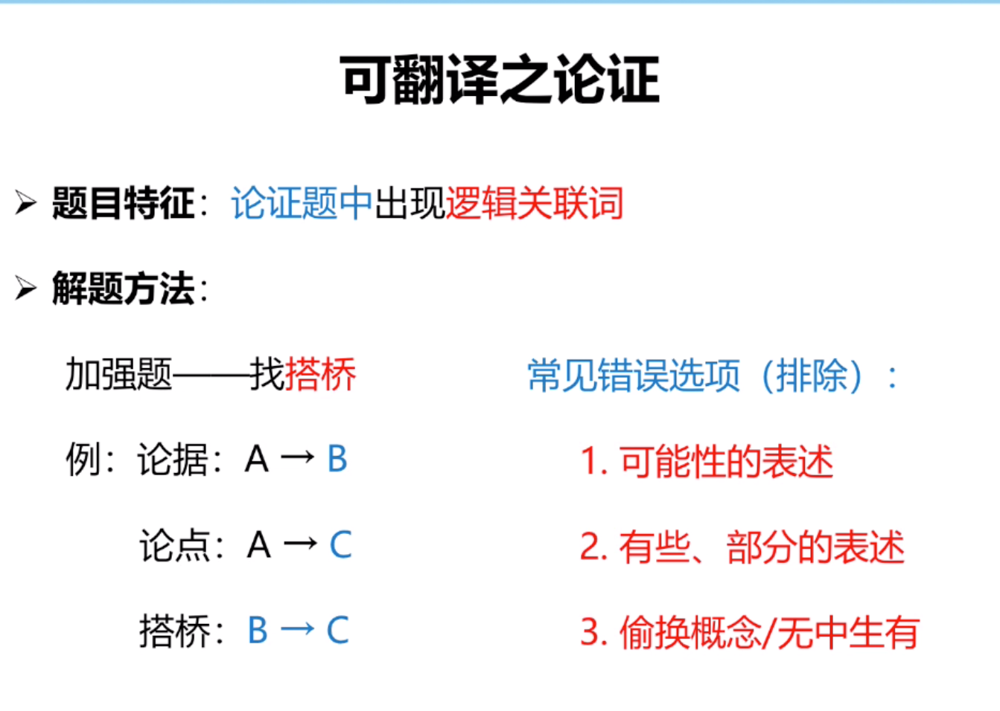

- 例子（选A）


- 例子(1. 可以用数字代替较长的文案 2. 不都是意思为有的不，也就是可能，一般会排除可能项 3. 找前提一般是找加强)


- 削弱题


- 总结
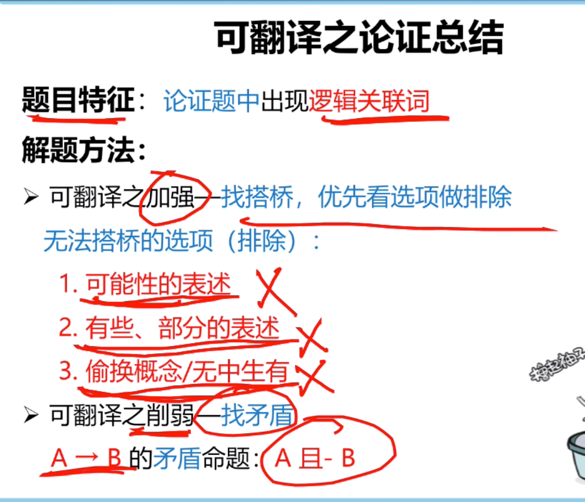

### 类比推理


- 成语类


- 例子
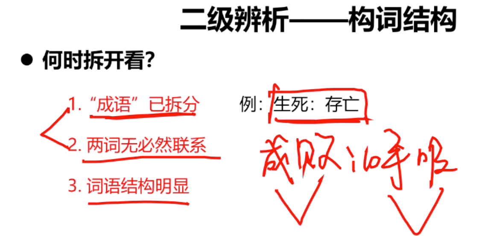

```
刻舟求剑：不知变通

竹篮打水：什么都得不到

言不由衷 = 口是心非 
```


### 词构结构


- 例子

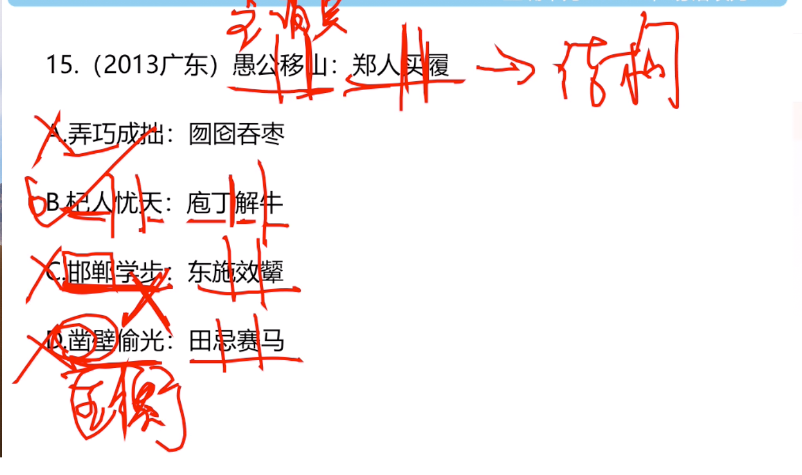

```
邯郸学步：邯郸是个地名。而不是人名，所以不是主谓结构。
```
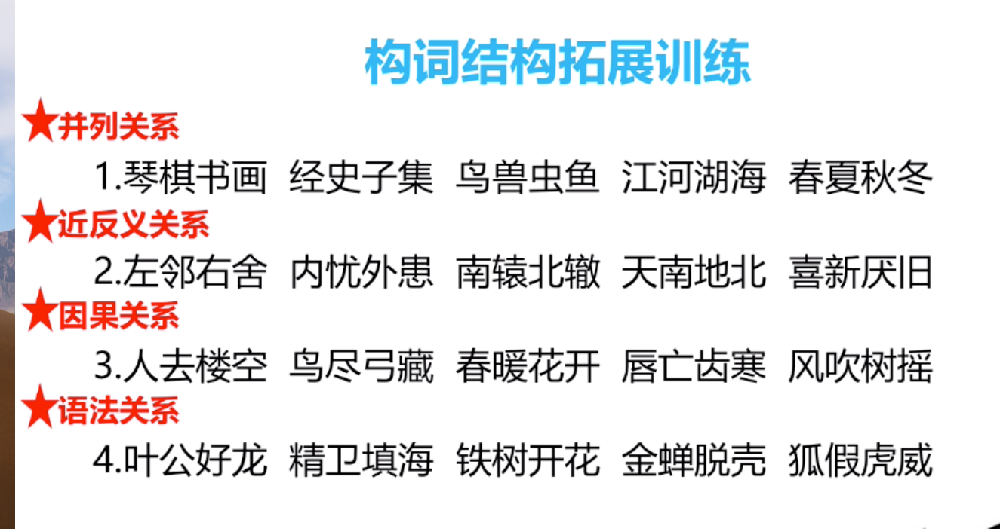

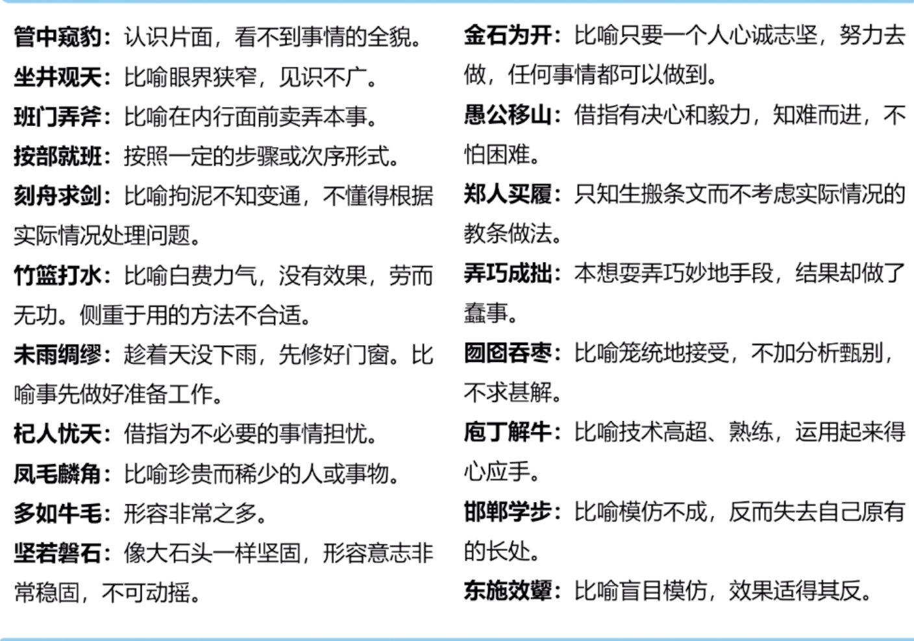


### 高频考点二：类比推理之语法关系

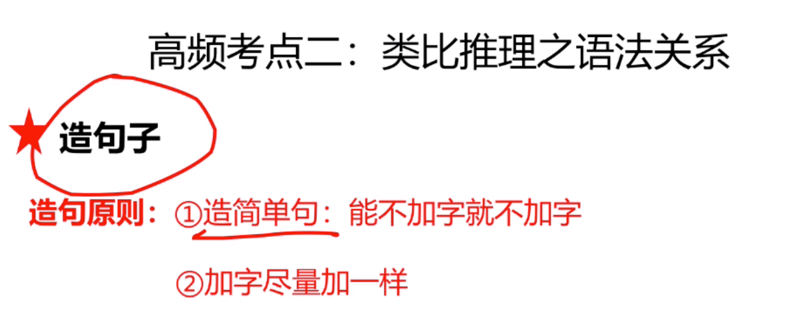
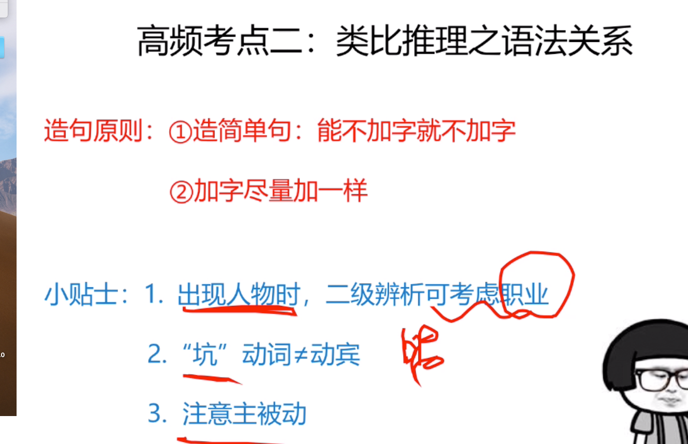

### 高频考点三：类比推理之对应关系

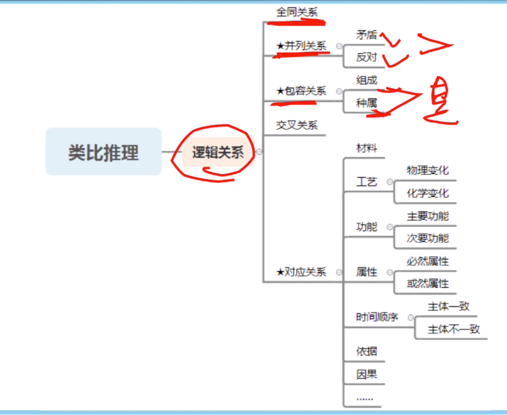

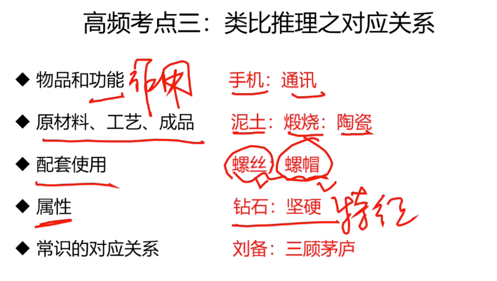

- 例子

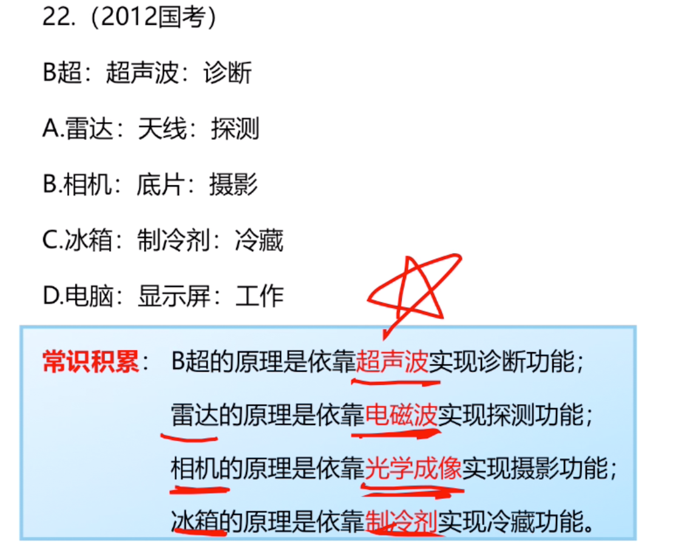
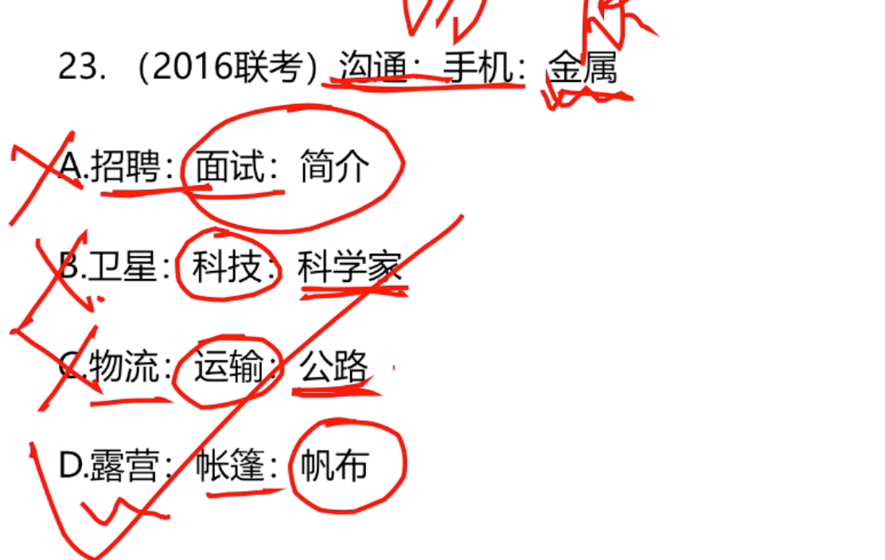


- 例子


