## 资料分析


### 两期比重(两个时间+比重)


- A:1899-1800 B 1900-2000， 还是属于选项差距大，分母不能全部约掉

- 推出题目，四个选项都要选的时候，从cdab顺序开始计算

### 百化分

```
18.3% 处于 16.7 到 20 之中。 6/1- 1/5

 约等于 5.5    
```
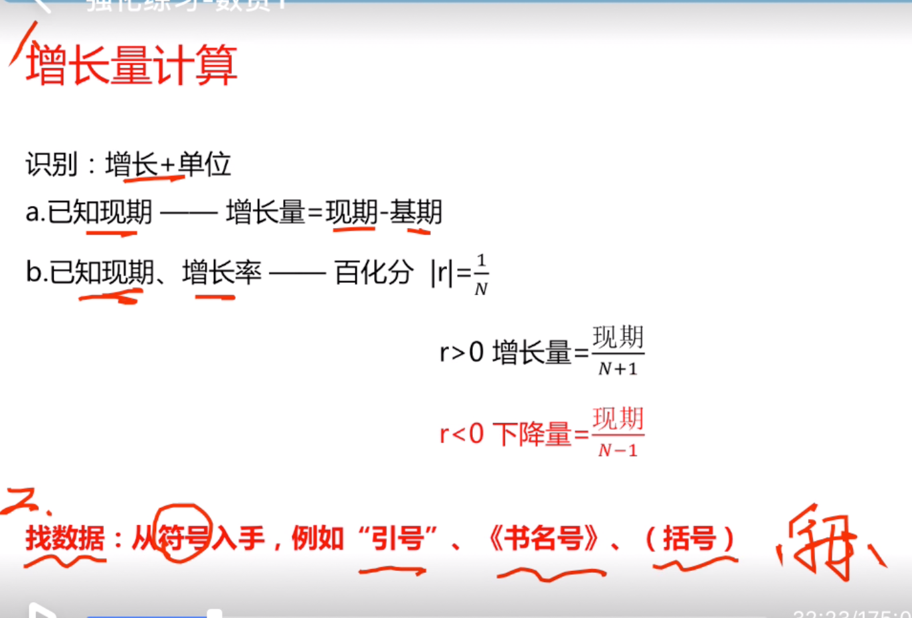

### 听不懂的题型要仔细

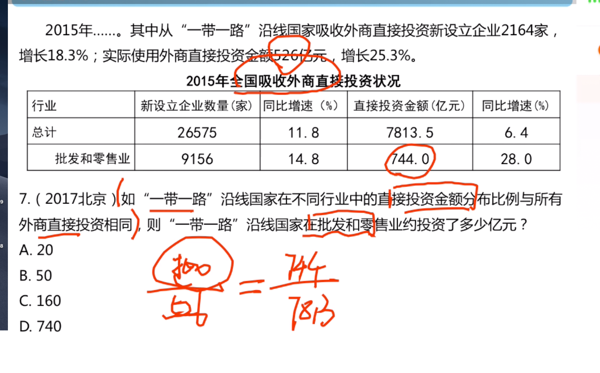

```
1. 直接投资金额占总体的 = 所有外商直接投资占总体的

```

### 平均每家新设立企业获得直接投资金额最接近总体平均  -> 后除于前  金额除于企业数

### 比较类题型，谁算谁是小傻瓜。可以比较首位

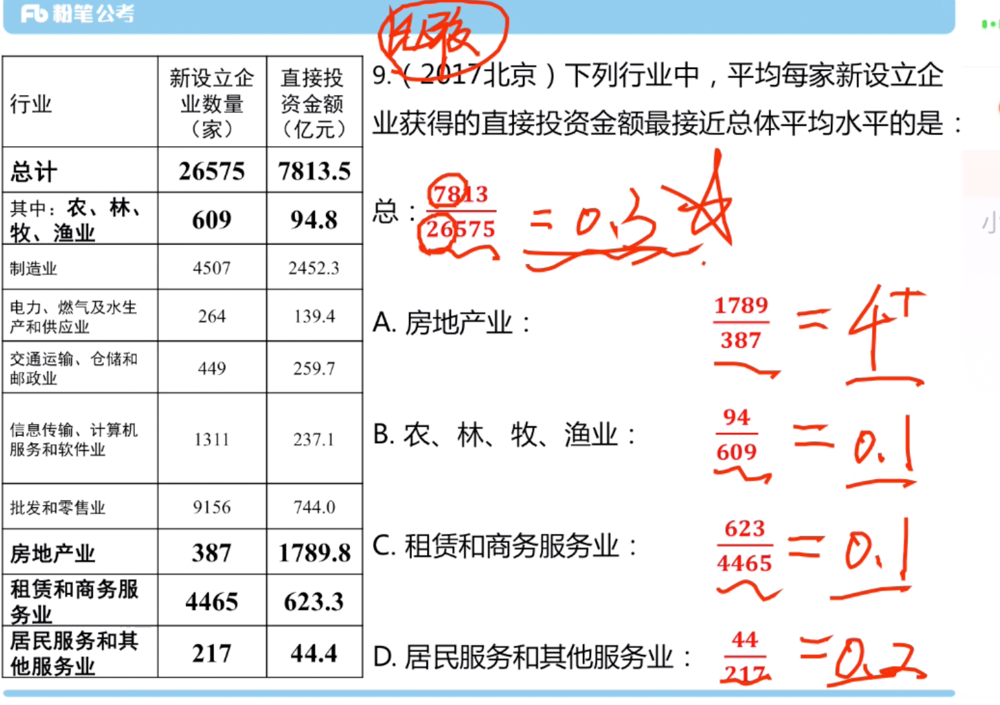
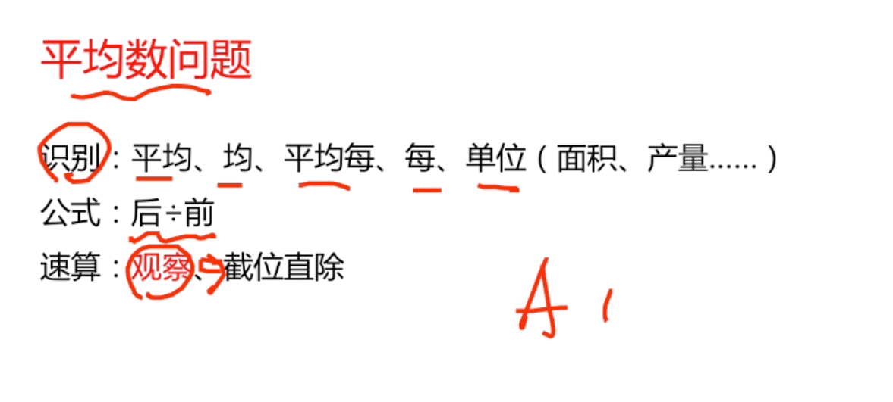

### 综合分析题

- 可以用到之前的结论

- 例子

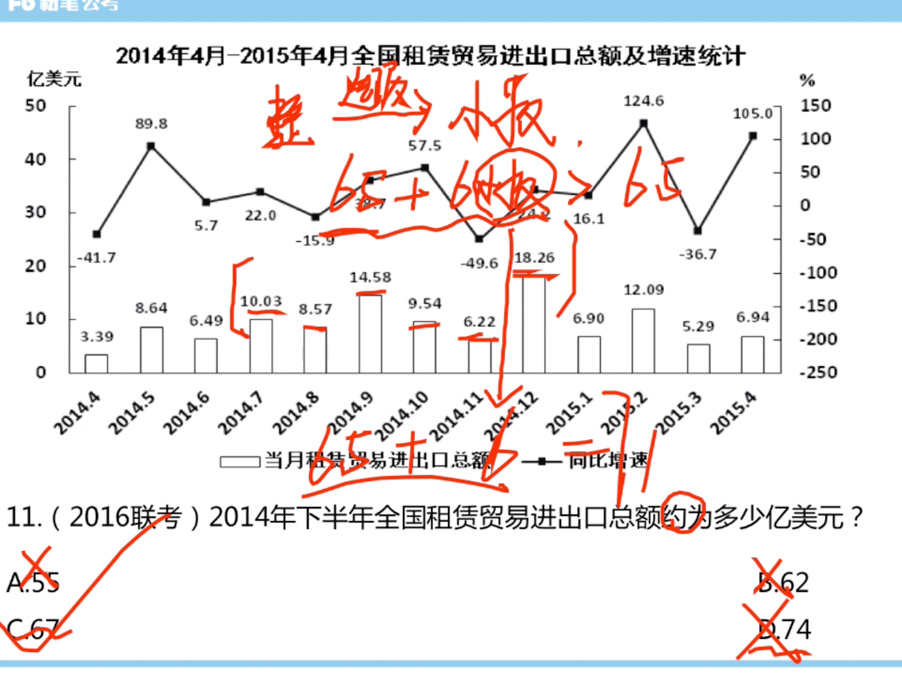

```
1. 下半年为7月份到12月份

2. 削峰填谷法加法，小数部分最多为1，但是就算极值法，也最大为71.所以排除D,不要死算。
```


### 增长率比较
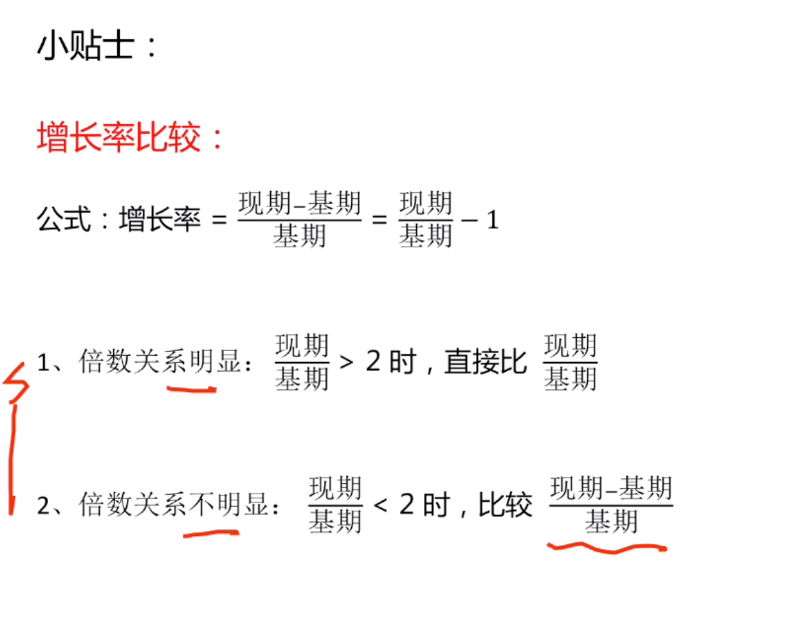

- 利用前面的结构，继续算。

## 数量关系

### 代入排除法(先排除再代入)

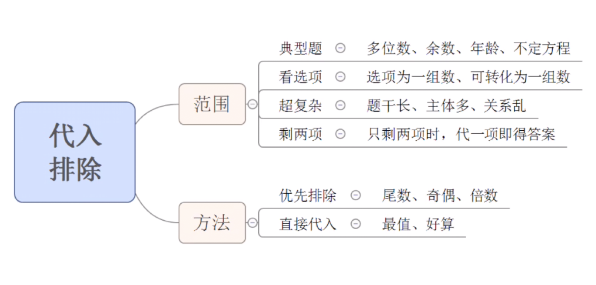

- 例子

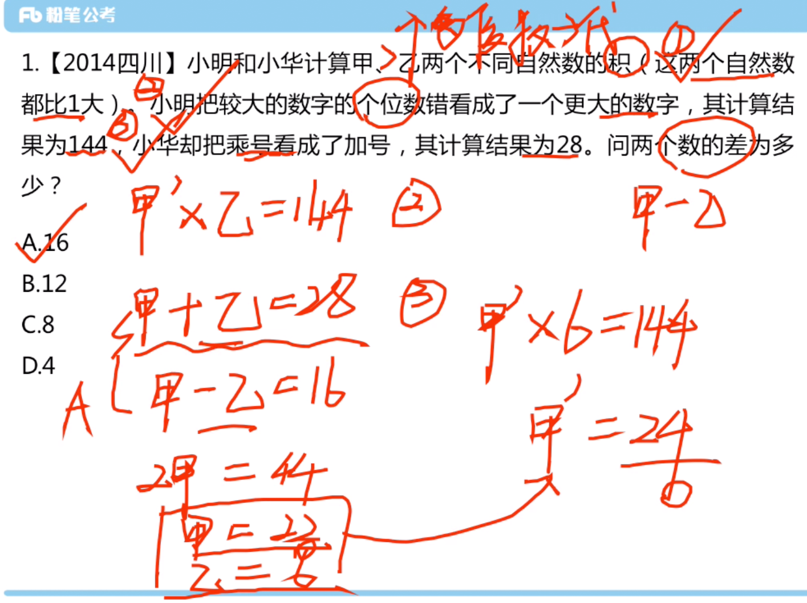


- 例子(结合题目条件列式，根据素数做题，根据倍数特性做题。)

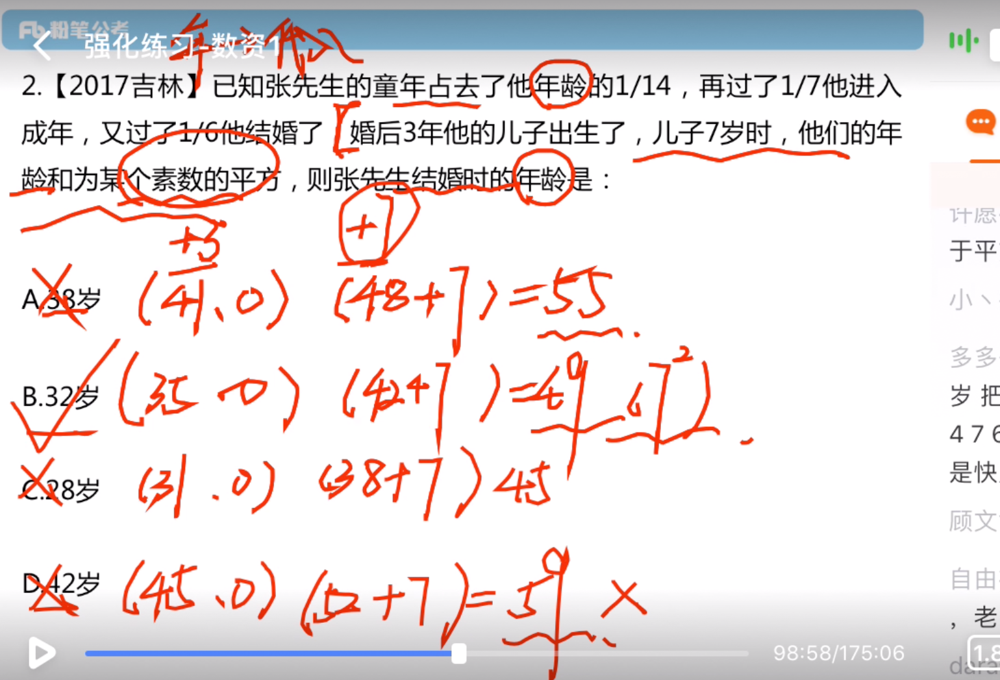
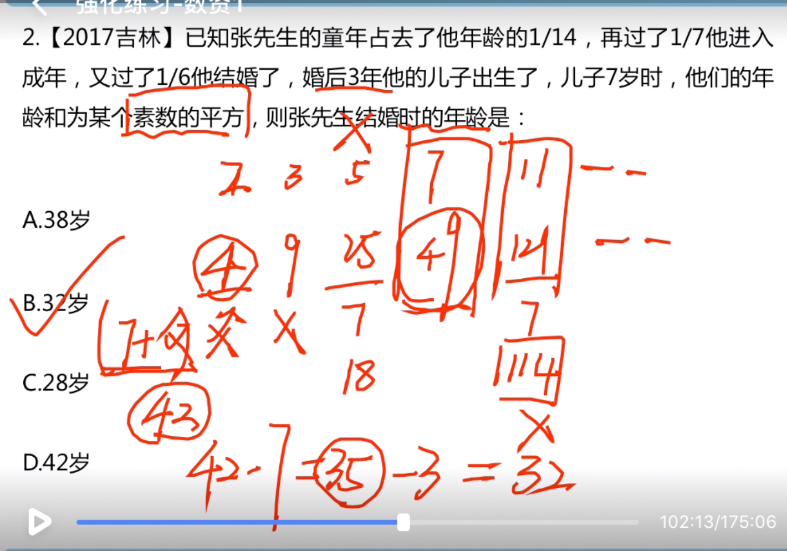
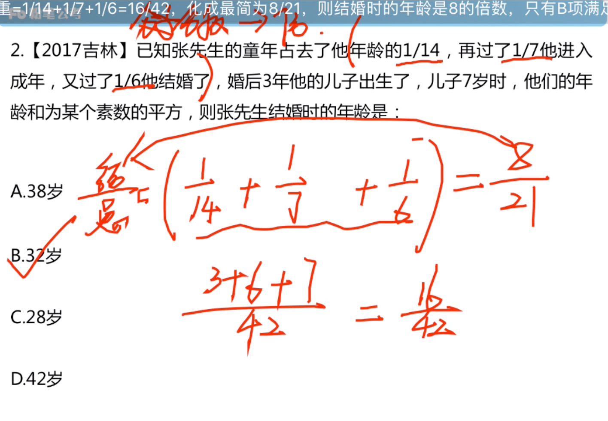

- 例子（如果题目，个体多，时间多，记得列式子计算）

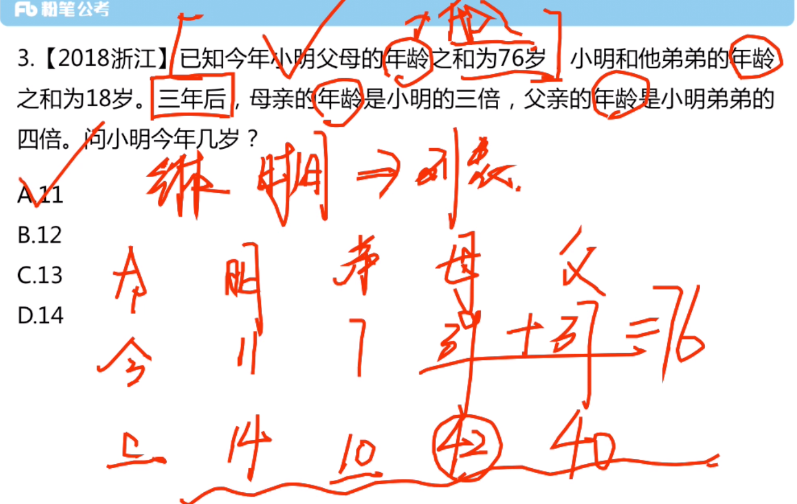

- 例子(1.代入 2.除于2是奇数)

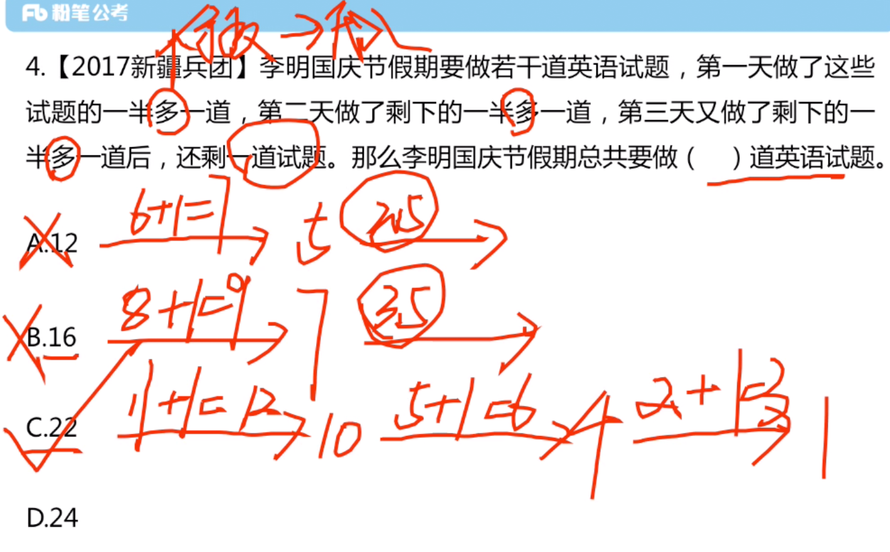

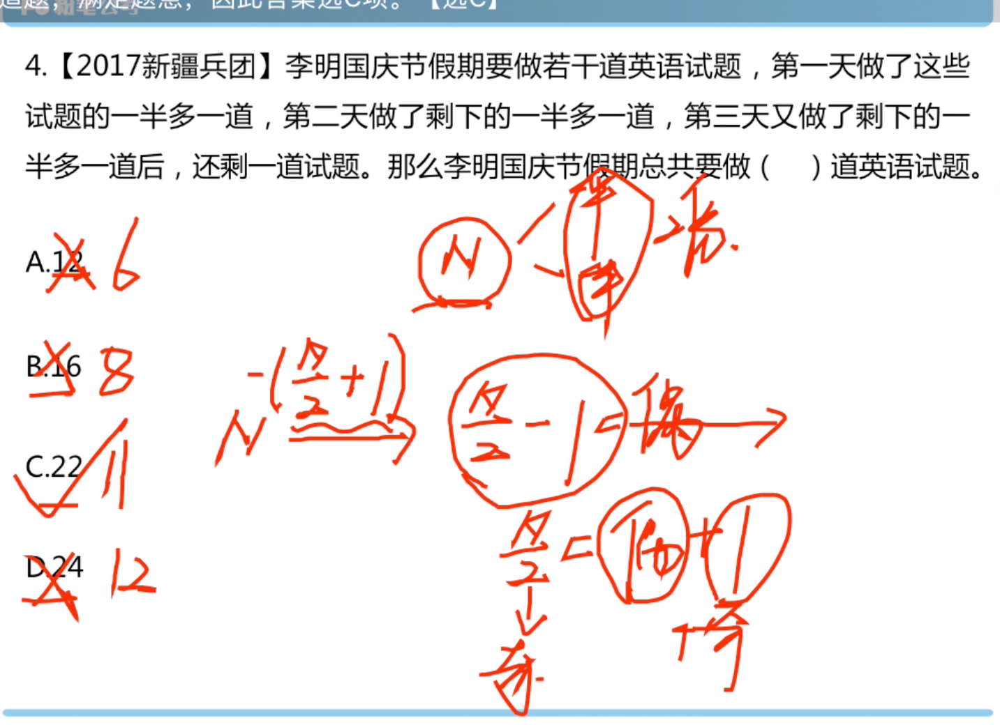

- 总结


```
1. 首先根据奇偶同性，甲是奇数

2. 甲是乙的二倍则，甲大于平均数51，选D

```

