### 语境分析

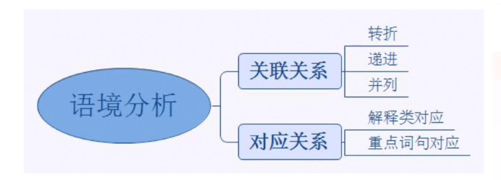
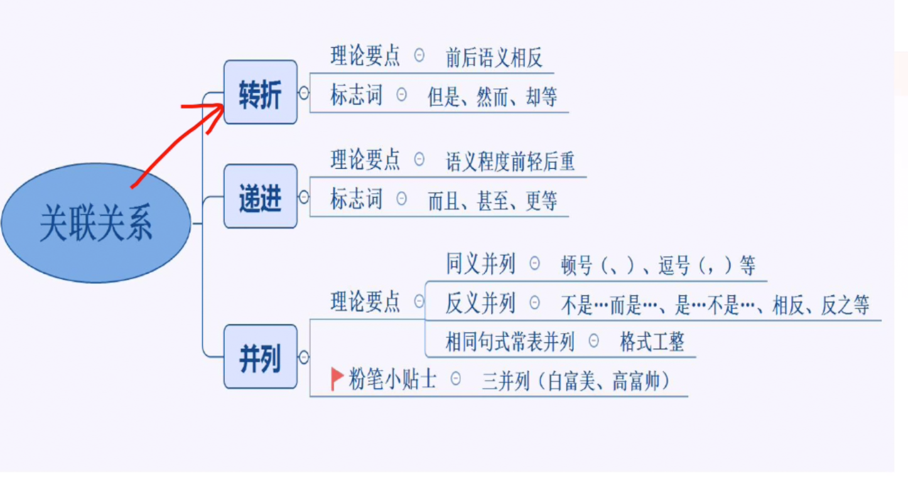


- 例子

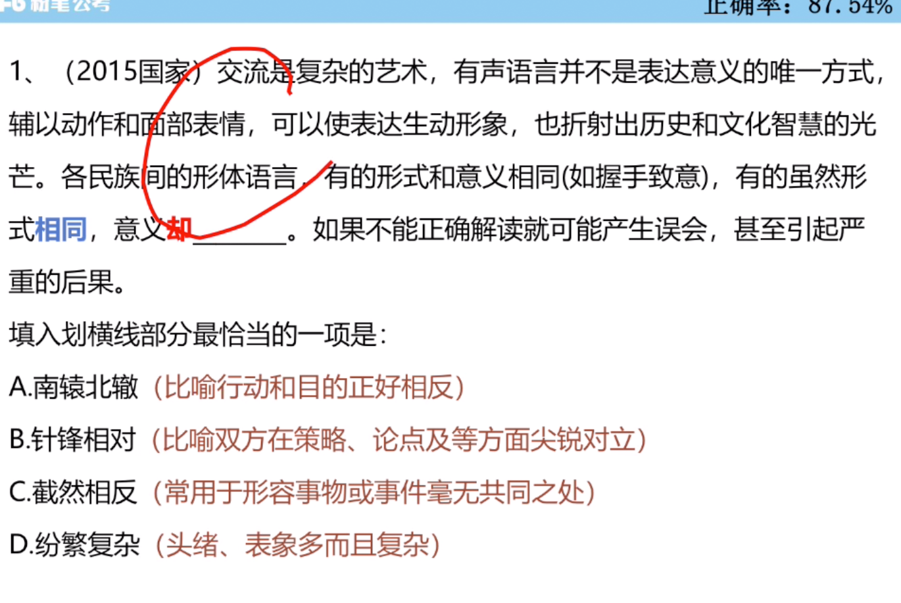

```
南辕北辙一般用于一个主体。
```

```
无所适从：多个观点、标准不知道选择哪一个。

```

- 例子（第二个空，文章没有比较的意思。没有比较谁长谁短，没有比较谁陈谁新。）

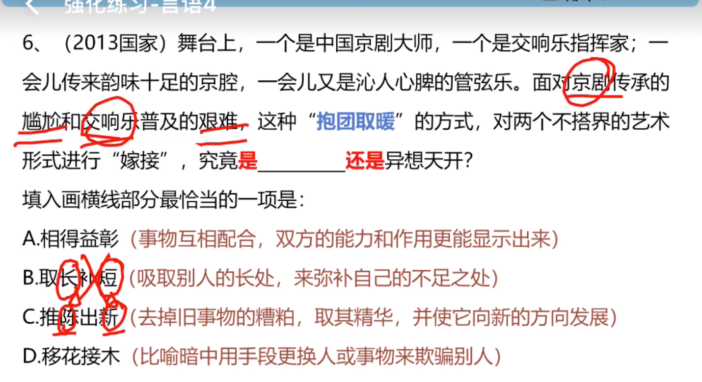

### 对应关系

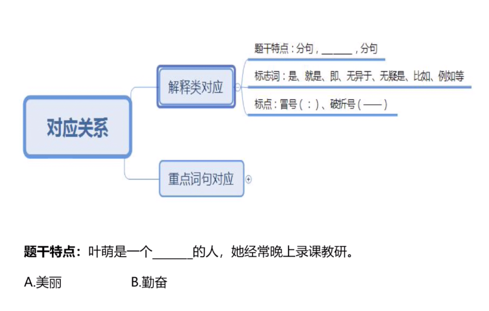

- 例子
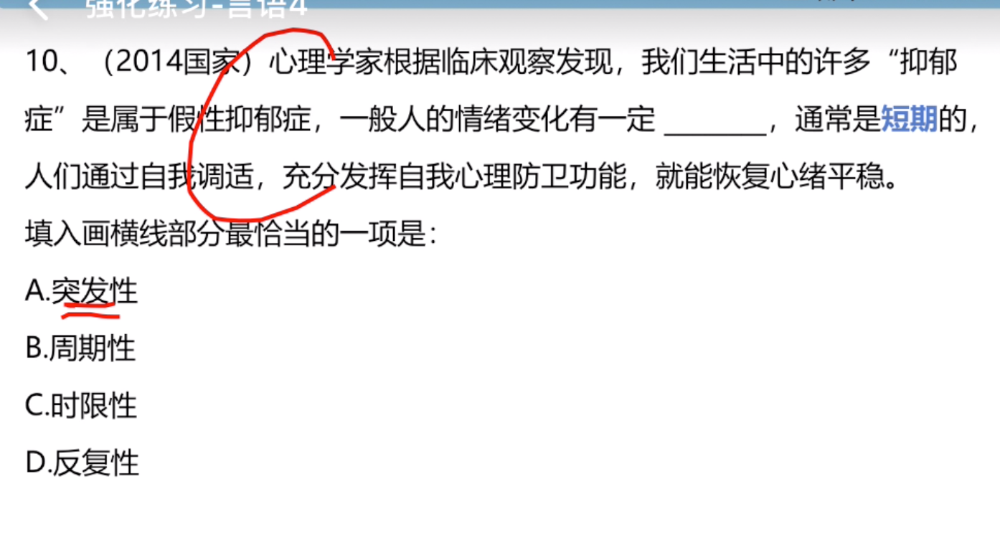

```
形容时间长短，用时限性比较好。
```

- 例子
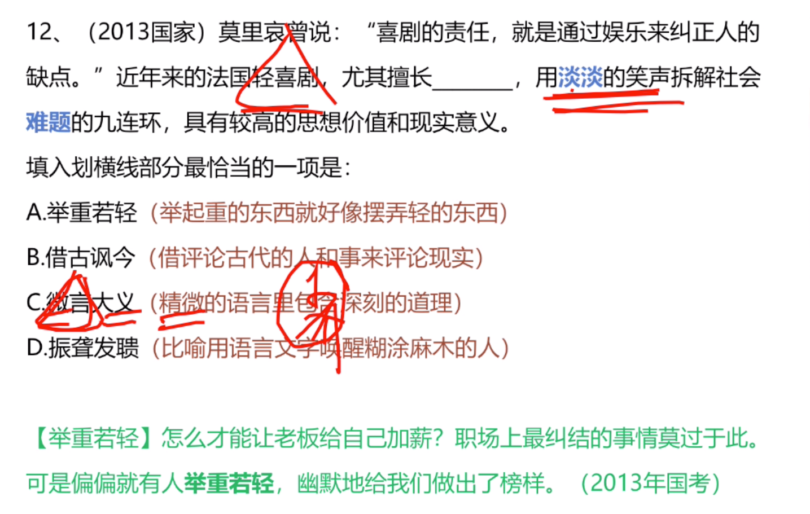

```

讳疾忌医：比喻掩饰错误，不愿意改正。
```

- 例子


```
吐故纳新不对，因为前文没有强调要抛弃旧的。
标新立异：中性词：可以表达好的也可以表达不好的。
```
- 重点词句对应
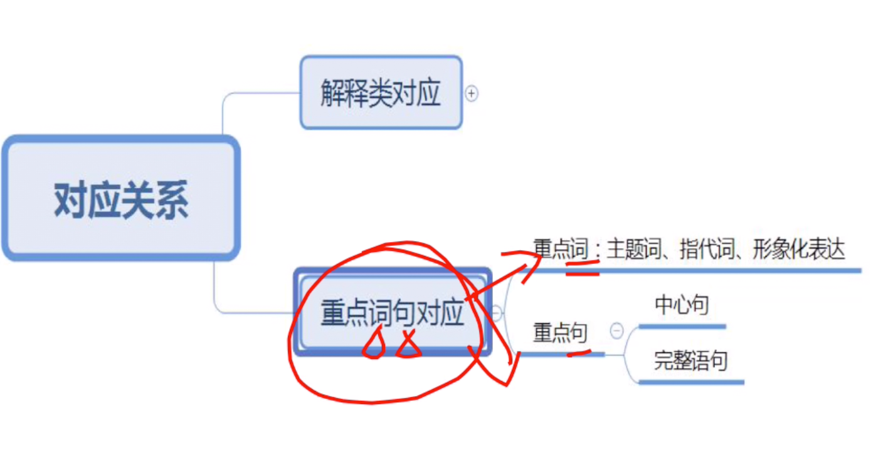

```
大而化之：表示做事情马虎

等量齐观：对有差别的事情同等看待
```

- 有时候要注意词的侧重点！

- 例子

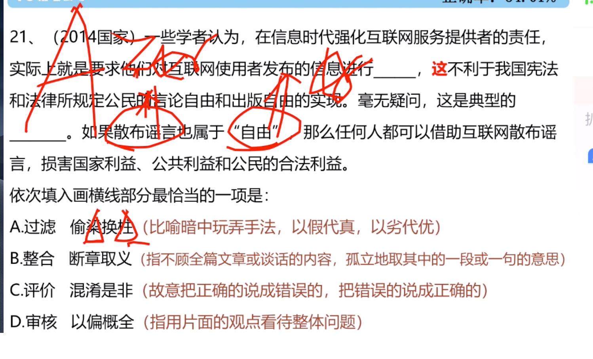

```
偷梁换柱：又指偷换概念
```
- 例子

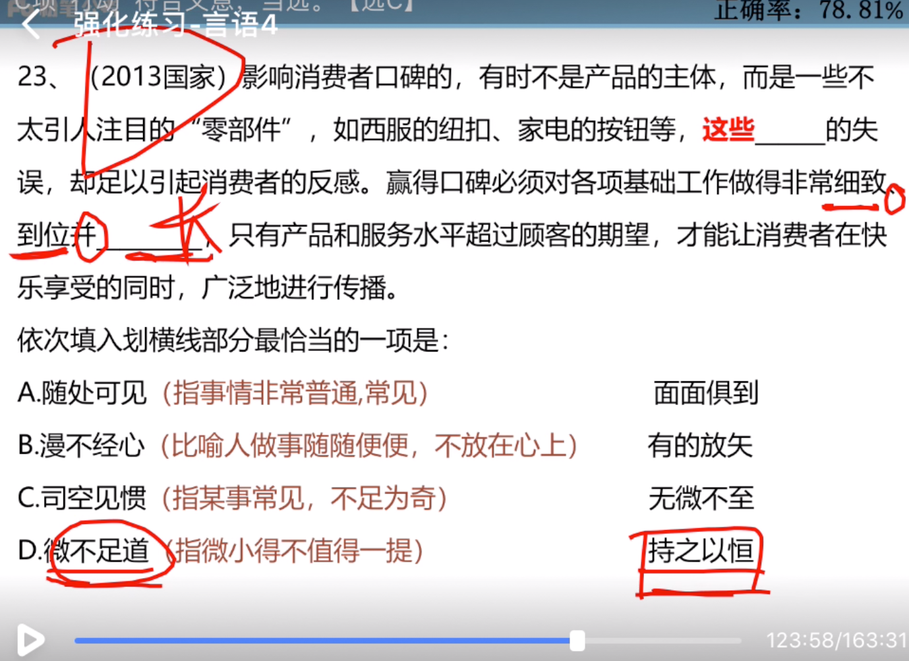

- 例子

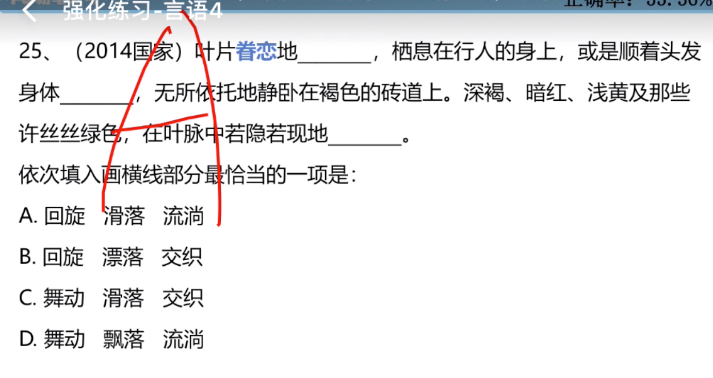

```
在血脉里面，比较形象一点的话，是流淌。
```

- 例子

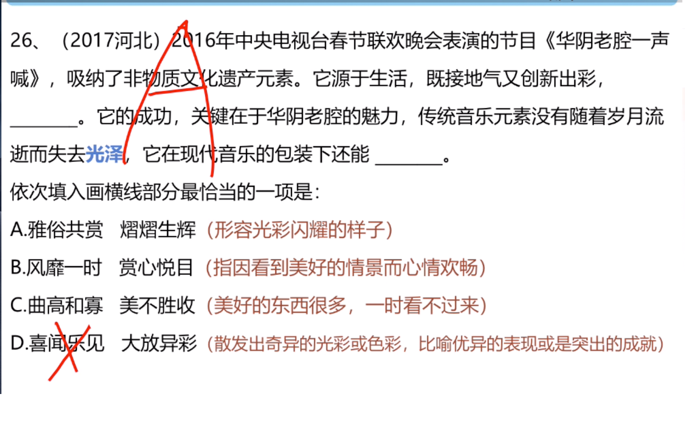
```
这个节目让人 喜闻乐见

干部清正，政府清廉，政治清明
```


