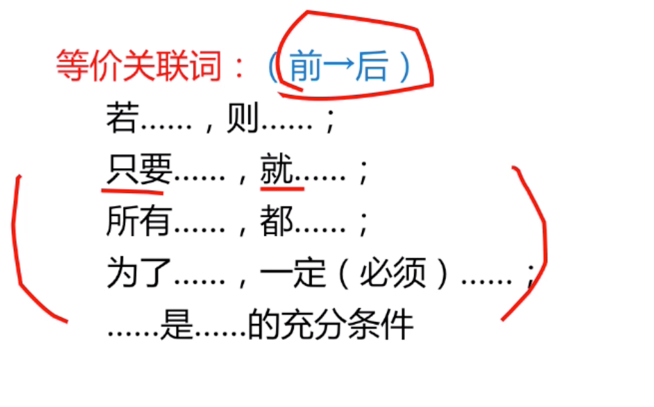
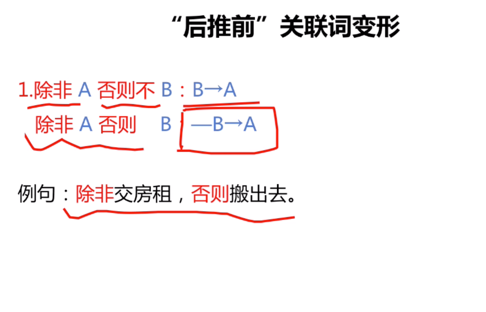
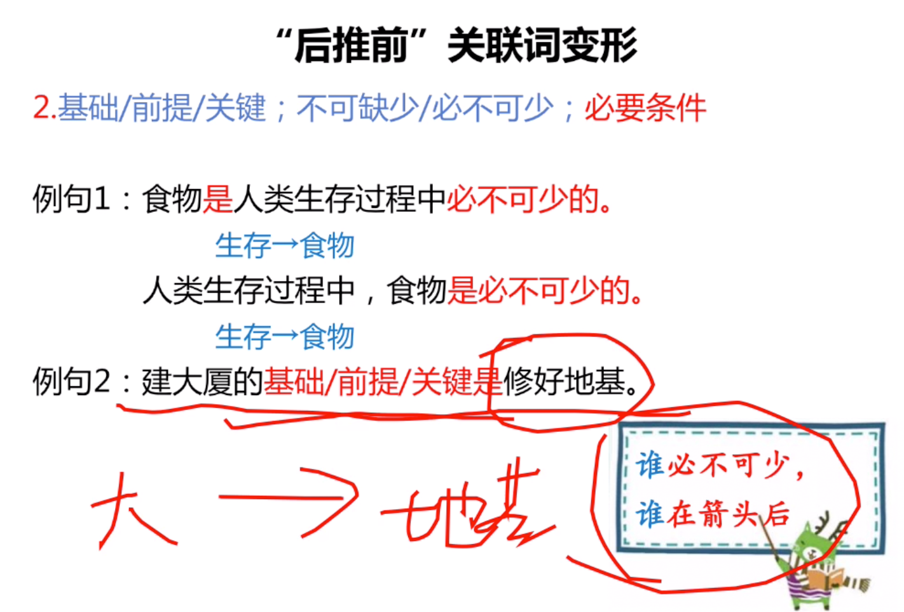
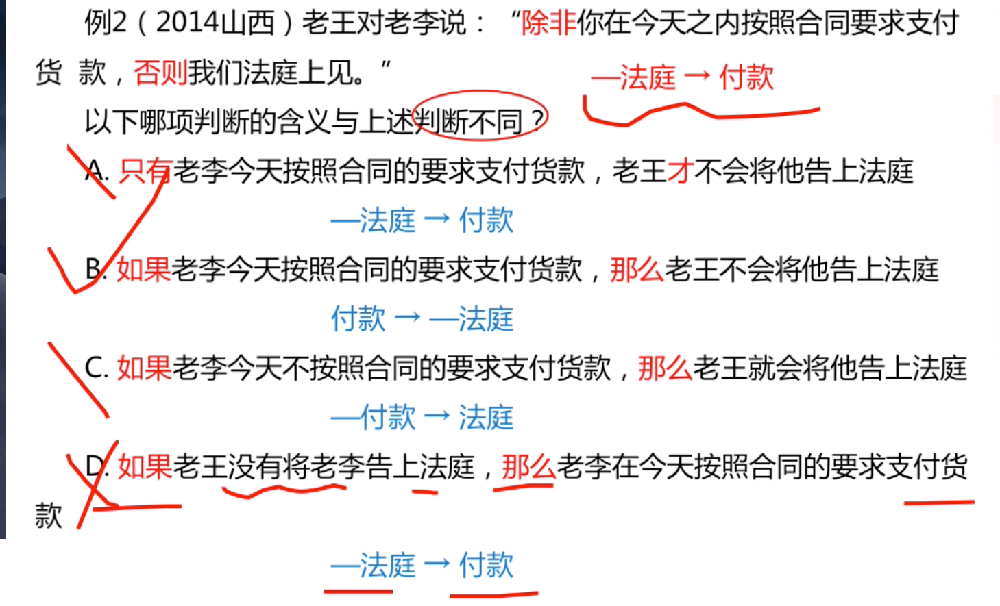
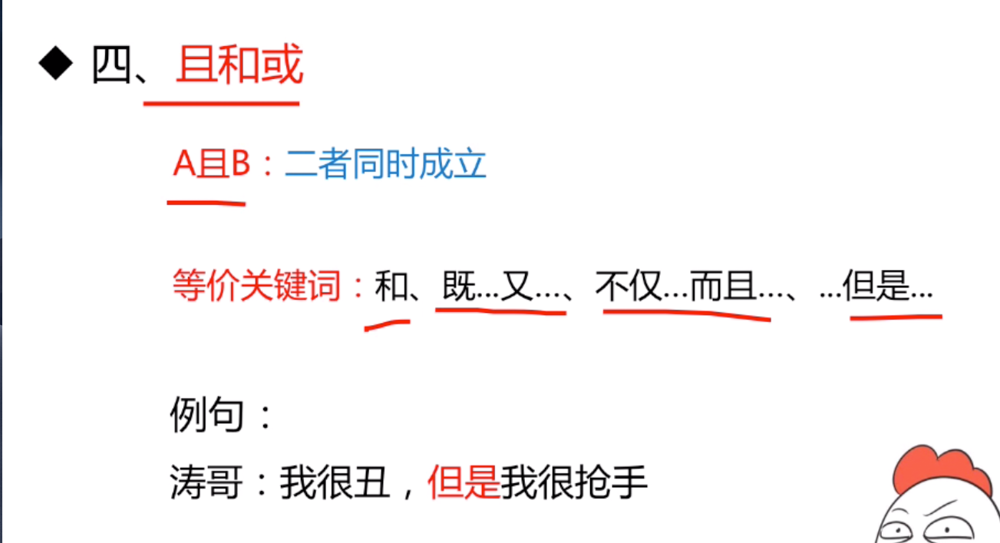
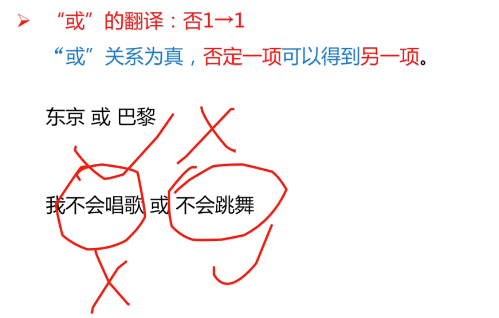
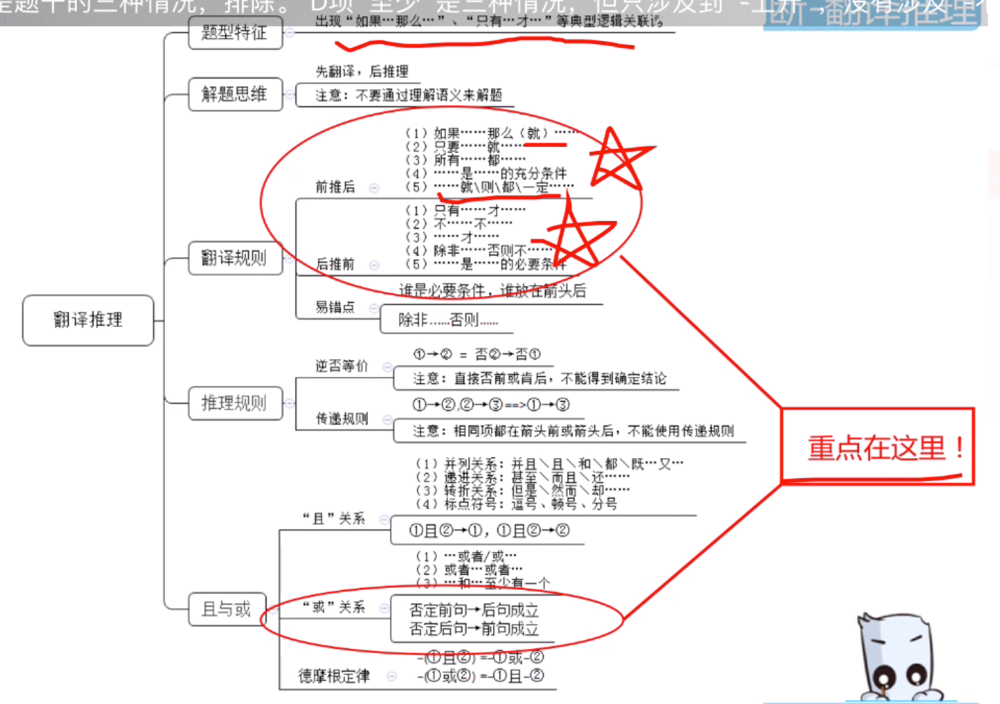

# 逻辑判断

## 翻译推理
----




> 逆否等价


- 例子


```
选b
```
```

只要...就...

A -> B

B-> C

==>  A->C
```

> 后推前





- 例子



> 且和或



```
A或者B:两者至少一个成立

```




```
要么...要么...：两者只有1个
等价关键词：..和..只能有一个


```

> 德摩根定律

```
(1) -(A且B) = -A或-B
(2) -(A或B) = -A且-B
```

> 总结




## 排列组合
----


> 考点1：1.排除代入法（读一句排一句）
> 考点1：2.代入法，选项代入题干验证（题干条件确定优先排除，题干条件不确定尝试代入）

> 考点2：辅助技巧

1. 最大信息（题干条件中出现次数最多的词），以此作为推理起点


> 考点2：辅助技巧
2. 符号：>,<,=,往往涉及年龄，成绩，收入，身高等大小比较

> 考点2：辅助技巧
3. 列表格：多个对象以及信息匹配（往往三个以上）


## 逻辑论证
----

## 日常结论
----