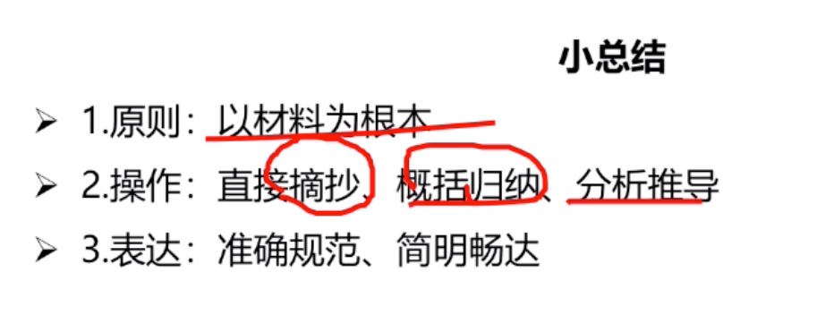
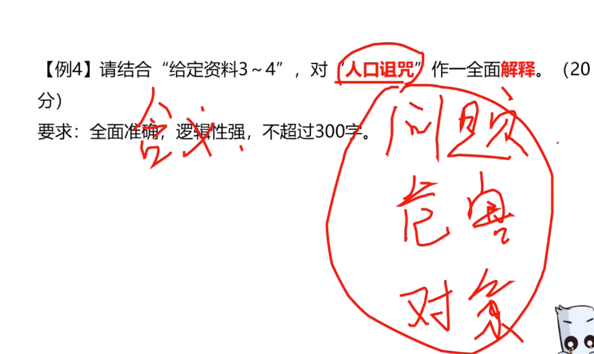
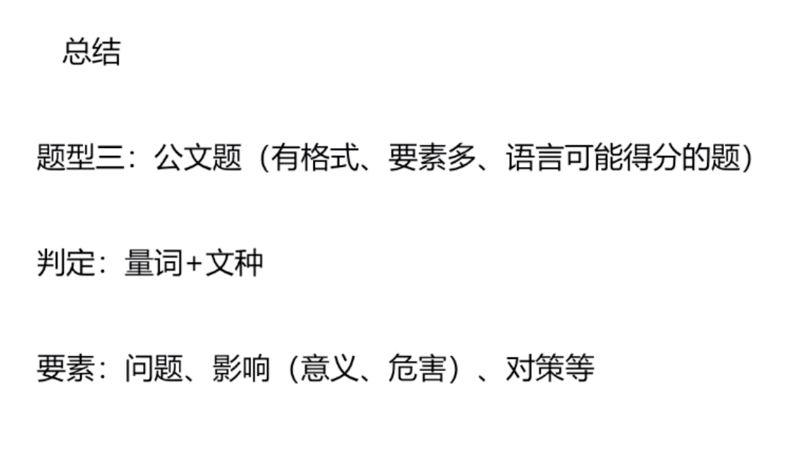
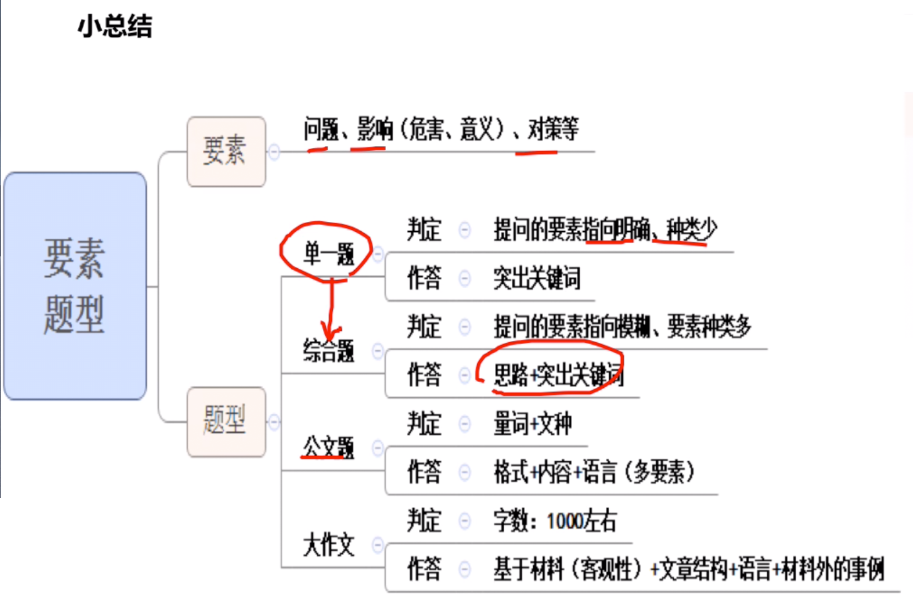
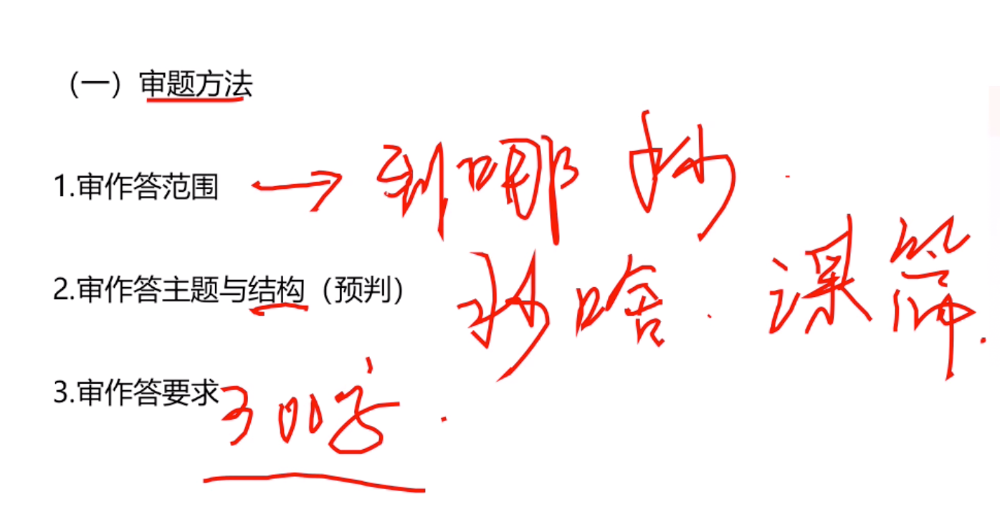
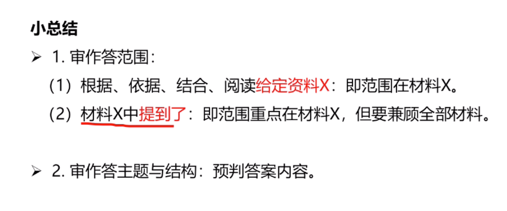
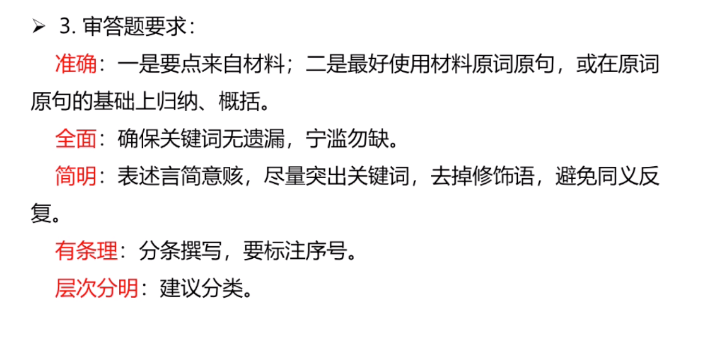
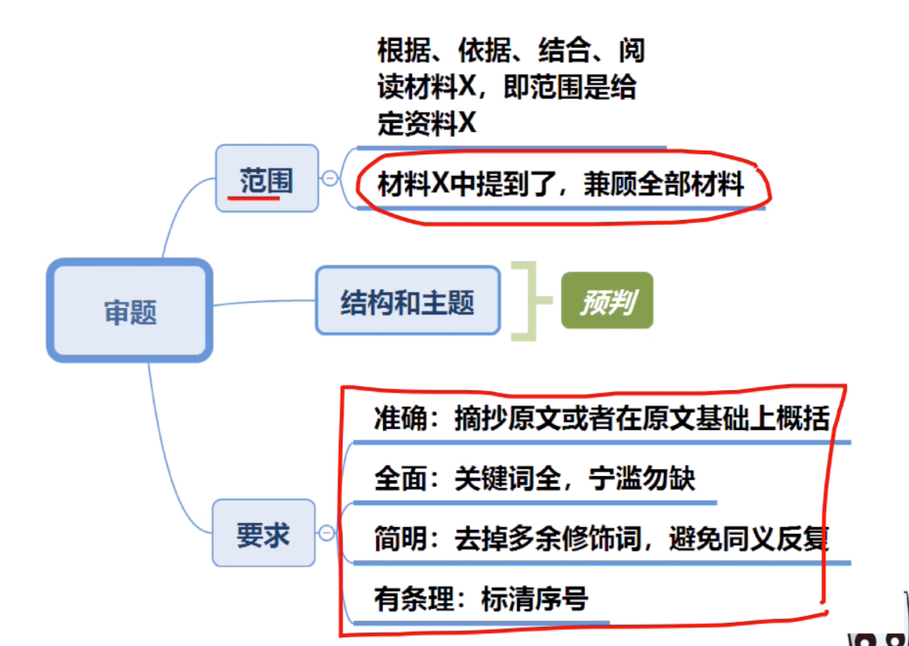

```
1. 听懂用原词——不改变文意

2. 归纳——推断或评价

3. 判断是好还是坏，

```


### 答题要素以及基本题型


> 单一题


> 综合题



> 公文题



> 大作文


```
一篇倡议书 = 量词 + 文种

```

- 总结


### 申论答题步骤

- 步奏


- 审题



- 例子



```

1. 坑，应该是从全文找

2. 先说影响 再说问题

```

- 总结


### 要求



- 总结


### 读材料技巧


- 摘抄（找动词）


```
1. 文化例外后面一句是解释文化例外，所以不摘抄。

2. 直接将重复的语句改为，拒绝华盛顿配额限制的无理要求

3. 现在母语中使用外语，要求互联网广告译成母语

```