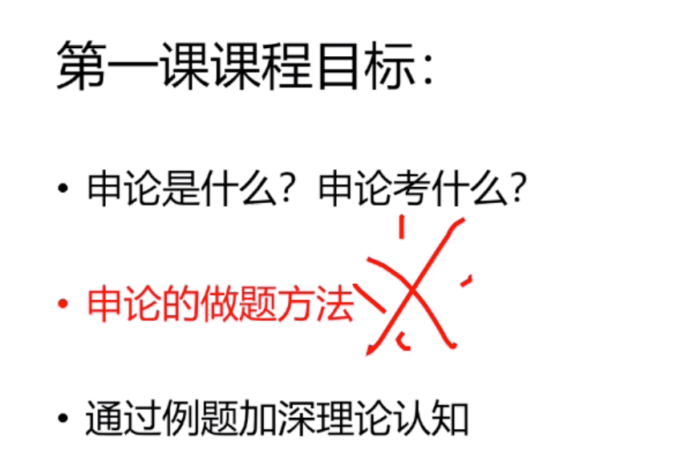


```
1. 听懂用原词——不改变文意

2. 归纳——推断或评价

3. 判断是好还是坏，

```


### 答题要素以及基本题型


> 单一题


> 综合题


> 公文题
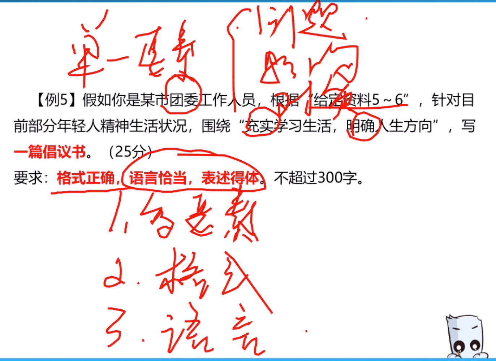


> 大作文

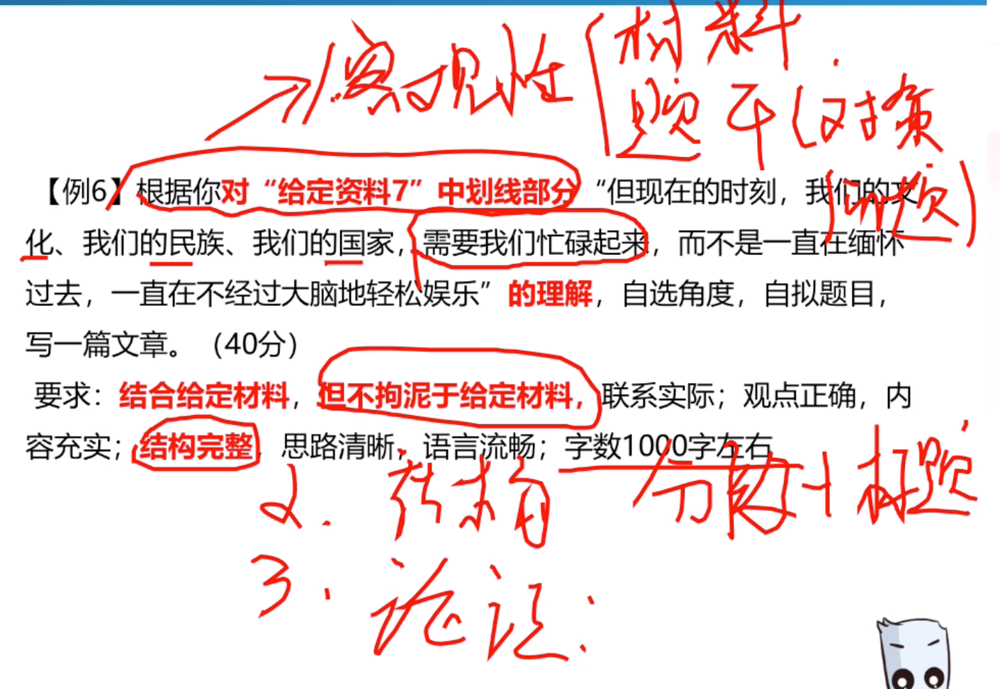

```
一篇倡议书 = 量词 + 文种

```

- 总结


### 申论答题步骤

- 步奏


- 审题


- 例子

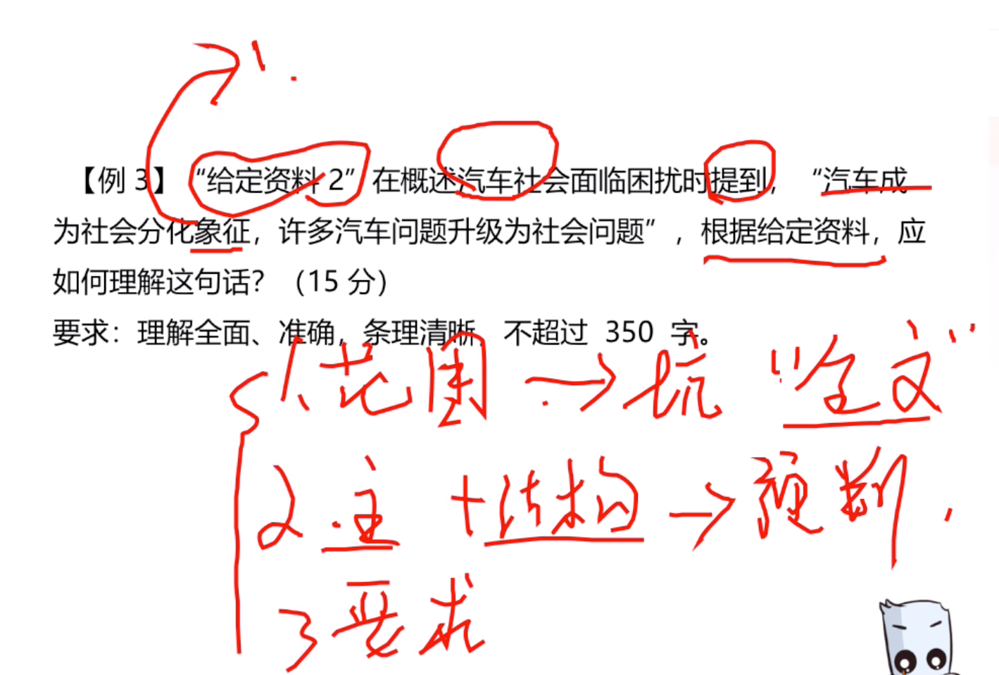


```

1. 坑，应该是从全文找

2. 先说影响 再说问题

```

- 总结


### 要求


- 总结


### 读材料技巧


- 摘抄（找动词）


```
1. 文化例外后面一句是解释文化例外，所以不摘抄。

2. 直接将重复的语句改为，拒绝华盛顿配额限制的无理要求

3. 现在母语中使用外语，要求互联网广告译成母语

```

- 自然段的首位处(抄)


- 有观点的句子(可能会抄)

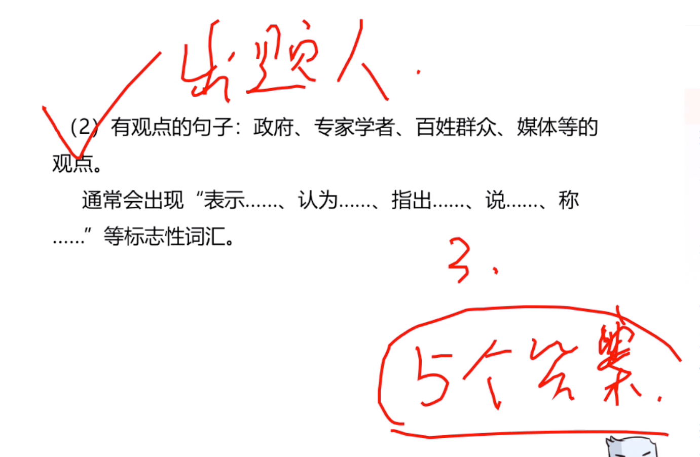

- 有关联的句子
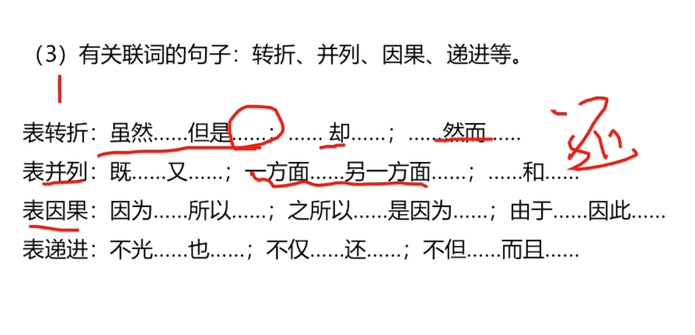

- 标点符号

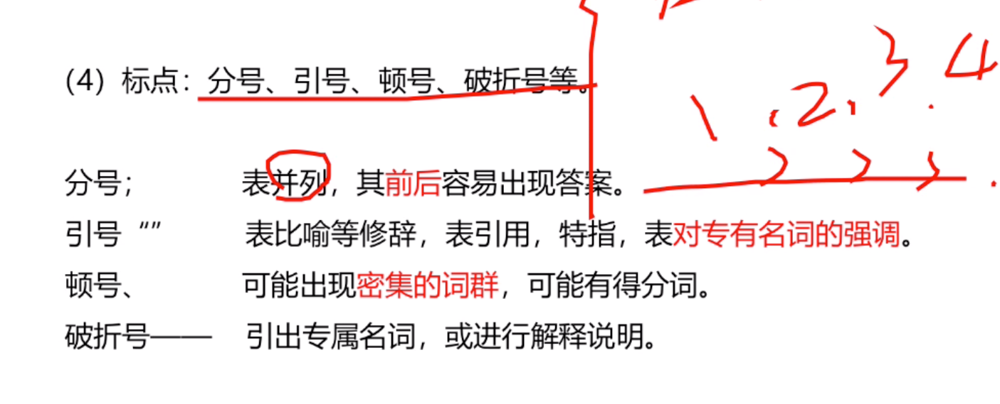

```
分号：要么全写，要么只归纳为一个点

引号：表强调

顿号：可能有分词

破折号：可能有规范词

```

- 例子

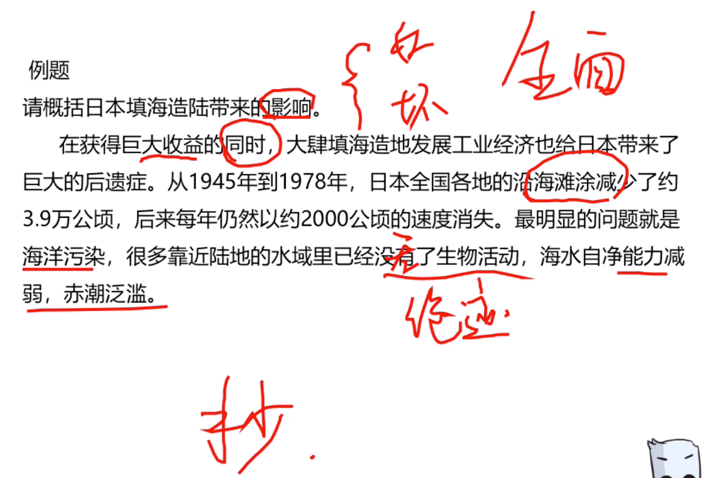

```
1. 影响一般表两个方面，好的方面和坏的方面

```

- 资料类型
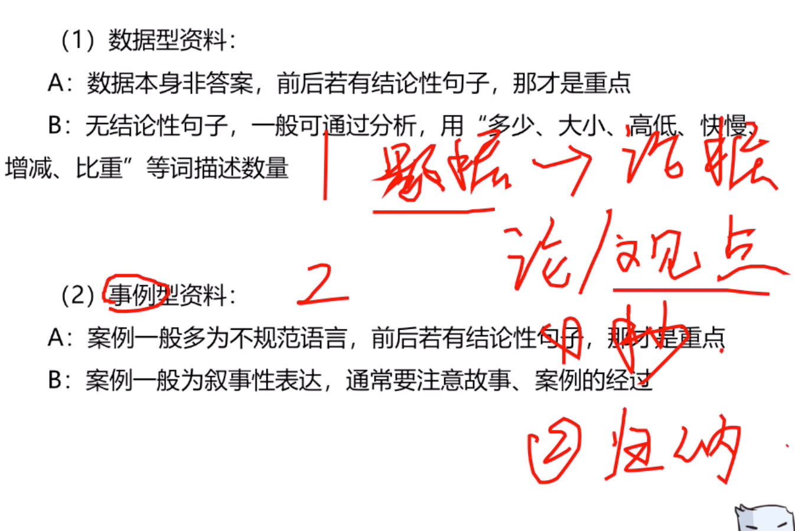

- 例子（归纳）
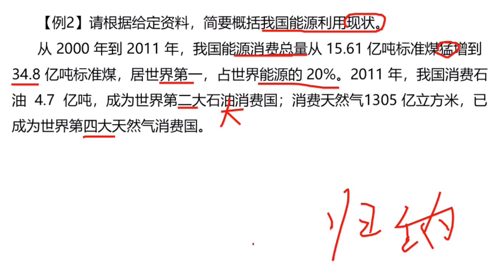

```
能源消耗总量大

```
- 例子（分析推导）


- 总结


- 例子

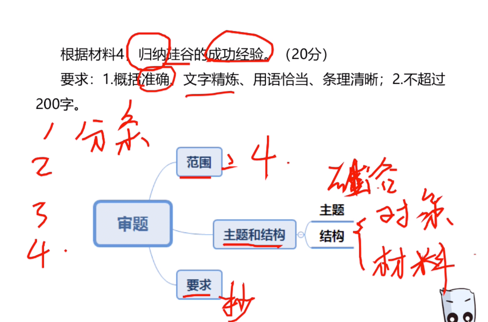


```
1. 例子不重要

2. 关键词：风险投资（吸引）


```


```
1. 不要意义,因为不是对策

```
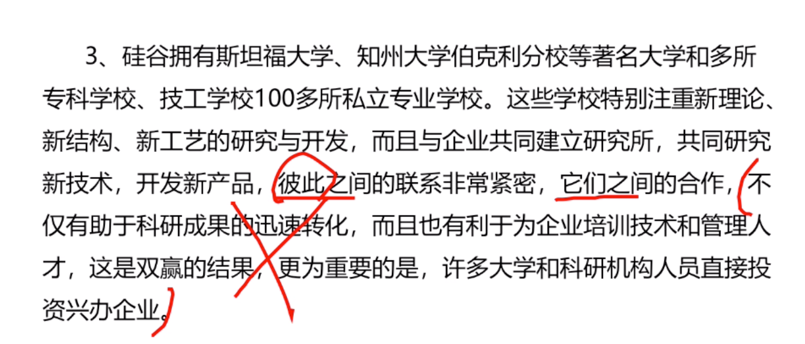


```
1. 不抄解释

```
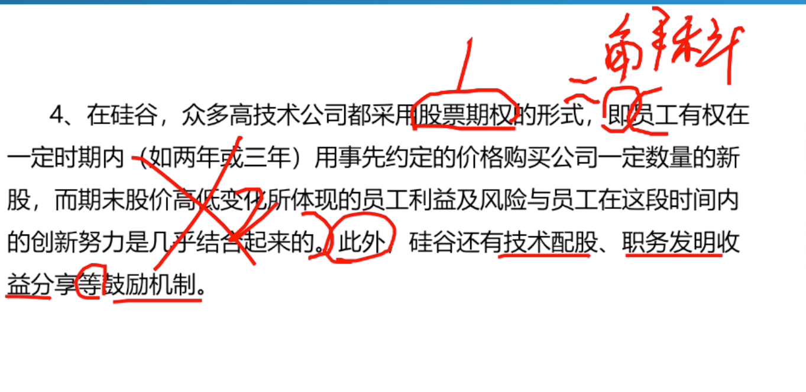

```
1. 分号都要写要么就一句话概括
```

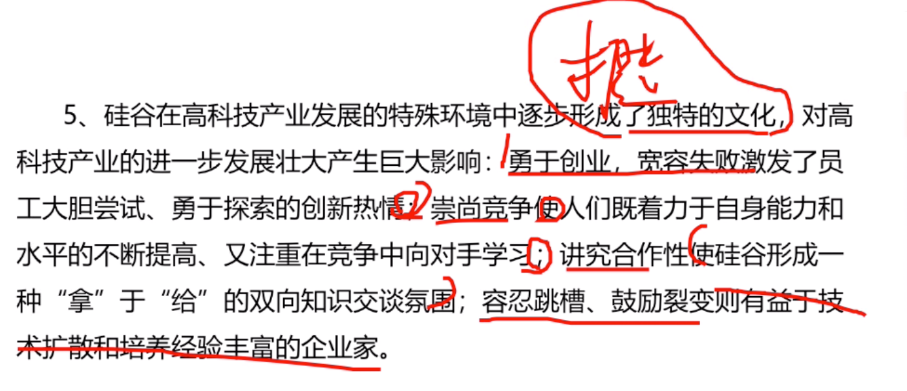

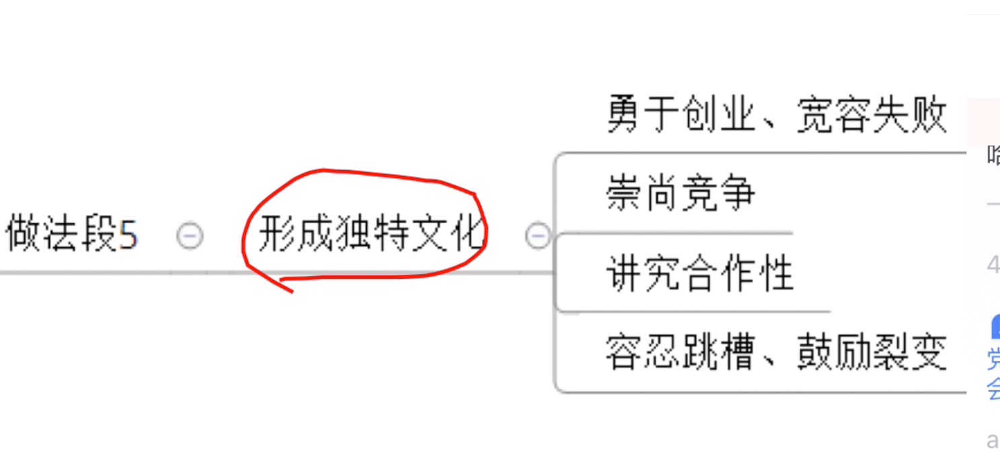

- 积累

```
天下事有难易乎？为之，则难者亦易亦；不为，则易者亦难矣。 ——为学
```

