### 晨读材料的读法

1. 通读

2. 改写

3. 逻辑

### 要素和题型


### 单一题

- 问题
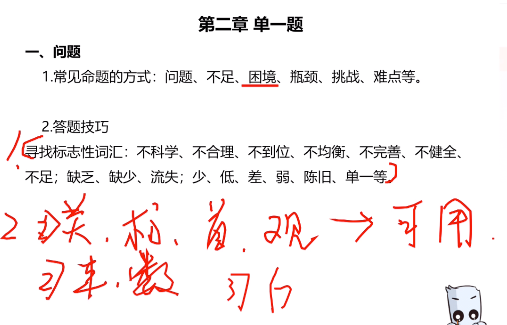
```
1. 一般民众说的观点是问题
2. 政府的观点是措施
3. 你想宣传啥就宣传啥 ——片面 

```
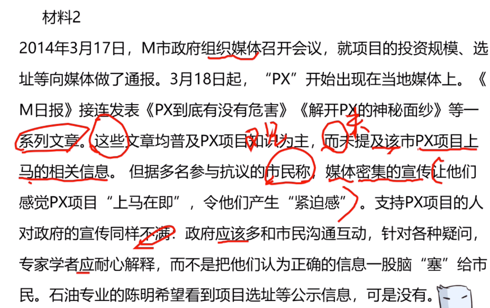


```
1. 摘抄观点，但，这
2. 应该 -> 注意反推
3. 归纳

```
<!--  -->


```
1. 专家给了建议，反推问题

```

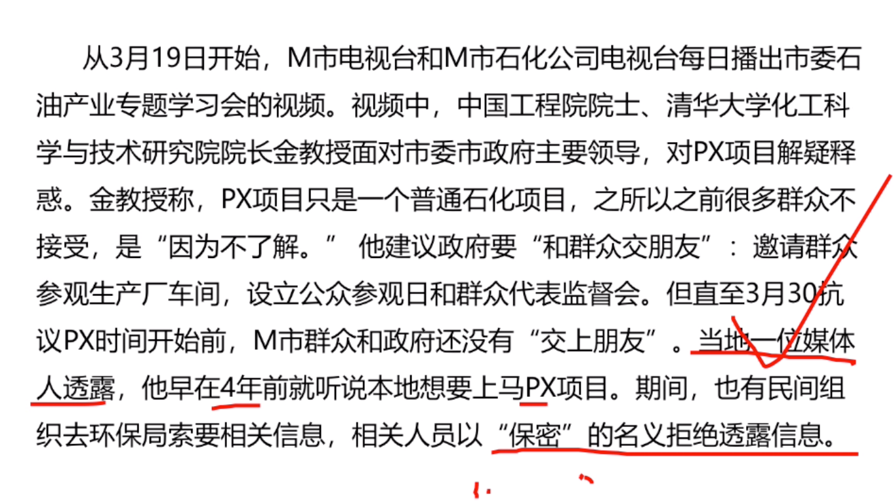
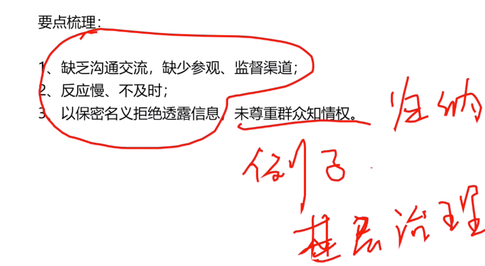

```
1. 保密——知情权（知识点迁移）

```

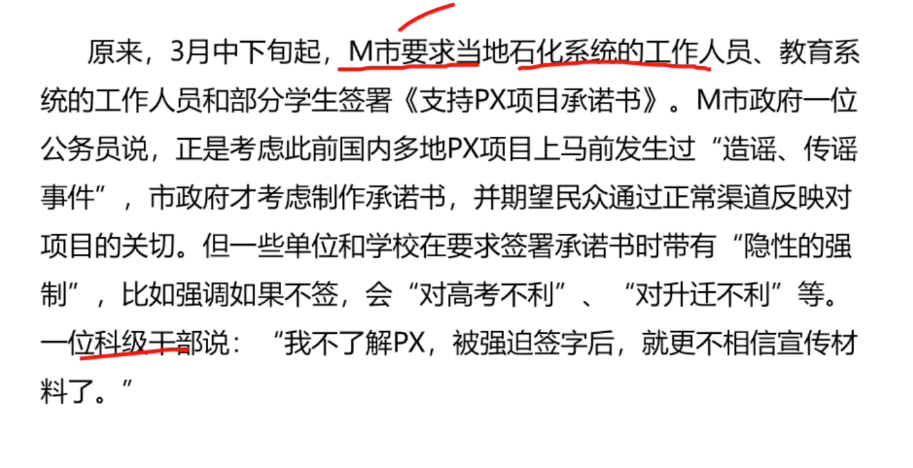


```
不作为太大了，要清楚一点
```
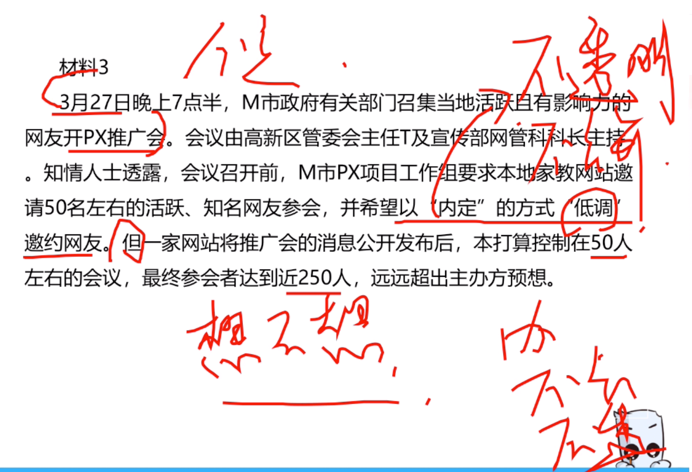


答案

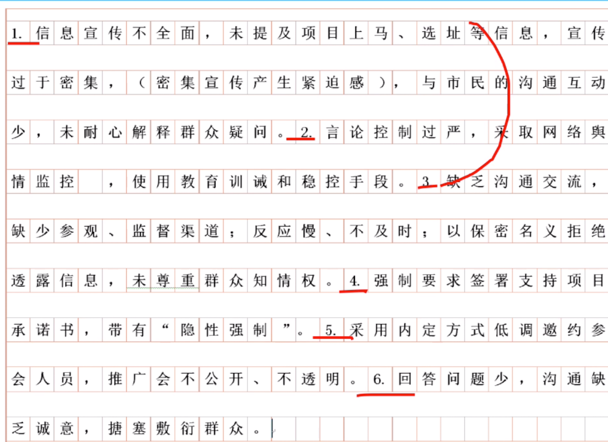

- 总结
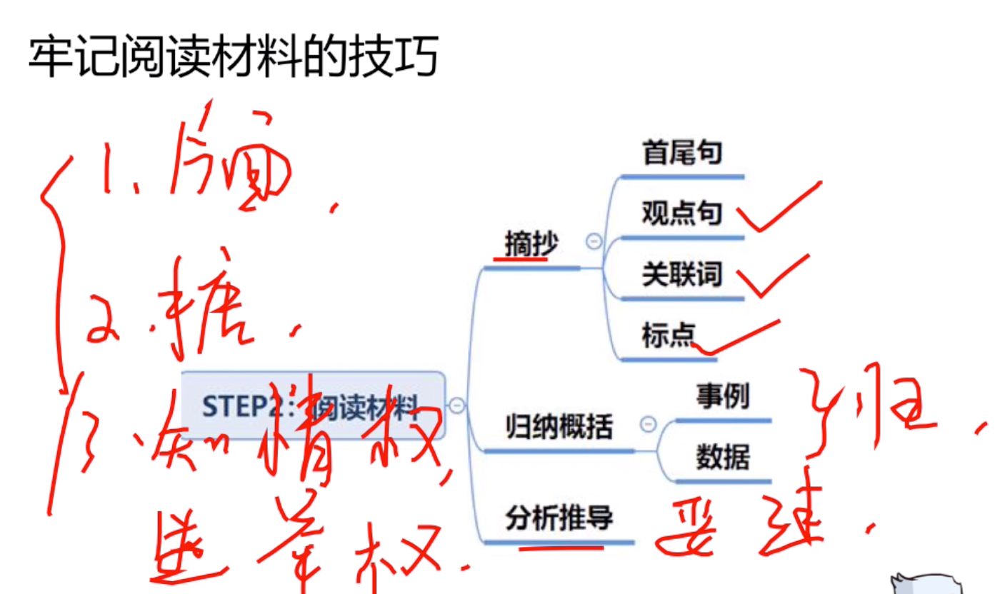

- 例子

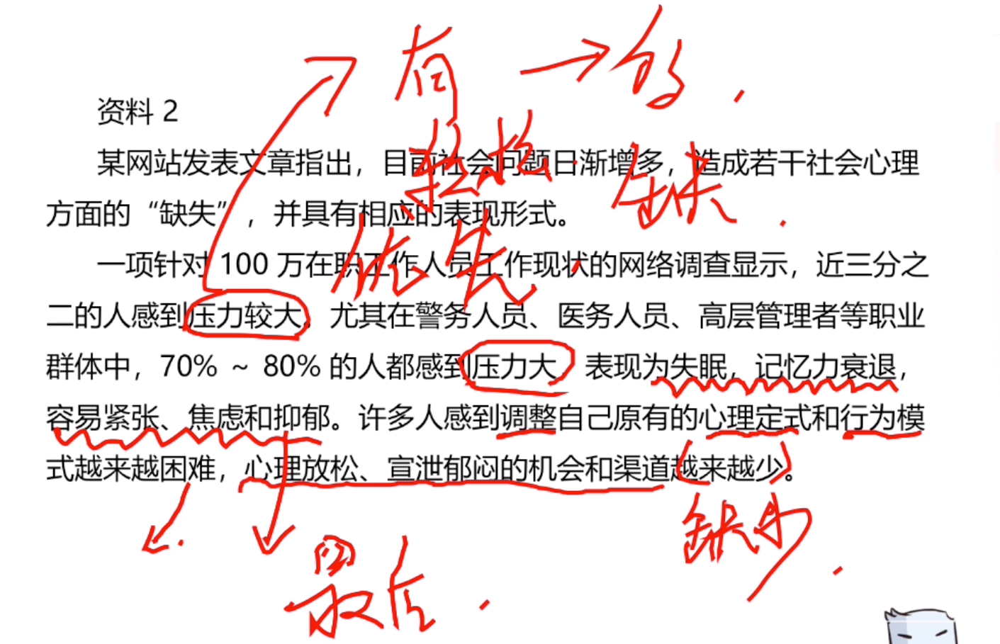


```
1. 确定的用直线写

2. 不确定的画波浪线

```

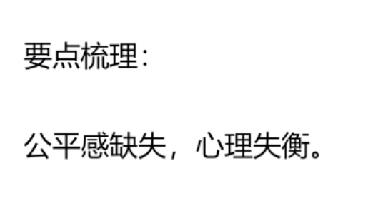

```


```


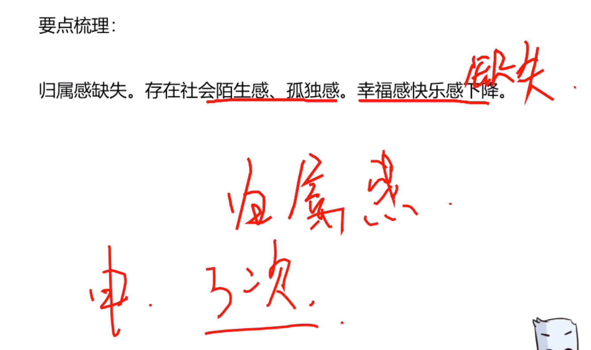


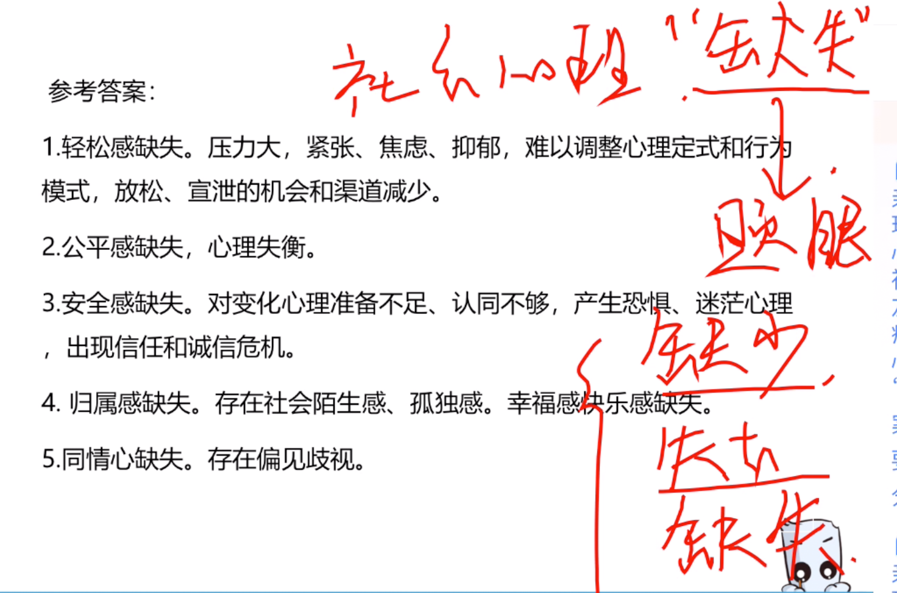