## 学习内容


### 行文脉络
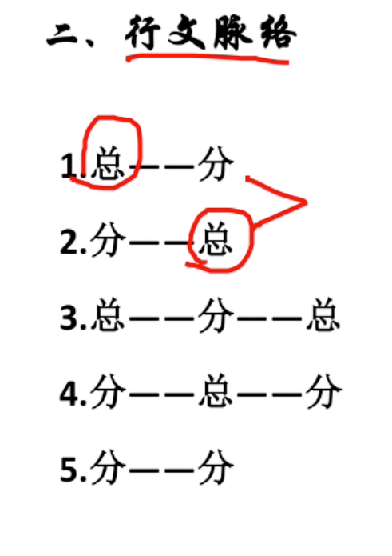

- 理论要点


- 例子
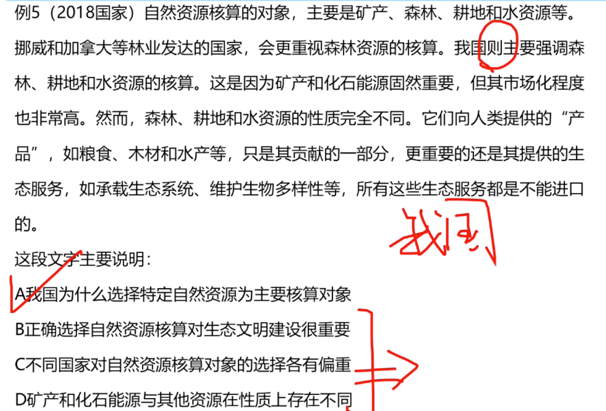

```
核心话题：我国
```

> 分总结构


- 例子

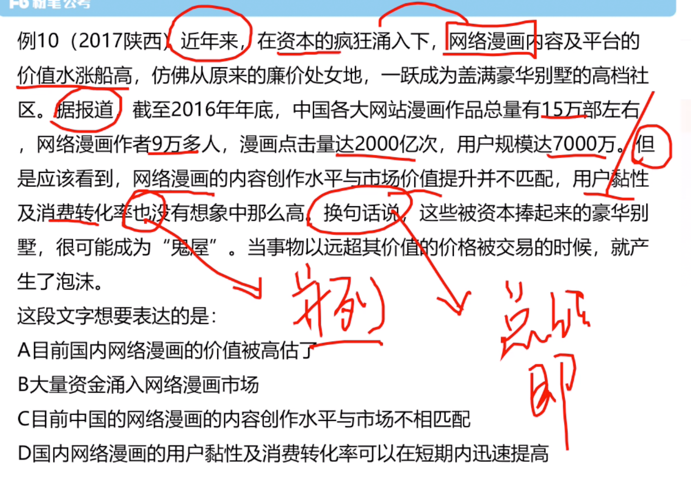

```
选a

c:有也字，不全面
而且文章说的是和市场价值不匹配
```

- 总结
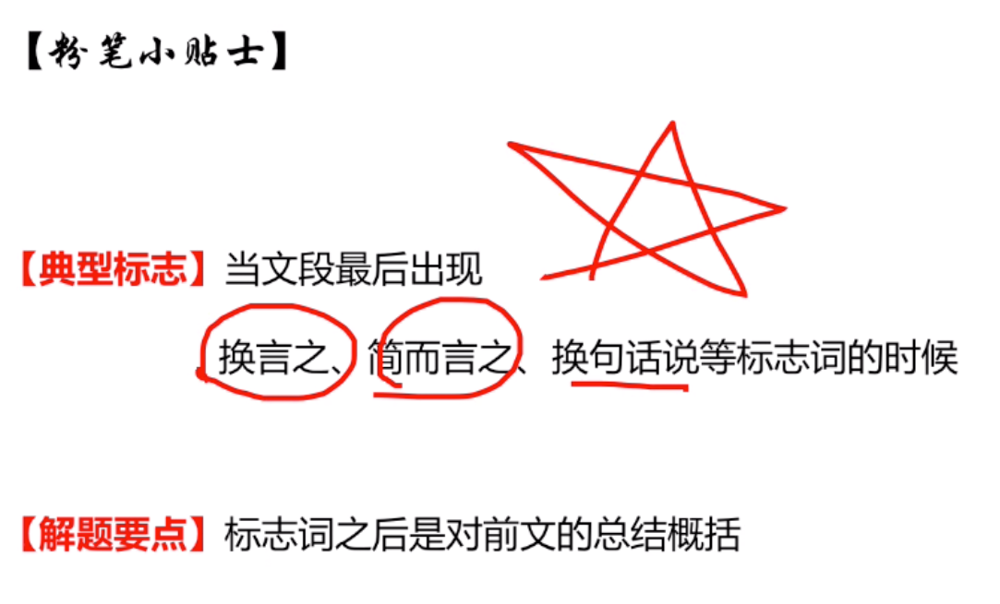
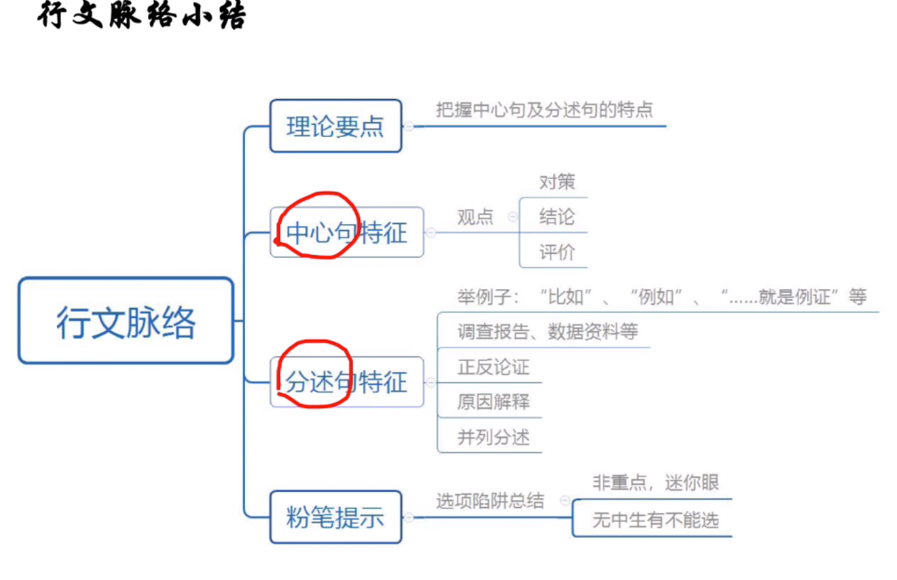

### 细节判断题

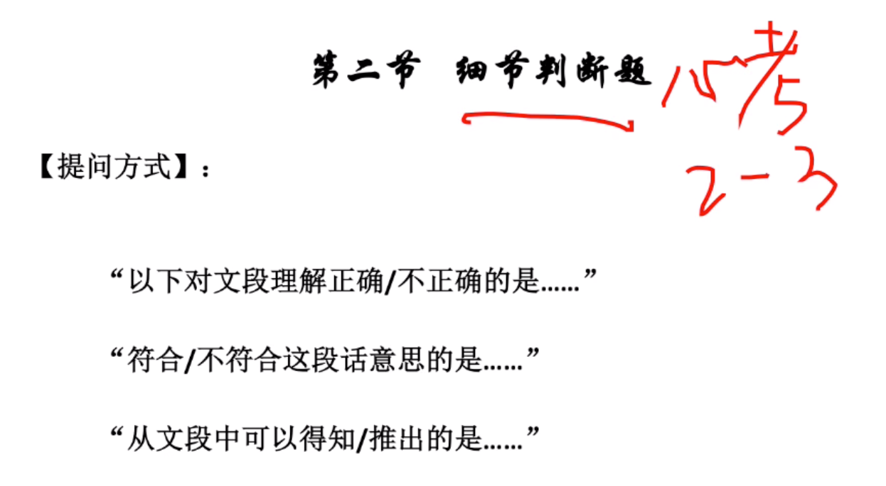

- 先去读提问方式，大致看一下文意。再去看选项。
- 错误选项


- 例子
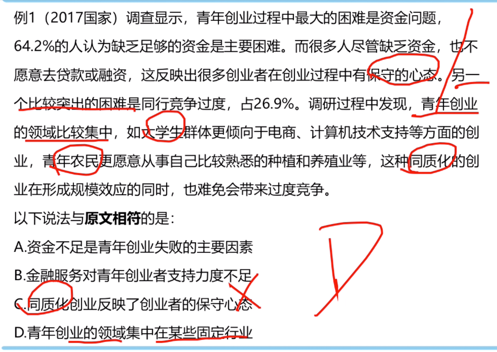

```
A，没说这时失败的原因，而是困难的原因

B,不是支持度不够，而是不想贷款

C，不是一个句子里面的话语。
```

- 例子

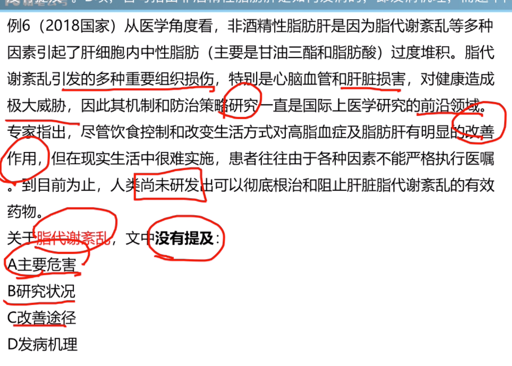

```
文章问的是脂代谢紊乱。而第一句说的是非酒精脂肪肝的发病机理

```

- 相对绝对法
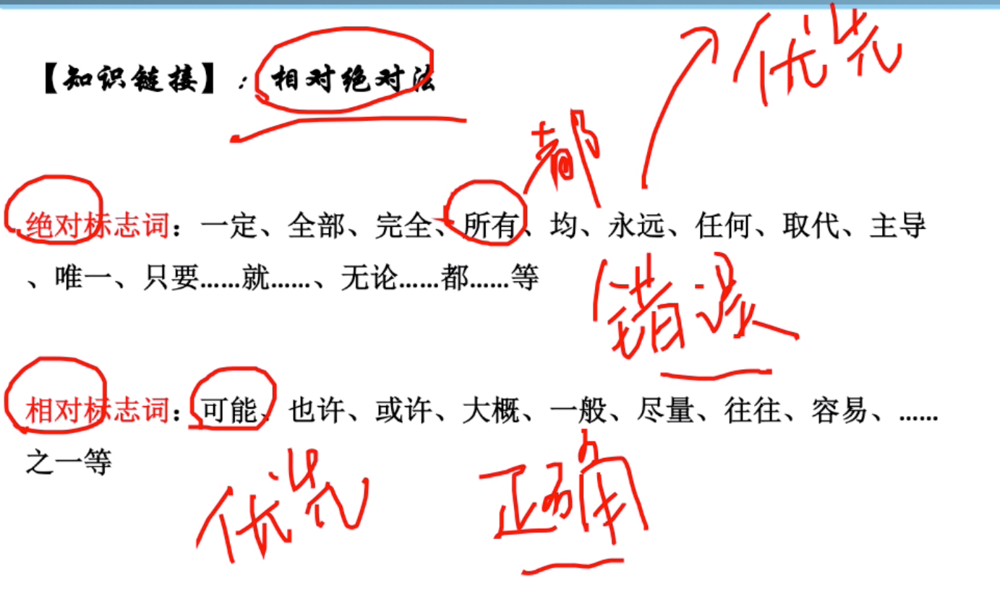
（绝对先拿出来，去全文找，优先验证。）

- 例子


> 细节主旨化


- 例子（直接去匹配，中心内容，答案可能就是选项）

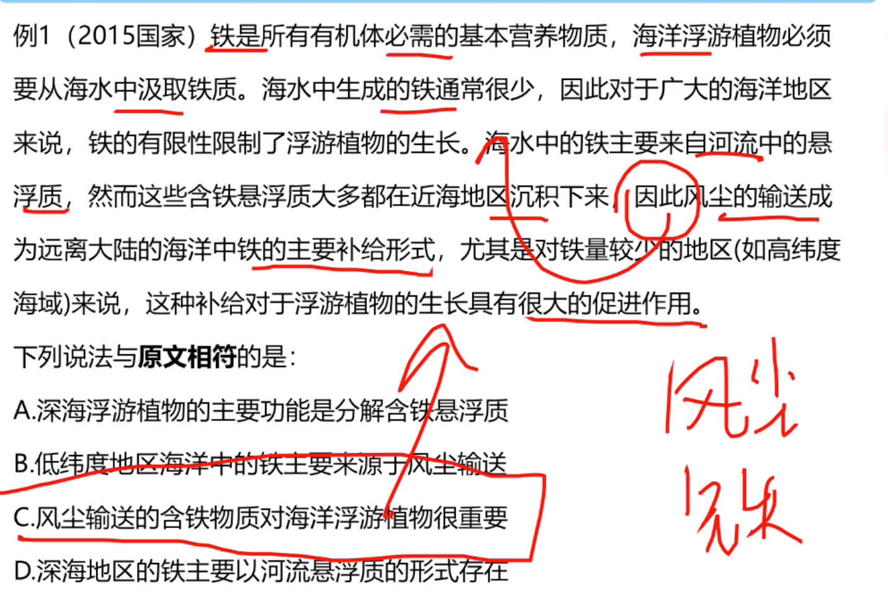

- 例子(主题词是观念)

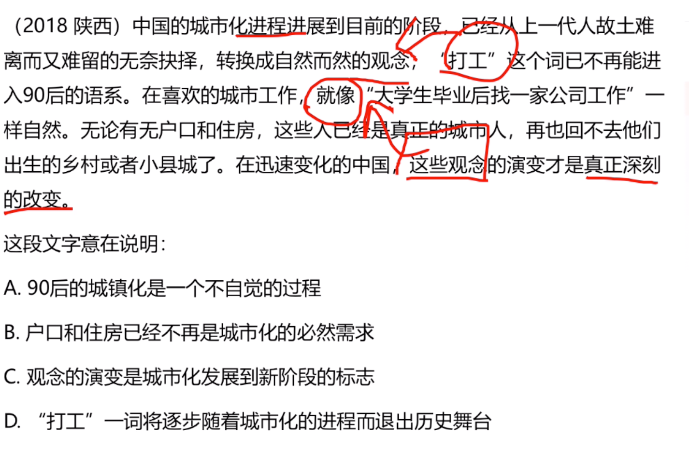

- 例子


```

D项，没有提到，绝对。

a,几乎都，很科学，确实是除了木材都是
``