## 第一节 速算技巧

-----

> 截位直除


```
(1)保留位数

1,2:选项差距大，保留两位

3,4：选项差距小，保留三位

例如：4286/7676
选项差距大:4286/77
选项差距小：4286/768

(2)一位除法还是多步除法

```


(3) 例子

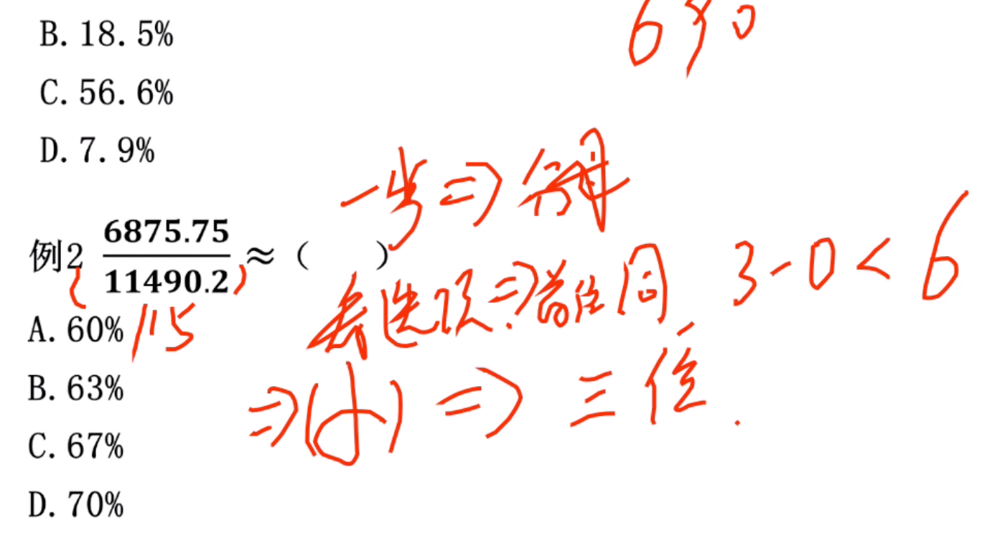

>  比较类

- 一大一小看：分子大的分数大

  (1) 例子(分子大，分母小，一定大)

  
- 同大，同小（1.直接除 2.比分子分母增长速度）
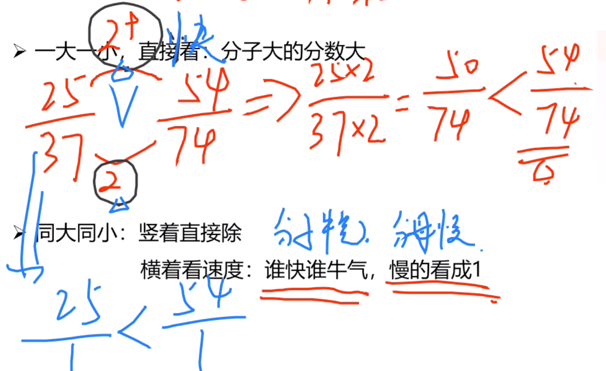
```
分子变化快，把分母当成1，则比较谁大
分母变化快，把分子当成1，则比较谁小
```
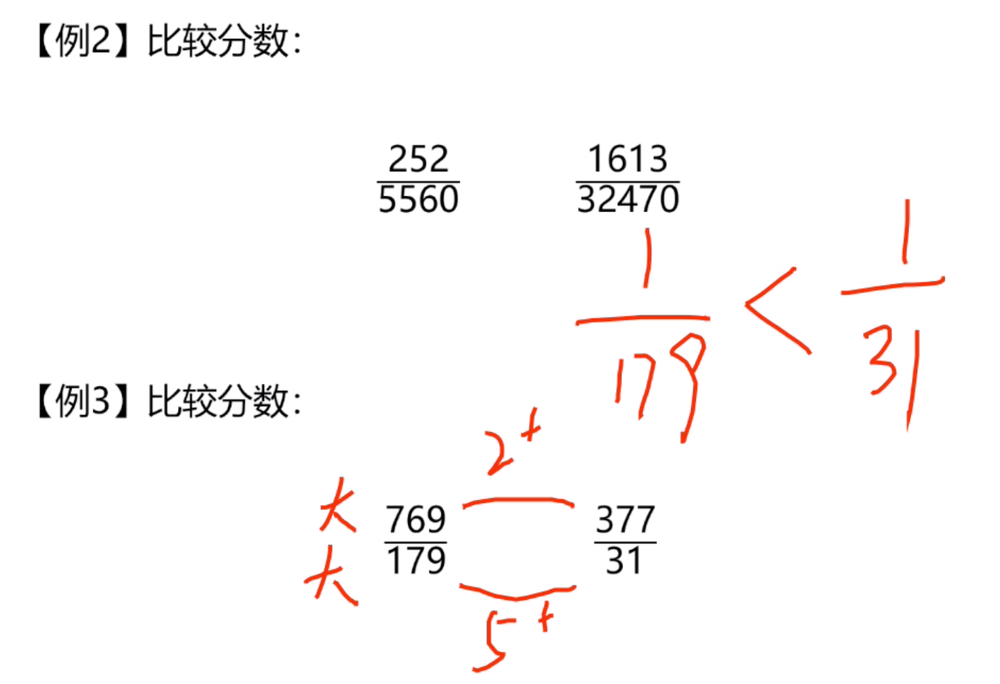

```
竖着除也是有技巧的不用硬算，换成几分之几
```
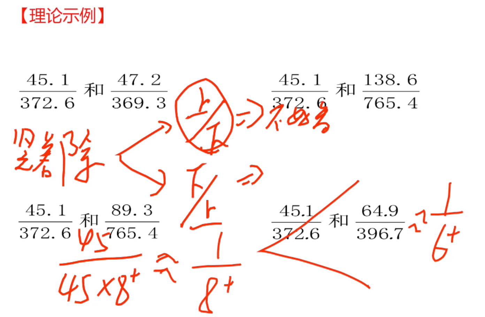

```
技巧：比较分子分母的倍数，如果算出分子倍数是6，则直接把6带进分母中，看看比6大还是比6小
```


> 总结


## 第二节 材料找数

-----

> 快速找数注意事项


## 第三节 基期和现期
- 基期与现期的概念

- 做题步骤
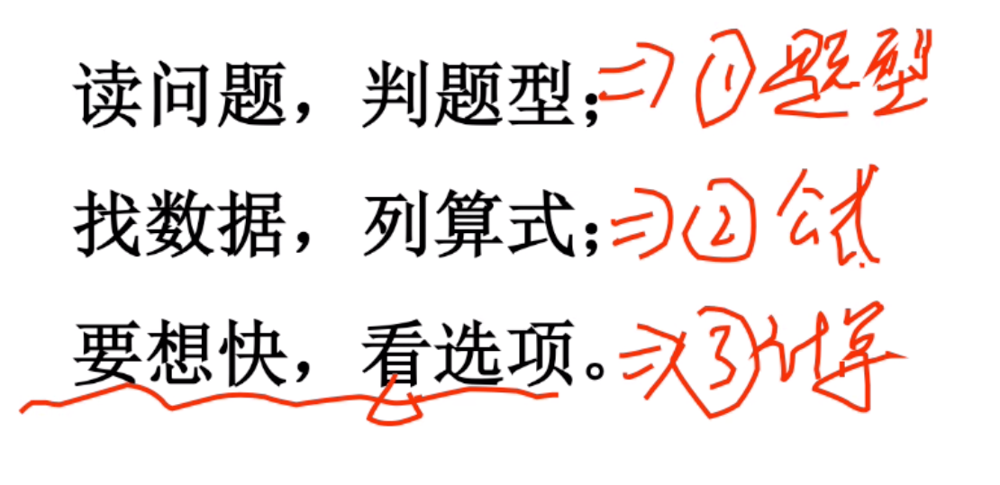

- 化除为乘

- 同比和环比
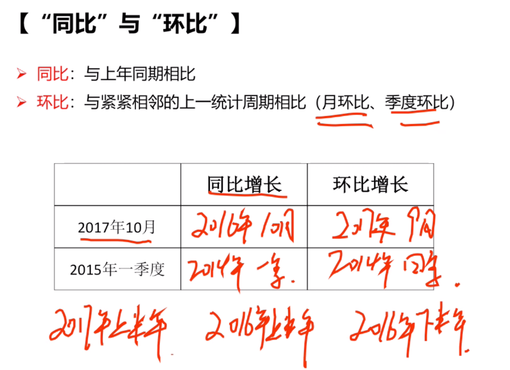

- 例子（看多位数如何截算）
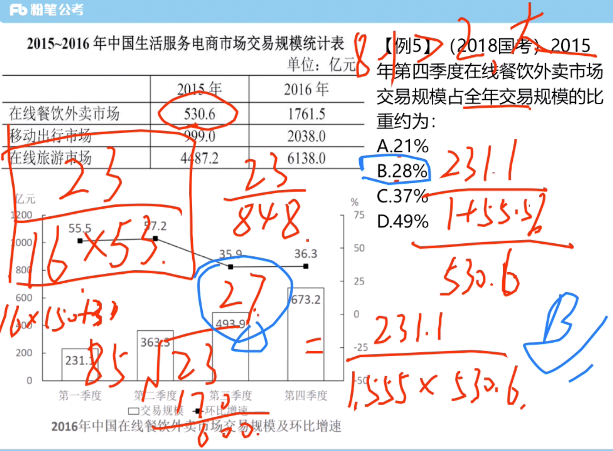
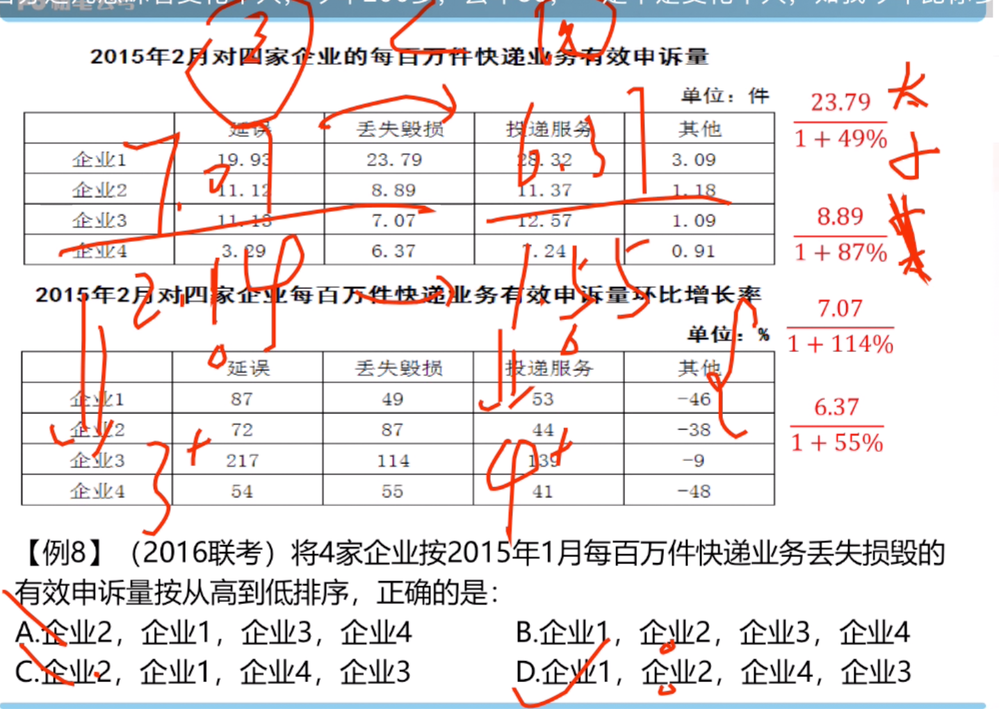


- 出口大于进口，是贸易顺差（反之是贸易逆差）选d,因为还要算分母，而现期差是32，求的是基期差,排除32

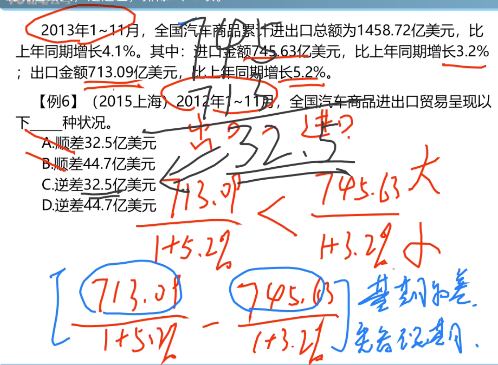

- 例子，基期差+单位陷阱
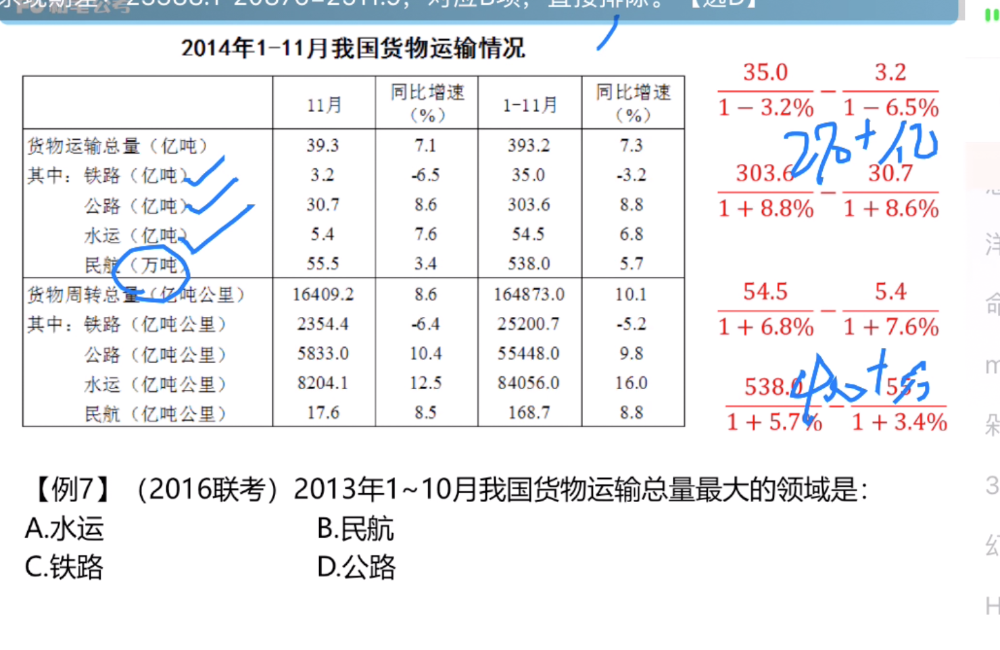

> 现期

- 概念
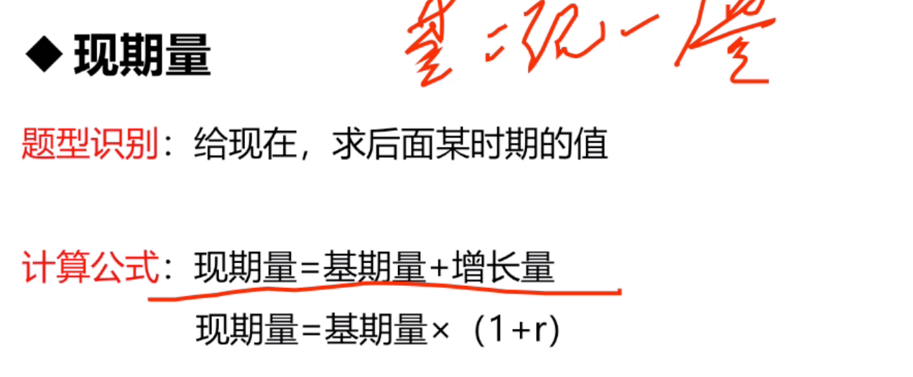

- 例子，注意列式，简化
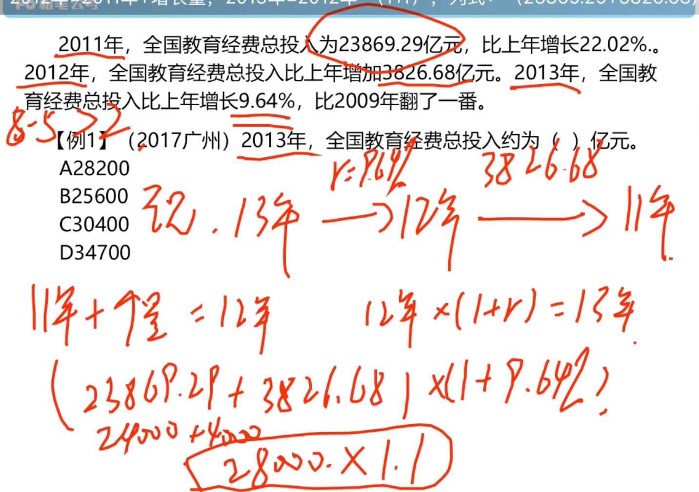
- 算第几年超过
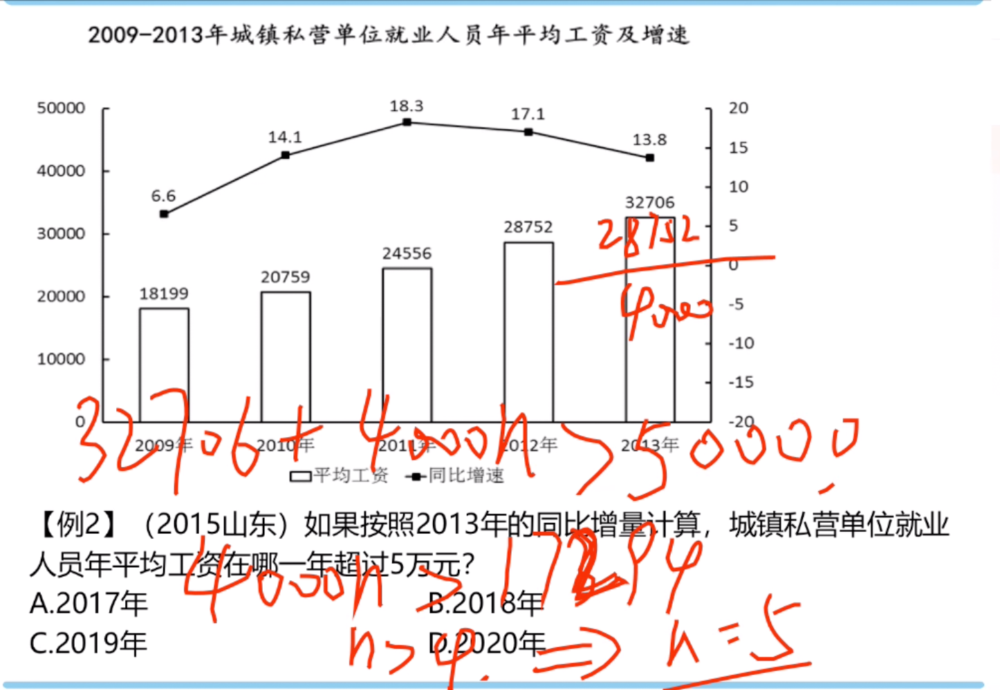

> 总结


```
1. 截位直除 （1）保留位数 （2）一位除法还是多步除法
2. 比较类  （1） 一大一小看：分子大的分数大 （2）同大，同小（1.直接除 2.比分子分母增长速度）
3.技巧：技巧：比较分子分母的倍数，如果算出分子倍数是6，则直接把6带进分母中，看看比6大还是比6小
4. 题型，公式，找数
5. 有关基期和现期的概念，上图
```