1. 早上判断40（完结）资料 10
2. 中午言语 40
3. 晚上判断20（新）
4. 晚上资料 10 
5. 晚上对答案（当天记录对答案）
6. 当天解决当天的。过去的不予解决。做好记录，周末解决。

### 言语
|  错误类型（为什么错）   | 统计次数  |
|  ----  | ----  |
|   | 1 |
|  | 1 |
|   | 1 |

- 1（1. 语境分析第一个空应该填写感情色彩贬义的词。因为动不动，程度很重。 2.C项“南辕北辙”指行动和目的相反，文段并无行动和目的的比较，排除 ）


```

在产品广告和自媒体营销号中，我们经常看到对“防癌食品”“抗癌保健品”的        。许多营销文案还能列出一篇篇的科学文献，动不动就说“某著名大学发现”“某权威医学期刊证实”等，显得“很有科学依据”的样子。其实，科学领域说的“致癌”和“防癌”，跟广大公众心中所想的“致癌”“防癌”           。

A

鼓吹 相去甚远

B

宣传 毫不相干

C

炒作 南辕北辙

D

正名 判若云泥


正确答案是： A收起
解析
第一空，根据后文“动不动······显得‘很有科学依据’的样子”可知，广告和营销号对防癌食品起到不好的作用，横线处需填贬义词。A项“鼓吹”指宣传提倡或过分吹嘘，可用作消极倾向，符合文意；C项“炒作”指为扩大或事物的影响而通过媒体反复做夸大的宣传，往往带有消极倾向，符合文意；B项“宣传”为中性词，与文段感情倾向不符合，排除；D项“正名”指辨正名称和名分，一般带有积极感情倾向，不符合文意，排除。

第二空，分析文段可知，横线处要体现科学领域和大众所想是相反的。A项“相去甚远”指互相之间存在很大差异和距离，符合文意；C项“南辕北辙”指行动和目的相反，文段并无行动和目的的比较，排除。

故正确答案为A。
```
- 2（1. 这道题是分总分。首先提出军事战略空间话题，总说战略空间要进行有机融合。 只有C主题军事战略空间话题对 2. 总是指代词：这引出来的。这就要求战略主体转变对战略空间的价值判断，把战略空间的安全目标和发展目标有机融合。）


```
军事战略空间融合化指的是战略空间不再仅限于军事或战时范畴，而是融合了一个国家治国理政的各个领域和所有时期。在和平与发展成为时代主题的大背景下，战争和冲突只发生在世界局部地区。这就要求战略主体转变对战略空间的价值判断，把战略空间的安全目标和发展目标有机融合。冷战结束后，许多军事空间开始向军民融合空间的方向转变，形成一股潮流。历史上，各国十分重视边境线、公海、两极、太空等战略空间的军事控制权，而现在越来越关注的则是如何实现共同安全和共同发展的融合。

这段文字意在说明：

A

战略空间的概念已扩展至国家治理各个层面

B

军民融合是军事战略空间融合化的主要方向

C

时代主题的变化改变了军事战略空间的内涵

D

安全和发展是当前国际军事战略研究的主题


正确答案是： C收起
解析
文段开篇“军事战略空间融合化指的是······而是融合了一个国家治国理政的各个领域和所有时期”引出“军事战略空间融合化”融合了更多的内容。随后指出在和平与发展的时代主题背景下，要求战略主体转变对战略空间的价值判断，把战略空间的安全目标和发展目标有机融合。接下来通过“冷战结束后”“历史上”进行进一步的解释说明。故文段重在强调军事战略空间在和平与发展成为时代主题的大背景下发生了改变，对应C项。

A项，“战略空间”主题词范围扩大，文段主题词为军事战略空间，排除；

B项，“军民融合”出现在后文解释说明当中，非重点，排除；

D项，“军事战略研究”偏离文段核心话题，排除。

故正确答案为C。

```
- 3（1. 这是并列结构：社会各界一直在努力寻找对策。相关科学研究从生物医学、心理学和社会学等不同角度阐释了游戏成瘾的生成机理并寻求相应的干预治理机制。不一定必须从最糊一句话，接着说。因为这是整体。所以从社会各界这个话题继续解决问题）


```
就青少年网络成瘾这个社会心理痼疾，社会各界一直在努力寻找对策。相关科学研究从生物医学、心理学和社会学等不同角度阐释了游戏成瘾的生成机理并寻求相应的干预治理机制。生化科学家从生物医学角度研究发现，游戏成瘾应作为一种大脑神经多巴胺系统疾病开展治疗；心理学家从大量案例研究中揭示了游戏成瘾大多来源于缺陷人格、认知偏离、平衡内心世界和外界现实冲击的特定防御机制；社会学研究则关注游戏成瘾行为背后的国家政策、社会环境、家庭教育、亲子关系、学校教学、社会交往方式及重要的生活事件环境因素等。

接下来作者最有可能讲述的是：

A

生化科学家研发治疗青少年网瘾的药物

B

心理学家提出解决青少年网瘾的对策

C

社会学家分析青少年网瘾问题的成因

D

社会各界如何解决青少年网瘾问题


正确答案是： D收起
解析
该题为接语选择题，重点关注文段尾句。该题尾句较长，命题方式比较特殊。文段中的长尾句主要是从生化科学、心理学、社会学三个不同角度阐释游戏成瘾的生成机理的研究成果。后文应全面承接并提出对策，对应D项，“社会各界”是对前文提及三个角度的概括，“如何解决⋯⋯”为对策表述。

A项“生化科学家”、B项“心理学家”、C项“社会学家”均为尾句提及的一个方面，表述片面，排除。

故正确答案为D。

```
- 4（1. 这道题的核心话题是乡土题材 2. 这道题没读懂，说的是不管住不住在乡村的都喜欢写乡土题材）


```
好的作家像名茶一样，是岁月山川灵气之凝聚，除了后天的技艺训练，还与天赋和成长环境密不可分。中国当代文坛的中坚力量，如莫言、贾平凹、阿来、迟子建等，就鲜明体现了地域环境对其写作的深刻塑造。这些作家的出生地多是偏僻乡村，作品也主要是乡土题材，很多都以自己家乡作为“文学根据地”。这集中反映了中国当代文学的一个现象，即乡土题材作品占绝大多数。哪怕写作和阅读的群体多数都居于城市，他们之间的交集还是乡村：住在城市的作家，写关于乡土的小说，给住在城市却保有乡土记忆的读者读。

这段文字接下来最可能讲的是：

A

作家的成长环境对文学创作的影响

B

当代文坛著名乡土作家的代表作品

C

当代文学为何热衷于乡土题材创作

D

当代中国文学叙事主题的变化趋势


正确答案是： C收起
解析
本题为接语选择题，重点关注文段尾句。文段尾句对反映出的现象做具体论述，即就算作家和读者都在城市，还是要写乡土题材的作品这一现状，反映出现在的作家都热衷于乡土题材的作品。故文段接下来应该围绕作家热衷乡村题材这一现象展开论述，进一步寻求现象出现的原因，对应C项。

A、D两项，均偏离文段尾句核心话题“乡土”，排除。

B项，讨论的是乡土作家，而文段尾句的话题既包括乡土作家又包括作品的读者，核心仍在讨论乡土题材的作品，偷换概念，排除。

故正确答案为C。

```
- 5


```


```
- 6


```


```
- 7


```


```
- 8


```


```
- 9


```


```
- 10


```


```
- 11


```


```
- 12


```


```
- 13


```


```
- 14


```


```
- 15


```


```
### 判断（未）
|  错误类型（为什么错）   | 统计次数  |
|  ----  | ----  |
|   | 1 |
|  | 1 |
|   | 1 |

- 1（注意观察凹凸处，找特异性。看能不能拼合。）


- 2（相邻比较思维 后面比前面变化一根线短）


- 3（S N Z 平行四边形 注意是中心对称图形特征）

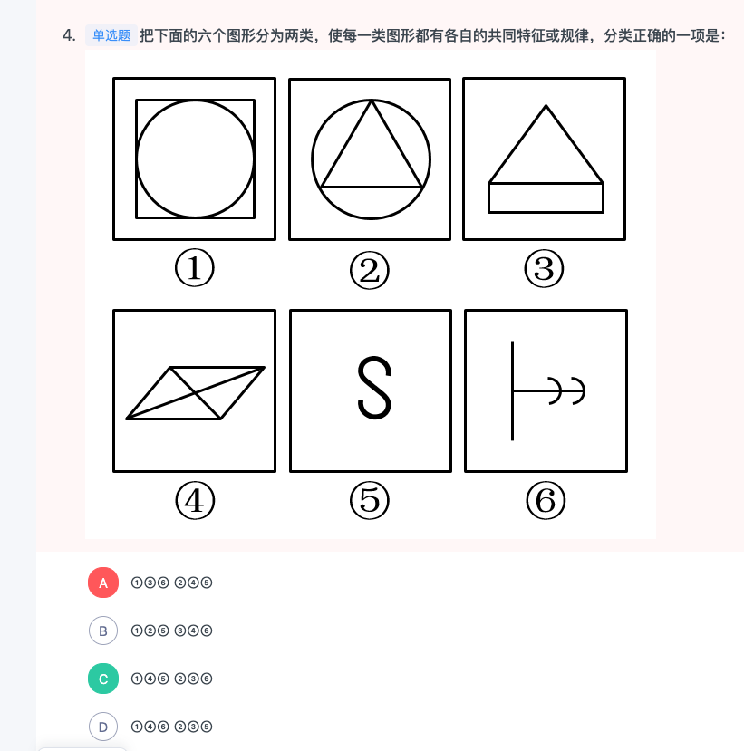


- 1（属性没有特征看数量，数量是占到面积的四分之一）


- 1（1. 排除法：A相对面不能同时出现 B：公共点被直线相连排除 D：多了一个不存在的面）

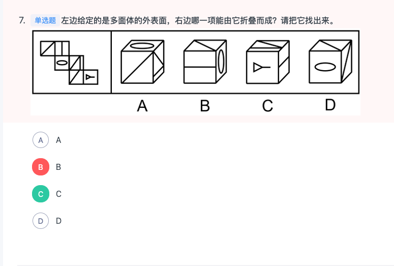


- 1（1. 观察到面有特征 2. 属数量发现2，3，4相同面的个数为6（3中有个图形和其他六个不一样））

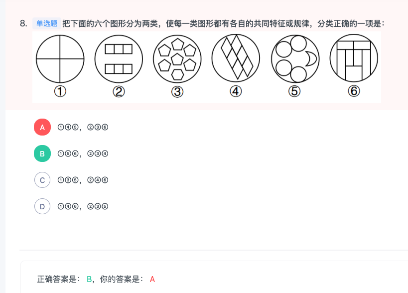

```

```
- 1（1. 发现上面的图都是同一个图 2. 观察到有两个面相接排除，观察到C是逆时针纵轴旋转。3.这种立体图形还可能考左视图是不是一样）

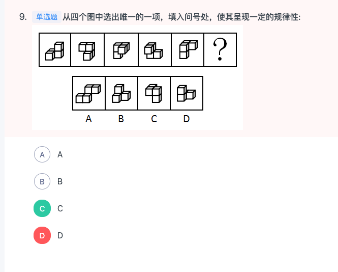

```

题干给出的图形均为四个正方体构成的立体图形，且每幅图的四个正方体均为同样的排列形式，即题干每幅图的立体图形都相同，只是每幅图立体图形的位置发生了旋转。据此规律，只有C项跟题干立体图形是同样的排列形式。

故正确答案为C。

```
- 1（黑球的数量成递增趋势）

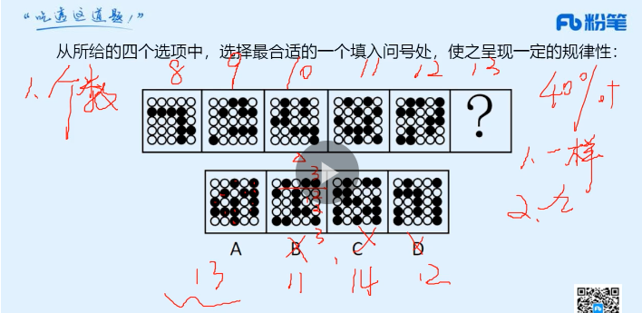


- 1（1. 注意有等腰元素，考对称轴的方向 2. 对称轴经过点）

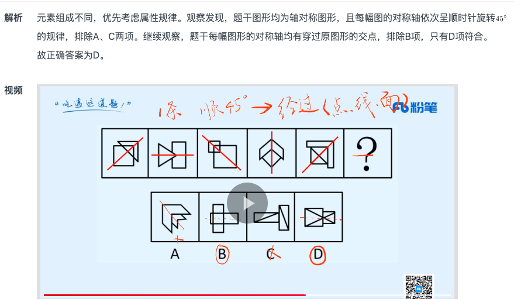


- 1（1. 注意数面的个数递增：1，2，3，4，5，6  2. 注意面的形状都不超过两个）


- 1（1. 看似正确的图形可能是错的，比如A，它少了个X。 B少了个0 ，D多了个【】）


```
题干要求选“转动”，可以包括旋转或者翻转（上下翻转或左右翻转，类似于“翻书页”）两种形式。

首先观察题干图形特征，包括汉字“发票专用章”、“（0）”、16个“X”，以及18个“0”，共四类元素。

观察选项：

A项：图形包含15个“X”，比原图少一个“X”,故不可能是题干图形旋转180度而来，排除；

B项：图形包含17个“0”，比原图少一个“0”,故不可能是题干图形上下翻转而来，排除；

C项：所有元素齐全，为题干图形左右翻转而来，当选；

D项：将原图中的“（0）”改成了“[0]”，故不可能通过原图转动得到，排除；

故正确答案为C。
```
- 1（这道题考的是立体图形的俯视图是一致的。）

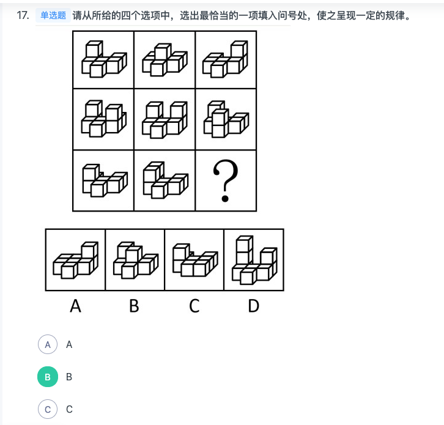


- 1（线的细化有：直线，曲线，平行线。考的是平行线组数）


- 1（1. 注意可以顺着方向画箭头，并且下方有一个小正方形，在右边。 如果把小正方形放在上面，那么应该在左边，所以排除B.顺着肩箭头方向它在右边。）

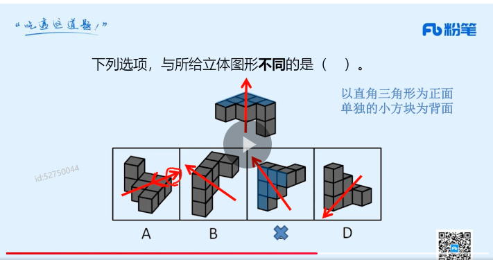


- 1（1. 曲线直线的规律除了可以看交点 2. 也可以看曲线和直线个数的差）

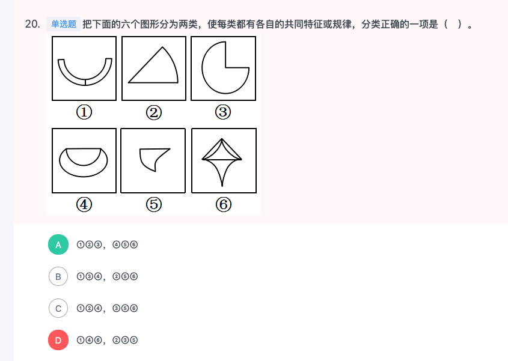


- 1（1. 数量有递减趋势 2. 每相邻两行只有一行不一致，其他都一致）


```
元素组成不同，每幅图都有小黑球，发现小黑球数量从图一到图五依次递减，分别为14、13、12、11、10，？处应选择一个9个黑球的，排除B、C两项。再次观察题干发现，图二和图一相比只有第一行颜色变动，其他行不变，图三和图二相比只有第二行颜色变动，其他行不变，图四和图三相比只有第三行颜色变动，其他行不变，图五和图四相比只有第四行颜色变动，其他行不变，因此问号处应该是第五行和前一幅图相比颜色变动，其他行不变。排除A项，只有D项符合。

故正确答案为D。
```
- 1（1. 通过数数排除选项 2. 找到最大的拼合。把3当作底子 3. D项目，2为底子但是，2，5拼不进去）


```
题干要求组成立方体方块，故小方块总数应该是27块。图1是9块，图2是7块，图3是12块，图4是6块，图5是8块，排除A、B两项；剩余C、D两项，都有图3，立方体每层有9块，图3已满足一层是9块，另一层有3块，故另外两图应满足某一层相加有6块。图2和图5均无法满足某一层相加有6块，而图1上层与图4下层相加为6块，即图1、3、4可组合成立方体方块（如下图所示）。


```
- 1（D选项找出两种情况，发现都不能拼合）


```

```
- 1（走投无路一笔画 并且属性都是直线组成）

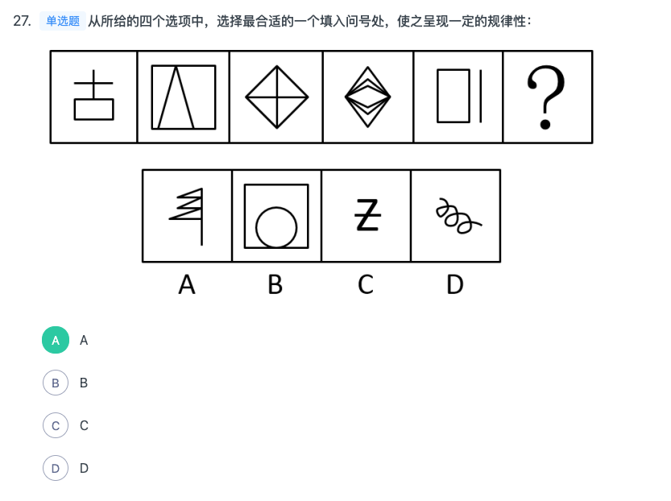

```
元素组成不同，且无明显属性规律，优先考虑数量规律。观察发现，第三幅图形为“田”字变形图，考虑笔画数。题干图形的笔画数依次为2、1、2、1、2，因此问号处图形的笔画数应为1。四个选项的笔画数分别为1、1、2、1，排除C项；再观察题干图形发现均为直线图形，因此排除B、D两项。

故正确答案为A。

视频


```
- 1（头尾两条线的状态是垂直还是平行）

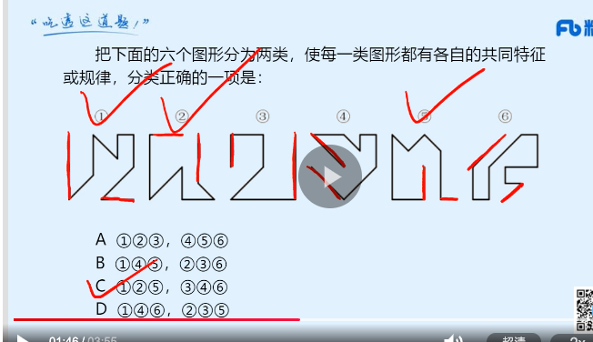


- 1


```

```
- 1


```

```
- 1


```

```
- 1


```

```
- 1


```

```
- 1


```

```
### 资料
|  错误类型（为什么错）   | 统计次数  |
|  ----  | ----  |
|   | 1 |
|  | 1 |
|   | 1 |

- 3


```

```