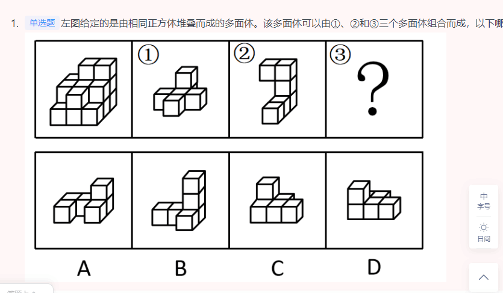
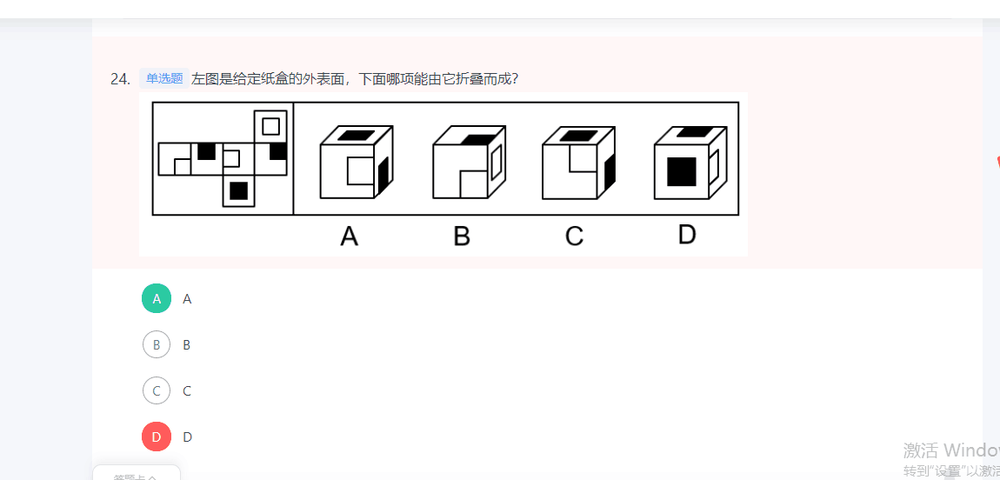
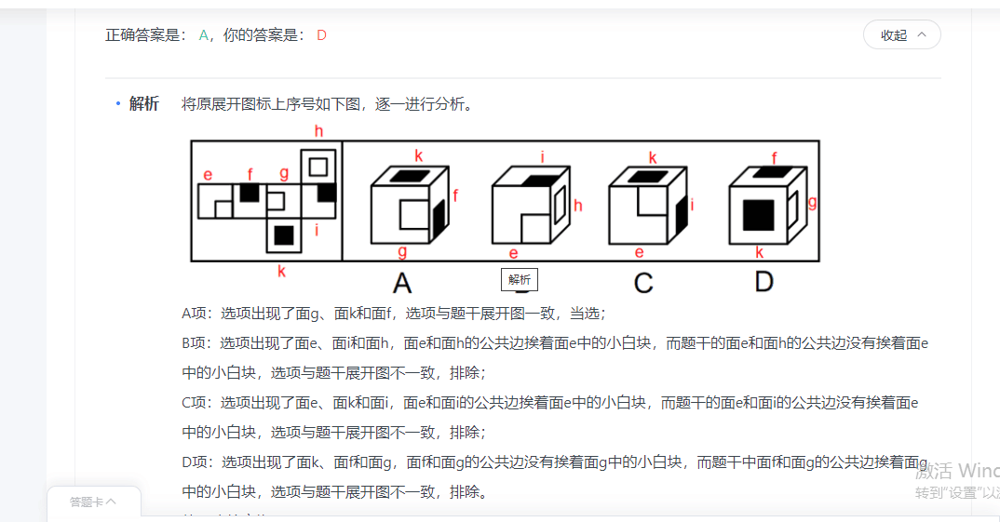
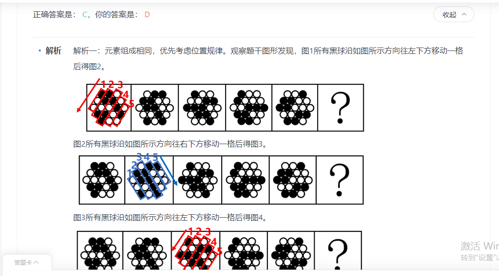

### 言语
|  错误类型（为什么错）   | 统计次数  |
|  ----  | ----  |
|   | 1 |
|  | 1 |
|   | 1 |

- 1


```
某大学团队研究了“干细胞间竞争”在小鼠尾部皮肤老化中的作用。结果表明，“干细胞间竞争”由胶原蛋白COL17A1驱动。他们发现，COL17A1的表达在不同干细胞间存在差异，COL17A1表达水平较高的干细胞会牢固地锚定于基底膜，且对称分裂，并将附近COL17A1表达水平较低的细胞排挤出去。这样的细胞间竞争有助于维持皮肤的整体结构和完整性。研究同时显示，COL17A1的表达会随年龄增长而下降，也会因为应激（如氧化或紫外线辐射）而下降。最终，所有干细胞中的COL17A1表达水平都下降，皮肤随之老化。

根据这段文字，下列说法正确的是：

A

年龄与性别因素都会影响COL17A1的表达水平

B

COL17A1表达水平较低的细胞在竞争中更具优势

C

完备的防晒措施能有效提高COL17A1的表达水平

D

COL17A1的表达水平与皮肤组织的老化程度负相关


正确答案是： D收起
解析
A项，“性别因素”文段未涉及，无中生有，排除；

B项，根据“COL17A1表达水平较高的干细胞会······并将附近COL17A1表达水平较低的细胞排挤出去”可知，COL17A1表达水平较高的细胞更具优势，与文意相悖，排除；

C项，根据“COL17A1的表达会······也会因为应激（如氧化或紫外线辐射）而下降”可知，文段只是介绍了紫外线辐射可以使COL17A1表达水平下降，但并未提到防晒可以提高COL17A1的表达水平，无中生有，排除；

D项，根据“所有干细胞中的COL17A1表达水平都下降，皮肤随之老化”可知，COL17A1的表达水平越低，皮肤组织的老化程度越高，即二者呈负相关，表述正确，当选。

故正确答案为D。

```
### 判断

```
1. 这种选项很接近，又不好区分的。可以用同构看。2.在BC里面选，回头看题目细节有对比择优.
```
|  错误类型（为什么错）   | 统计次数  |
|  ----  | ----  |
|  图推-立体拼合 | 1 |
|  单定义-同构| 2 |
|   单定义-对应| 2|
|   单定义-对应| 1 |

- 1


```
1. 找特殊图形拼接
```



- 2（1. 这种选项很接近，又不好区分的。可以用同构看。2. B项可以理解为干瞪眼。其他都有做实验或者观察什么特定情况下的运动。3. 先排除A D,在BC里面选，回头看题目细节有对比择优，B好像是比C偏逻辑更多一些。）


```
经验假说是根据观察或实验的种种结果及已有的科学原理对事物现象及其规律所作出的推测性解释；而理论假说则是通过直觉、想象、抽象等思维过程对事物现象及其规律所作出的推测性解释。

根据上述定义，下列属于理论假说的是：

A

伽利略通过多次斜面实验，提出了惯性概念

B

哥德巴赫通过对数字规律的考察，提出了哥德巴赫猜想

C

贝塞尔发现天狼星的运动具有周期性偏差，提出了天狼星有伴星的猜测

D

哥白尼在不同的时间和地点观察行星，发现每颗行星运行情况都不相同，提出了日心说


正确答案是： B，你的答案是： D收起
解析
第一步：找出定义关键词。

经验假说：“根据观察或实验的种种结果及已有的科学原理”；

理论假说：“通过直觉、想象、抽象等思维过程”。

第二步：逐一分析选项。

A项：伽利略根据多次斜面实验的结果及已有的与重力相关的科学原理，提出了惯性概念，符合“根据观察或实验的种种结果及已有的科学原理”，符合经验假说，不符合理论假说，排除；

B项：哥德巴赫考察数字规律提出猜想，是一种抽象的思维过程，符合“通过直觉、想象、抽象等思维过程”，符合理论假说，当选；

C项：贝塞尔根据观察到的天狼星的运动及已有的与伴星相关的科学原理，提出了天狼星有伴星的猜测，符合“根据观察或实验的种种结果及已有的科学原理”，符合经验假说，不符合理论假说，排除；

D项：哥白尼根据在不同的时间和地点观察到的行星运行情况，结合已有的天体相关科学原理提出日心说，符合“根据观察或实验的种种结果及已有的科学原理”，符合经验假说，不符合理论假说，排除。

故正确答案为B。
```
- 2（1. 找出单定义：“在突发事件中”、“身处不同地区民众所呈现的不同心理状态”、“越靠近危机事件中心区域，人们对事件的风险认知和负性情绪越高”。2. A项不满足越靠近危机事件中心区域。）


```
涟漪效应是指在突发事件中，身处不同地区民众所呈现的不同心理状态，越靠近危机事件中心区域，人们对事件的风险认知和负性情绪越高。

根据上述定义，下列符合涟漪效应的是：

A

台风外围空气旋转剧烈，而处于中心的风力流动反而相对微弱，因此，灾民负性情绪从“暴风眼”区域向外逐渐增强

B

地震带上的重灾区民众在风险认知、心理健康水平及应对行为上都显著高于非重灾区民众

C

距离垃圾焚烧厂、核反应堆越近的民众，其风险认知程度越高，因而其忧虑感越强

D

距离大规模传染疫情爆发的时间越短，民众的焦虑情绪及恐慌程度就越高


正确答案是： B，你的答案是： A收起
解析
第一步：找出定义关键词。

“在突发事件中”、“身处不同地区民众所呈现的不同心理状态”、“越靠近危机事件中心区域，人们对事件的风险认知和负性情绪越高”。

第二步：逐一分析选项。

A项：灾民的负性情绪是从“暴风眼”区域向外逐渐增强的，不符合“越靠近危机事件中心区域，人们对事件的风险认知和负性情绪越高”，不符合定义，排除；

B项：地震符合“在突发事件中”，地震带上的重灾区民众在心理健康水平及应对行为上都显著高于非重灾区民众，符合“身处不同地区民众所呈现的不同心理状态”，虽未提及“负性情绪”，但也符合“越靠近危机事件中心区域，人们对事件的风险认知越高”，符合定义，当选；

C项：垃圾焚烧厂、核反应堆，不符合“在突发事件中”，不符合定义，排除；

D项：距离大规模传染疫情爆发的时间越短，是所有人都会面临的，没有体现身处不同地区，不符合“身处不同地区民众所呈现的不同心理状态”，不符合定义，排除。

故正确答案为B。
```
- 3（又是没有对应到定义：“以‘线上申请、线下服务’的方式”、“为老弱病残孕等行动不便的人上门提供慢病管理、康复护理或专项护理等延续性的便捷服务”。d项没有线上预约）


```
网约护士服务：指经过官方许可，以“线上申请、线下服务”的方式，为老弱病残孕等行动不便的人上门提供慢病管理、康复护理或专项护理等延续性的便捷服务。

下列不属于网约护士服务的是：

A

谭女士因治疗原因留置了PICC管，每周需要更换一次贴膜，家住得比较远，每次去医院换膜都要耗费大量时间。家人在线下单预约后，医院护士准备好护理用品，到谭女士家中为她更换PICC管专用贴膜，同时对其家人进行了护理指导

B

颜奶奶在医院进行了胆总管探查术，出院后需要定期进行T管维护，家属利用小程序预购了医院护理服务。接到订单后，肝胆外科护士上门为颜奶奶进行T管冲洗。家属感激地说：“护士上门服务真方便，以后再也不用发愁去医院了”

C

某民营医院最近推出了一项新的便民服务措施，慢病患者下载“医者仁心”术后护理APP，进入平台选择自己所需要的服务项目，只要详细填写服务需求，上传就医证明，完成预约后，就可以等待护士上门服务

D

刘爷爷平时独居在家，一天因高血压晕倒，被邻居及时送到医院才脱离危险。在外工作的子女急忙回家到医院为他申请定期看护服务，护士会在每次服务后将他的健康报告上传到系统中，以便子女了解刘爷爷的健康情况


正确答案是： D，你的答案是： C收起
解析
第一步：找出定义关键词。

“以‘线上申请、线下服务’的方式”、“为老弱病残孕等行动不便的人上门提供慢病管理、康复护理或专项护理等延续性的便捷服务”。

第二步：逐一分析选项。

A项：家人在线下单预约，符合“以‘线上申请、线下服务’的方式”，护士到谭女士家中为她更换PICC管专用贴膜，符合“为老弱病残孕等行动不便的人上门提供慢病管理、康复护理或专项护理等延续性的便捷服务”，符合定义，排除；

B项：家属利用小程序预购医院护理服务，符合“以‘线上申请、线下服务’的方式”，护士上门为颜奶奶进行T管冲洗，符合“为老弱病残孕等行动不便的人上门提供慢病管理、康复护理或专项护理等延续性的便捷服务”，符合定义，排除；

C项：慢病患者通过APP选择服务项目，符合“以‘线上申请、线下服务’的方式”，之后护士会上门服务，符合“为老弱病残孕等行动不便的人上门提供慢病管理、康复护理或专项护理等延续性的便捷服务”，符合定义，排除；

D项：刘爷爷的子女到“医院”申请定期看护服务，不符合“线上申请”，不符合定义，当选。

本题为选非题，故正确答案为D。
```
- 4(1. 对比择优，B项目明确提到了信用，还有多部门。但是D没有提到信用。直接是商家做了坏事。跟信用关系并不直接。)


```
信用联动奖惩：指有关部门或组织在法定范围内根据企业、个人信用记录，采取部门联动、社会协同等方式，对其依法联合实施奖励或惩戒的行为。

下列属于信用联动奖惩的是：

A

某市设立了无偿献血“五星级志愿者”、志愿服务终身荣誉奖，获奖市民可以免除市管公园门票，免费乘坐市内公交车，享受市属公立医院诊察费半价优惠

B

餐馆老板李先生在当地政务服务网提交了经营性临时占道申请，由于其信用等级为A级，可以享受审批绿色通道，第二天就收到了城管和其他相关部门的许可短信

C

阮先生在承租的公租房里开设棋牌室，违背了申请公租房时的诚信承诺，被住房保障部门扣罚了住房保证金，并纳入五年内不得申请公租房的名单。阮先生对自己的失信行为深感后悔，保证以后一定做一个诚信公民

D

某区政府接到媒体举报，辖区内一超市以次充好，将普通猪肉当黑猪肉售卖，区政府立即召集市场监管、税务等职能部门赶到超市，现场联合办公，对相关责任人进行查处


正确答案是： B，你的答案是： D收起
解析
第一步：找出定义关键词。

“根据企业、个人信用记录”、“部门联动、社会协同”、“依法联合实施奖励或惩戒”。

第二步：逐一分析选项。

A项：根据无偿献血的志愿行为来实施奖励，不符合“根据企业、个人信用记录”，不符合定义，排除； 

B项：由于李先生的信用等级为A级，符合“根据企业、个人信用记录”，可以享受审批绿色通道，且收到城管和其他相关部门的许可短信，符合“部门联动、社会协同”，也符合“依法联合实施奖励或惩戒”，符合定义，当选；

C项：阮先生在公租房开设棋牌室是违背了诚信承诺，符合“根据企业、个人信用记录”，扣罚住房保证金、纳入五年内不得申请公租房的名单均为惩戒手段，符合“依法联合实施奖励或惩戒”，但该行为均由住房保障部门实施，未提及其他有关部门，不符合“部门联动、社会协同”，不符合定义，排除；

D项：市场监管、税务等职能部门联合办公，符合“部门联动、社会协同”，但以次充好，将普通猪肉当黑猪肉售卖，属于不诚信经营的行为，并未提及商家的信用记录，不符合“根据企业、个人信用记录”，不符合定义，排除。

故正确答案为B。
```
- 5（走投无路一笔画）


- 6(1.全面调查：“一定范围内的情况普查”；

非全面调查：“从总体中抽取一部分对象进行情况调查”；

抽样调查：“根据随机原则选择样本”；

典型调查：“有意识选取若干样本”。 2. 注意全面调查指的是一定范围内的情况普查，所以B是对的，对省内1~3年级的全体学生进行体育活动时间的调查。3.而C。 进行学生就业情况调查，只选了规模较大的前30所医学院校。这是非全面调查里面的典型调查)


```

按调查范围来看，可将调查分为全面调查和非全面调查。全面调查指的是一定范围内的情况普查；非全面调查是指从总体中抽取一部分对象进行情况调查，又可分为：根据随机原则选择样本的抽样调查和有意识选取若干样本进行的典型调查。

根据上述定义，下列说法正确的是：

A

对某市幼儿园所有儿童进行口腔卫生检查，这属于非全面调查

B

对省内1~3年级的全体学生进行体育活动时间的调查，这属于非全面调查

C

规模较大的前30所医学院校进行学生就业情况调查，这属于典型调查

D

对某市中考数学成绩最好的几所学校进行调查，总结相关经验，这属于抽样调查


正确答案是： C，你的答案是： B收起
解析
第一步：找出定义关键词。

全面调查：“一定范围内的情况普查”；

非全面调查：“从总体中抽取一部分对象进行情况调查”；

抽样调查：“根据随机原则选择样本”；

典型调查：“有意识选取若干样本”。

第二步：逐一分析选项。

A项：对某市幼儿园所有儿童进行口腔卫生检查，符合“一定范围内的情况普查”，符合“全面调查”的定义，不符合“非全面调查”的定义，排除；

B项：对省内1~3年级的全体学生进行的调查，符合“一定范围内的情况普查”，符合“全面调查”的定义，不符合“非全面调查”的定义，排除；

C项：在医学院校里选取了规模较大的前30所院校进行调查，不是随机选择，是有意识地选取一部分进行调查，符合“有意识选取若干样本”，符合“典型调查”的定义，当选；

D项：对某市中考数学成绩最好的几所学校进行调查，不是随机选择，是有意识地选取一部分进行调查，符合“有意识选取若干样本”，符合“典型调查”的定义，不符合“抽样调查”的定义，排除。

故正确答案为C。
```
- 7(1. 看清楚细节：年末员工人数，是某个时刻，而其他的都是2016年内，1-5月份内平均，第一季度平均。更不能算作时刻。2.看清楚定义 ：时期数列：每个指标都表示社会经济现象在一定时期内发展过程的总量。时点数列：每个指标都表示社会经济现象在某一时点（时刻）上的数量)


```
正确答案是： B，你的答案是： C收起
解析
第一步：找出定义关键词。

总量指标动态数列：“将反映某种社会经济现象的一系列总量指标按时间先后顺序排列”；

时期数列：“每个指标都表示社会经济现象在一定时期内发展过程的总量”、“各指标值可以相加”、“指标数值的大小与时期长短有直接关系”；

时点数列：“每个指标都表示社会经济现象在某一时点（时刻）上的数量”、“各指标值不能相加”、“指标数值大小和‘时点间隔’长短没有直接关系，每个指标通常都是定期（间断）登记取得的”。

第二步：逐一分析选项。

A项：选项中每项指标表示的是每一年的税收情况，属于一定时期内的总量，符合“每个指标都表示社会经济现象在一定时期内发展过程的总量”，符合“时期数列”定义，不符合“时点数列”定义，排除；

B项：选项中每项指标表示的是每一年的年末员工人数，“年末”是个时点，符合“每个指标都表示社会经济现象在某一时点（时刻）上的数量”，指标是年末的人数，不能相加，符合“各指标值不能相加”，且和时间长短没有直接关系，统计每年的年末数据，说明其是间断取得的，符合“指标数值大小和‘时点间隔’长短没有直接关系，每个指标通常都是定期（间断）登记取得的”，符合“时点数列”定义，当选； 

C项：选项中每项指标表示的是每月的平均工资，是一整月的工资平均值，不是某一时点（时刻）上的数量，不符合“每个指标都表示社会经济现象在某一时点（时刻）上的数量”，不符合“时点数列”定义，排除；

D项：选项中每项指标表示的是每一季度的生产产量，属于一定时期内的总量，符合“每个指标都表示社会经济现象在一定时期内发展过程的总量”，符合“时期数列”定义，不符合“时点数列”定义，排除。

故正确答案为B。
```
- 8（1. 标出六个面序号 2. 找出选项的三个面序号 3. 看特定的边有没有错）




- 9（1. 元素组成相同首先考虑位置 。2.所有的黑球向左下方平移一格。再向右下方平移一格）




- 10（1.要找到B选项的对应关系，排除。B项：“法律”是判定是否“腐败”的依据，二者为对应关系；“癌症”是“疾病”的一种，二者为种属关系，前后逻辑关系不一致，排除； 2. 在“政治”中可能存在“腐败”，二者为对应关系；在“身体”中可能存在“癌症”，二者为对应关系，前后逻辑关系一致，当选；）


```
腐败 对于 （    ） 相当于 癌症 对于 （    ）

A

罪恶；风险

B

法律；疾病

C

政治；身体

D

铲除；病灶


正确答案是： C，你的答案是： B收起
解析
逐一代入选项。

A项：“腐败”是指制度、组织、机构、措施等混乱、黑暗；“罪恶”是指严重犯罪或作恶的行为，“腐败”是一种“罪恶”，二者为种属关系；“癌症”会对生命构成“风险”，二者为对应关系，前后逻辑关系不一致，排除；

B项：“法律”是判定是否“腐败”的依据，二者为对应关系；“癌症”是“疾病”的一种，二者为种属关系，前后逻辑关系不一致，排除；

C项：在“政治”中可能存在“腐败”，二者为对应关系；在“身体”中可能存在“癌症”，二者为对应关系，前后逻辑关系一致，当选；

D项：“铲除腐败”，二者为动宾结构；“病灶”是指机体上发生病变的部分，而“癌症”是指生有恶性肿瘤的病，二者不是动宾关系，前后逻辑关系不一致，排除。

故正确答案为C。
```
- 11（1. 选不属于。看错题目2.遂将内部报账相关事项交由出纳代为处理没有层级关系，但是其他选项有层级关系。 ）


```

授权是指领导者把部分处理问题的权限委派给某些下属的行为。

下列不属于授权的是：

A

某公司财务专员因事外出，遂将内部报账相关事项交由出纳代为处理

B

某公司为优化内部审批流程，部分需要董事长签字的文件由其秘书盖章予以处理

C

某公司总经理因病住院期间，公司各项工作由常务副总经理代为主持

D

某公司员工在出差期间，代表公司与客户签订了一项订单合同


正确答案是： A，你的答案是： B收起
解析
第一步：找出定义关键词。

“领导者把部分处理问题的权限委派给某些下属”。

第二步：逐一分析选项。

A项：财务专员将内部报账相关事项交给出纳，财务泛指财务活动和财务关系，财务专员不是出纳的领导，不符合“领导者把部分处理问题的权限委派给某些下属”，不符合定义，当选； 

B项：董事长将需要董事长签字的文件交给秘书，董事长是秘书的领导，符合“领导者把部分处理问题的权限委派给某些下属”，符合定义，排除；

C项：总经理将各项工作交给常务副总经理，总经理是常务副总经理的领导，符合“领导者把部分处理问题的权限委派给某些下属”，符合定义，排除；

D项：员工代表公司签订合同，签订合同的权利一般是公司领导的，所以可能是领导把代表公司签订合同的权利委派给了该员工，符合“领导者把部分处理问题的权限委派给某些下属”，符合定义，排除。

本题为选非题，故正确答案为A。
```
- 12（这道题又是看错题目）


```
战争中的随机是指战争主体随着战争情况和条件的改变，因时因地灵活机智地把握和应对已出现的有利于或不利于军事行动的时机。

根据上述定义，下列没有体现战争中的随机的是：

A

得时无怠，时不再来

B

知己知彼，百战不殆

C

待其来者而正之，因时之所宜而定之

D

兵无常势，水无常形，能因敌变化而取胜者，谓之神


正确答案是： B，你的答案是： C收起
解析
第一步：找出定义关键词。

“战争主体随着战争情况和条件的改变”、“因时因地灵活机智地把握和应对已出现的时机”

第二步：逐一分析选项。

A项：意思是“得到了机遇就不要懈怠，机遇一旦错过，就不会再度重来。”该项指出能否遇到机遇是随机的，要灵活地把握机遇，体现了随机性，符合“战争主体随着战争情况和条件的改变”、“因时因地灵活机智地把握和应对已出现的时机”，符合定义，排除；

B项：意思是“如果对敌我双方的情况都能了解透彻，打多少次仗都不会失败。”该项只说明了常胜之道在于了解自身和对方，未体现对于时机的灵活应对，不符合“因时因地灵活机智地把握和应对已出现的时机”，不符合定义，当选；

C项：意思是“等待时机到来时就把不利于自己的局面扭转过来，根据对自己最适宜的情况把已扭转的局面予以巩固。”该项指出要灵活地利用时机来扭转局面，体现了随机性，符合“战争主体随着战争情况和条件的改变”、“因时因地灵活机智地把握和应对已出现的时机”，符合定义，排除；

D项：意思是“用兵作战没有固定不变的方式，如同水流没有固定的形状，能够依据敌情的变化而取胜，可称得上用兵如神了”。该项指出需要根据敌情的变化来布置战术，体现了随机性，符合“战争主体随着战争情况和条件的改变”、“因时因地灵活机智地把握和应对已出现的时机”，符合定义，排除。

本题为选非题，故正确答案为B。
```
- 13（中间有个镂空的小圆。所以应该是虚线）


```
正确答案是： C，你的答案是： A收起
解析
本题考查俯视图。需要对立体图形从上往下看。从上往下看立体图形的最后一排只有三个面，排除D项。从上往下看立体图形的中间一排只有一个面，排除B项。比较A、C两项，均有中轴的虚线，但是C项比A项多两条短虚线，观察题干发现立体图形中间有中空的小圆，从上往下看看不到圆的轮廓，故应出现两条短虚线。

故正确答案为C。
```
- 14（1.注意A是否定论据 2.B否定论点,论点是书中人物刻画帮助他人理解别人。而B否定了名著里面有人物刻画而是说情节描述更多。 ）


```
某研究机构通过的一项实验证明喜欢阅读文学名著的人理解他人的能力更强。该实验让参与者阅读古典名著、通俗小说和纪实文学。然后进行一项“从眼睛中读懂别人心思"的测试。结果发现，读名著的参与者更容易读懂别人的感情。研究者认为，文学名著更注重人物角色的刻画而不是情节的描述，从而要求读者对人物角色进行细致思考和推理，因此文学名著有助于人们更好地感知他人。

以下各项如果为真，最能削弱上述结论的是：

A

“从眼睛中读懂别人心思”测试本身的设计缺乏科学性

B

相较于人物角色的刻画，许多文学名著更注重情节描述

C

许多善解人意的人具有理工科背景，很少阅读文学名著

D

另有研究证明，理解他人能力强的人更喜欢读科技著作


正确答案是： B，你的答案是： C收起
解析
第一步：找出论点和论据。

论点：文学名著更注重人物角色的刻画而不是情节的描述，从而要求读者对人物角色进行细致思考和推理，因此文学名著有助于人们更好地感知他人。

论据：读名著的参与者更容易读懂别人的感情。

论点和论据都提到了文学名著有助于人们更好地理解、感知他人，所以讨论的话题是一致的，削弱优先考虑否论点。

第二步：逐一分析选项。

A项：提到测试本身缺少科学性，是对题干论据的削弱，可以削弱，保留；

B项：论点说的是文学名著注重人物角色刻画而非情节描述，而该项指出许多文学名著更注重情节描述而非角色刻画，即文学名著无法帮助感知他人，举例子否定题干论点，可以削弱，保留；

C项：许多善解人意的人很少阅读文学名著无法说明文学名著能否帮助人们更好地感知他人，无关项，无法削弱，排除；

D项：理解他人能力强的人更喜欢读科技著作，说的是能力强后喜欢做什么，而论点讨论的是文学名著对于感知他人的作用，话题不一致，无关项，无法削弱，排除。

比较A、B两项，A项是否定题干论据，B项是举例子否定论点，B项的力度更强。

故正确答案为B。
```
- 15（1. 这种题不确定把握轻重的话，可以对比择优。 2. 比如同构。其他都是丧失意志都有体现，但是B没有说道意志这一方面，只有丧失主心骨。）


```

震慑是指利用各种手段造成足够强大的胁迫和强制力量，从而使对手慑于巨大的压力而丧失继续抵抗意志的一种军事战略形式。

根据上述定义，下列军事行动不属于震慑的是：

A

运用大规模毁灭性武器打击敌国重要设施，数天内即瓦解敌国的抵抗意志

B

对敌国主战派进行有选择的、迅速的斩首行动，使敌国主战派丧失主心骨

C

长时间使用经济禁运、骚扰等恶化敌人生存环境的手段胁迫使敌人崩溃

D

通过欺骗、误导、散布假情报等方式，使敌人相信自己不堪一击从而放弃抵抗


正确答案是： B，你的答案是： C收起
解析
第一步：找出定义关键词。

“利用各种手段造成足够强大的胁迫和强制力量”、“使对手慑于巨大的压力而丧失继续抵抗意志”。

第二步：逐一分析选项。

A项：运用大规模毁灭性武器打击敌国重要设施，符合“利用各种手段造成足够强大的胁迫和强制力量”，数天内即瓦解敌国的抵抗意志，也符合“使对手慑于巨大的压力而丧失继续抵抗意志”，符合定义，排除；

B项：对敌国主战派进行有选择的、迅速的斩首行动，符合“利用各种手段造成足够强大的胁迫和强制力量”，使敌国主战派丧失主心骨，不等同于丧失抵抗意志，不符合“使对手慑于巨大的压力而丧失继续抵抗意志”，不符合定义，当选； 

C项：长时间使用经济禁运、骚扰等恶化敌人生存环境，符合“利用各种手段造成足够强大的胁迫和强制力量”，胁迫使敌人崩溃，也符合“使对手慑于巨大的压力而丧失继续抵抗意志”，符合定义，排除； 

D项：欺骗、误导、散布假情报等方式，使敌人相信自己不堪一击从而放弃抵抗，符合“利用各种手段造成足够强大的胁迫和强制力量”，也符合“使对手慑于巨大的压力而丧失继续抵抗意志”，符合定义，排除。

本题为选非题，故正确答案为B。

备注：通过查询相关文献发现，其实ABCD项均在原文有所体现，但是出题人明显改动了B项的斩首行动，将原文中的目的进行了删减，从而使B项跟其他三项相比，关键词并不完全对应，本题问“不属于”，故小粉笔更倾向把答案给到B项。
```
- 16


```

```
- 17


```

```
- 18


```

```
### 资料
|  错误类型（为什么错）   | 统计次数  |
|  ----  | ----  |
|   | 1 |
|  | 1 |
|   | 1 |

- 3


```

```