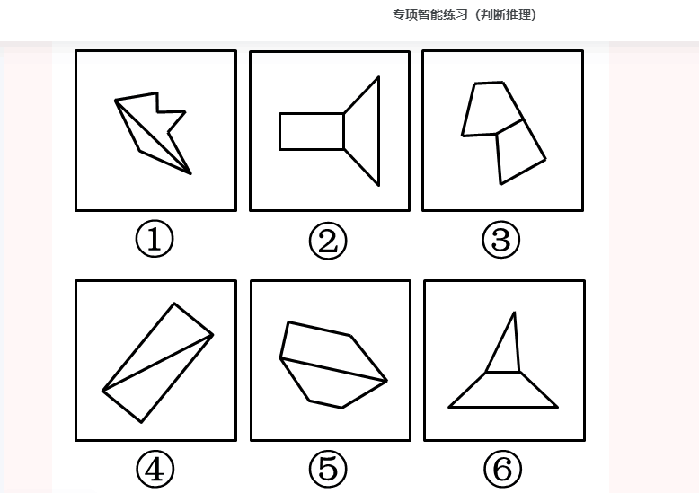

###  共40道，答对25道，正确率63%


- 1


```

阳春白雪 对于 （    ） 相当于 （    ） 对于 度日如年

A

曲高和寡；浮光掠影

B

余音绕梁；潜移默化

C

靡靡之音；如隔三秋

D

下里巴人；白驹过隙


正确答案是： D，你的答案是： C


阳春白雪”比喻高深的不通俗的文学艺术
“曲高和寡”原指知音难得，现比喻言论或作品不通俗，能了解的人很少，二者为近义关系
浮光掠影”比喻观察不细致，学习不深入，印象不深刻
靡靡之音”是指使人萎靡不振的音乐
如隔三秋”形容情人之间思慕殷切或是良师益友之间的思念之情
度日如年”是指过一天像过一年那样长，形容日子很不好过
下里巴人”比喻通俗的文学艺术，二者为反义关系

C项：“阳春白雪”比喻高深的不通俗的文学艺术，“靡靡之音”是指使人萎靡不振的音乐，比如使人颓废的、低级趣味的乐曲，二者无明显逻辑关系；“如隔三秋”形容情人之间思慕殷切或是良师益友之间的思念之情，“度日如年”是指过一天像过一年那样长，形容日子很不好过，二者无明显逻辑关系，前后逻辑关系不一致，排除；

D项：“阳春白雪”比喻高深的不通俗的文学艺术，“下里巴人”比喻通俗的文学艺术，二者为反义关系；“白驹过隙”形容时间过得极快，“度日如年”是指过一天像过一年那样长，形容日子很不好过，二者为反义关系，前后逻辑关系一致，当选。

故正确答案为D。
```

- 2(时间关系)


```
创作：印刷：发行

A

撒网：钓鱼：捕捞

B

生产：研发：采购

C

播种：开花：结果

D

拆除：安装：维修


正确答案是： C，你的答案是： D收起
解析
第一步：判断题干词语间逻辑关系。

先创作，再印刷，最后发行，三者是时间先后顺序的对应关系。

第二步：判断选项词语间逻辑关系。

A项：先撒网，再捕捞，二者和钓鱼没有明显的时间先后顺序，与题干逻辑关系不一致，排除；

B项：先研发，再生产，最后采购，研发应在生产之前发生，与题干逻辑关系不一致，排除；

C项：先播种，再开花，最后结果，三者是时间先后顺序的对应关系，与题干逻辑关系一致，当选；

D项：先安装，再拆除，安装应在拆除之前发生，与题干逻辑关系不一致，排除。

故正确答案为C。
```
- 3（注意关键词自己）


```
人们常常系统地高估自己对事件的控制程度或影响力，而低估机会、运气等不可控制因素在事件发展过程及其结果上所扮演的角色，这一现象被称为控制错觉。

根据上述定义，下列没有体现控制错觉的是：

A

人们想用骰子掷出“双6”时会在心中默念，用力揉捏骰子，相信这样做就会如愿

B

一些股民往往借助几个简单的因素预测大盘指数，结果常常是谬以千里

C

某企业经理认为今年当地举办的运动会对企业发展非常有利，预测今年营业额会有所上涨

D

景区某摆渡车驾驶员常年走山路，认为自己路况熟、技术好，所以在山路上开得非常快


正确答案是： C，你的答案是： A收起
解析
第一步：找出定义关键词。

“高估自己对事件的控制程度或影响力”、“低估机会、运气等不可控制因素在事件发展过程及其结果上所扮演的角色”。

第二步：逐一分析选项。

A项：掷骰子是随机事件，人们心中默念并用力揉捏骰子，相信这样做会掷出“双6”，符合“高估自己对事件的控制程度或影响力”，也低估了不可控因素的作用，符合定义，排除；

B项：一些股民仅借助“几个简单的因素”就认为自己能够预测大盘指数，符合“高估自己对事件的控制程度或影响力”，符合定义，排除；

C项：某企业经理认为运动会对企业发展有利，能够增加营业额，预测的是运动会对企业的影响，不符合“高估自己对事件的控制程度或影响力”，不符合定义，当选；

D项：某摆渡车驾驶员认为自己路况熟、技术好而在山路上开快车，体现了此人因为“高估自己对事件的控制程度或影响力”而进行了不安全的驾驶行为，符合定义，排除。

本题为选非题，故正确答案为C。
```
- 4（这次考得是相切线得长短）



```
特殊考点——考查图形内部组成特征。每组图形都是由两个图形连接而成，所以观察每组图形的内部特征。①④⑤中两个图形的交线是两个元素最长的线段，②③⑥中两个图形的交线是两个元素最短的线段。

故正确答案为D。
```
- 5（判断有时候会考多种关系。比如，同时考种数，并列，还加上二级辨析材料不同。）


```
檀香：麝香：香料

A

木材：钢筋：建材

B

日光：月光：光明

C

薯条：粉条：食物

D

鲸鱼：鲍鱼：海鱼


正确答案是： A，你的答案是： C收起
解析
第一步：判断题干词语间逻辑关系。

檀香取于檀香科乔木檀香树的木质心材，属于香料的一种；麝香为鹿科动物麝的雄性腺囊中的分泌物干燥而成，是一种高级香料；二者为并列关系且原料不同，同时二者均与香料构成种属关系。

第二步：判断选项词语间逻辑关系。

A项：木材是建材的一种，钢筋是建材的一种，二者为并列关系且原料不同，同时二者均与建材构成种属关系，与题干逻辑关系一致，当选；

B项：日光与月光都是光的一种，但不是光明的一种，二者与光明不构成种属关系，与题干逻辑关系不一致，排除；

C项：薯条与粉条一般都是由土豆作为原材料加工而成的食物，二者为并列关系但原料可以相同，与题干逻辑关系不一致，排除；

D项：鲸鱼属于哺乳动物，不属于鱼类，与题干逻辑关系不一致，排除。

故正确答案为A。
```
- 6


```

```

