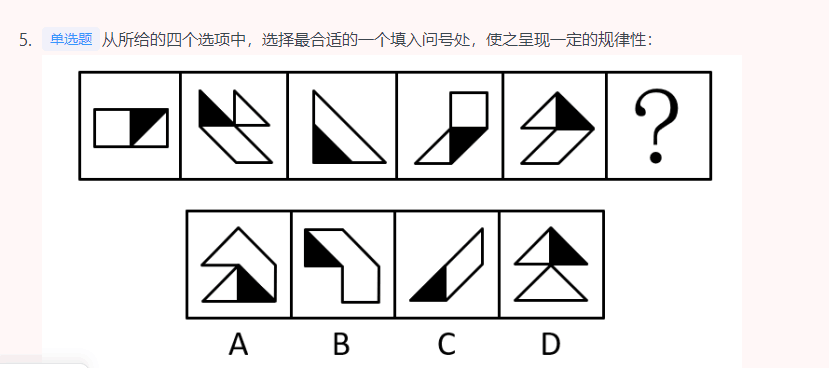
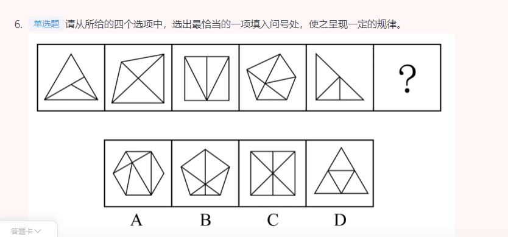
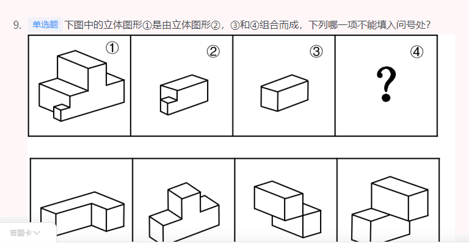
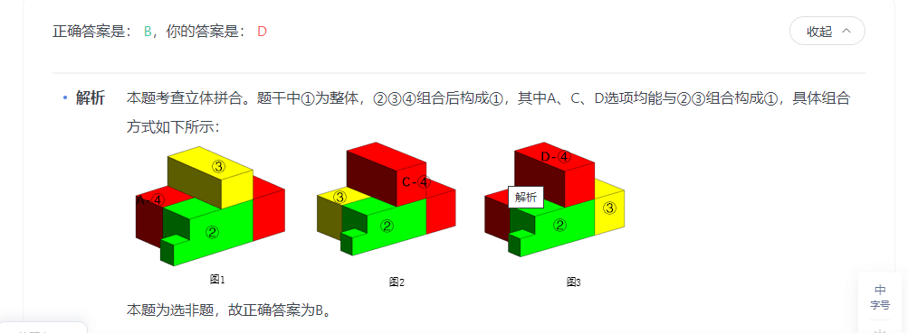
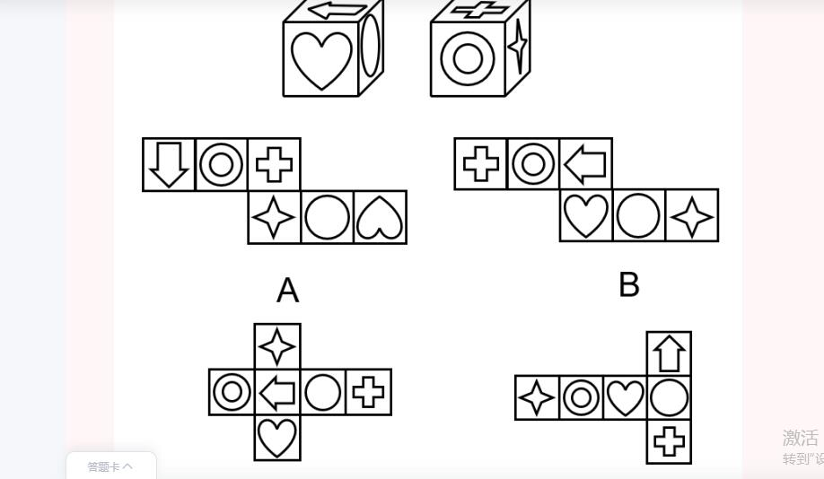

- 1


```
每两行图形相加减

方块+星星 -》 星星
星星+方块 -》星星
方块+方块-》方块
星星+星星 -》 方块

```

- 2


```
元素组成不同，无明显属性规律，考虑数量规律。题干每幅图均存在线线相交，优先考虑数交点，分别为6、8、6、6、13、？，并无明显规律。题干每幅图都有圆与直线相交叉，考虑曲直交点，分别是2、4、2、3、6、？，并无明显规律。再次观察发现每幅图都有圆，圆分内外，即可以分别数圆内外的交点，圆内部的交点分别为0、1、2、3、4、？，故？处应选择一个圆内部有5个交点的图形，A项是4个，B项是2个，C项是5个，D项是8个，只有C项符合。

故正确答案为C。
```
- 3



```
图形元素组成不同，考虑数量规律。每个图形中均存在一个黑色三角形和白色区域，并且题干所有图形中白色区域面积均为黑色区域面积的3倍，如下图所示，只有D项符合。

```
- 4



```
元素组成不同，无明显属性规律，考虑数量规律。观察发现，题干中的图形封闭区域明显，优先考虑数面，题干图形的面数量依次为3、4、4、5、3、？，单看无规律。再次观察发现，题干图形的外框均为多边形，且出现较多三角形、四边形，考虑外框直线数。外框直线数量依次为3、4、4、5、3、？。可知题干的规律为面数量外框直线数量，只有A项符合规律，当选。

故正确答案为A。
```
- 5



```
B
```

- 6




