**被安利了。白白酱讲的图推**

|  错误类型   | 统计次数  |
|  ----  | ----  |
| 属性-曲直性：曲线图形和直线图形分别位于上下  | 1 |
| 做题态度不对，属性以及点，线，面，素都要算算有没有规律。这道题就是面的数量递增的题型 | 1 |
| 黑白运算也有复合考点，比如先黑白运算后，再旋转 | 1 |
| 空间几何-首先用相对面，相邻边排除，再用特殊指向排除，最后画面法 | 1 |
|汉字可能会考汉字笔画数  | 1 |
| 部分数-虽然四个图都是曲线直线，但是第五个图出现了生活化的图形M,可以考虑部分数 | 1 |
| 部分数-出现了生活化图形气泡框，可以考虑部分数 | 1 |
| 5*5宫格黑白，也有可能考属性。而且属性不是考的整体的对称性，而是白色小球的对称性。  | 1 |
| 5*5宫格黑白，也有可能考笔画。而且笔画不是考的整体的对称性，而是黑色小球连成线，成一笔画。  | 1 |
| 样式-求同存异（可能不是普通的那种图形相求同存异，也有可能是面的求同存异）  | 1 |
| 线-曲直交点是曲线数的两倍  | 1 |
| 走投无路一笔画  | 1 |
| 所有方式都要试试，比如直角的数量，点的个数递增  | 2 |
| 空间几何-如果找四个图形中，不一样的。直接找相同的面画面法找  | 1 |
| 属性-对称性，可能考对称轴经过端点和不经过端点的图形  | 1 |
| 属性-对称性，可能考5*5宫格里面黑白图形，白色图形，有3个图为轴对称，有3个图为中心对称  | 1 |
| 面（1.面都是由两个三角形和一个四边形组成）  | 1 |
| 空间几何-几块立体图形拼接，用排除法，左下角那块拼不出来  | 1 |
| 空间几何-靠想象+排除法  | 3 |
| 面-有时候考面的个数。而不是对称性，因为有些对称性不规范不符合。  | 1 |
| 样式-黑白运算（1.可能是其他图形不是黑白图形 2.可能是相邻相加）  | 1 |
| 样式-黑白运算（1.可能是其他图形不是黑白图形 2.可能是相邻相加）  | 1 |


###  共15道，答对13道，正确率87%，用时36分钟
- 01


```
本题为分组分类题目。观察已知图形每个图形中都有小黑点，考虑功能元素。功能元素具有标记作用。观察小黑点在图形中的位置发现：①③⑤图形中小黑点在线上，②④⑥图形中小黑点在交点上。即①③⑤一组，②④⑥一组。

故正确答案为D。
```

- 02


```
元素组成不同，优先考虑属性规律。题干中每幅图形均由上下两个部分组成，且上下两个部分组成的线条样式不同。第一个、第三个、第五个图形中均为曲线图形在上，直线图形在下；第二个、第四个图形中均为直线图形在上，曲线图形在下，曲线图形和直线图形在上下两部分交叉出现。则？处所选图形应为直线图形在上，曲线图形在下，据此排除B、C选项。

比较A、D两项，最明显的区别在于A项有3个面，D项有2个面，观察发现题干中每幅图形均由3个面组成，据此排除D选项。

故正确答案为A。

```

- 03

```
元素组成不同，优先考虑属性规律，图形规整，考虑对称性，题干都是轴对称图形，但无唯一答案。继续观察发现，题干图形封闭面明显，考虑数面。题干第一组图形面数量依次为：2、3、4，呈现等差递增，第二组图遵循相同规律，前两幅图面数量依次为3、4，故“？”处应该选择有5个面的图形，只有A项符合。

故正确答案为A。
```

- 04 (没想到黑白还会配合着旋转)
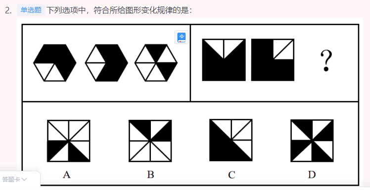


```

```
- 05 （找到公共边画面，然后顺时针，看对应的面对不对）

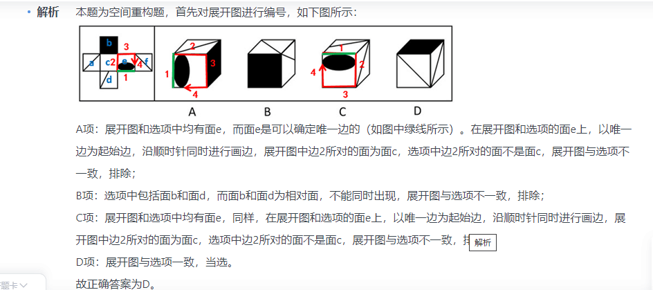

- 06（笔画数可能是汉字笔画数）


- 07
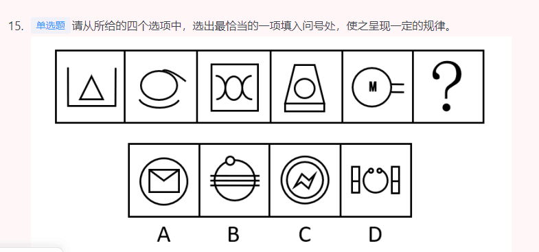
```
元素组成不同，无明显属性规律，考虑数量规律。题干出现较多独立小元素，考虑部分数。观察发现，题干图形的部分数均为2，所以？处要选一个部分数为2的图形，只有A项符合，当选。

故正确答案为A。
```


### test01
- 01（也可以理解为，生活化图形，考部分数）
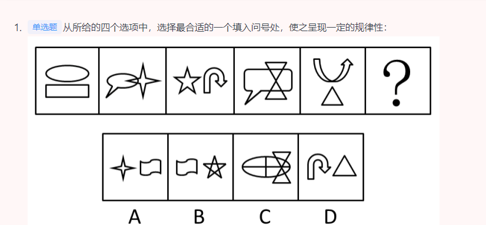

```
正确答案是： C，你的答案是： B

元素组成凌乱，但都由两个图形组成，观察两个图形间的关系。发现图形规律成奇偶性，即1、3、5图形相离，2、4图形成相交，那么接下来选择的图形应该为两个图形相交的形式。

故正确答案为C。
```

- 02


```
正确答案是： A，你的答案是： D

元素组成不同，优先考虑属性规律。观察发现，每幅图形整体并无规律，继续观察，每幅图形的白色区域分别是轴对称、中心对称、轴对称、中心对称、轴对称。因此？处白色区域应为中心对称图形。A项白色区域为中心对称图形，当选。B项白色区域为轴对称图形，C、D两项白色区域为非对称图形，均排除。

故正确答案为A。

```

- 03


- 04


```
本题为分组分类题目。观察图形发现，多边形内部被线条分割，优先考虑数面的数量，但题干图形的面数量都是5，无法分组。继续观察发现，图①③⑤中存在明显最小的面，且最小的面的形状均与图形外轮廓形状相同，图②④⑥中存在明显最大的面，且最大的面的形状均与图形外轮廓形状相同，故①③⑤一组，②④⑥一组。
故正确答案为C。
```

- 05

```

元素组成相似，优先考虑样式规律。题干图形均存在黑色部分和空白部分，考虑黑白运算。第一组图的黑白运算规律为：黑黑白，白黑黑，黑白黑，白白白。第二组图运用此规律，可以将图形分为四行看，第二行最左侧应满足白白白，排除B、C两项。第三行最右侧应满足白黑黑，排除A项，只有D项符合，当选。

故正确答案为D。


```

- 06

```
图形元素组成不同，且无明显属性规律，考虑数量规律。观察发现，题干出现明显的曲线和直线，且线条交叉明显，考虑数曲线与直线的交点数，分别是：4、6、2、4、8，同时，图形的曲线数为：2、3、1、2、4，发现规律为：图形的曲直交点数是曲线数的两倍。所以？处图形也应该符合此规律。选项中，曲直交点数分别为：5、4、1、2，均只有一条曲线，只有D项满足规律，曲直交点数是曲线数的两倍。

故正确答案为D。
```

- 07


-08

```
没有往一笔画这个方向上面想
```

###  共15道，答对8道，正确率53%

- 1


```

解析
元素组成不同，且无明显属性规律，考虑数量规律。题干所给的黑块图形出现多个明显的直角，优先考虑直角数。第一组图形中，黑块图形内部的直角个数依次为1、2、3。第二组图形运用规律，图1、图2黑块图形内部的直角个数分别为1、2，故“？”处应选择黑块图形内部直角个数为3的图形，只有B项符合。
```

- 2

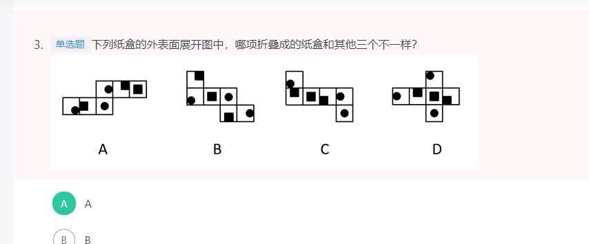


```

```
- 3（元素组成不同，考虑属性或者数量。此处考虑属性）

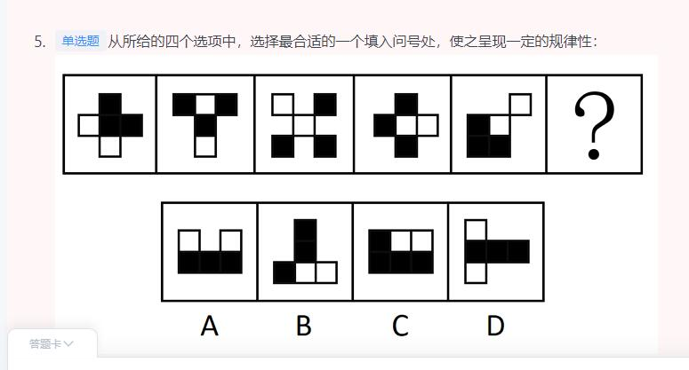


```
图形元素组成相同，但无明显位置规律，考虑属性规律。观察发现，图形比较规整，考虑对称性。画出图形对称轴后发现对称轴依次逆时针旋转，故“？”处图形的对称轴应为竖直方向，只有A项符合。
```
- 4（元素组成不同，考虑属性或者数量。此处考虑属性+对称轴经过的点的图形）

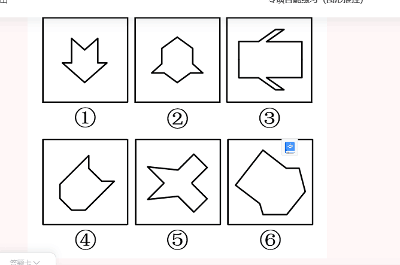

```
元素组成不同，优先考虑属性规律。观察可知，题干图形比较规整，考虑对称性。图125一组，对称轴穿过图中的两个交点；图③④⑥一组，对称轴穿过图中的两条线，并且这两条线和对称轴垂直，对应A项。
```
- 5（元素组成不同，优先考虑属性规律）


- 6(图形元素组成不同，且无属性规律，考虑数量规律)

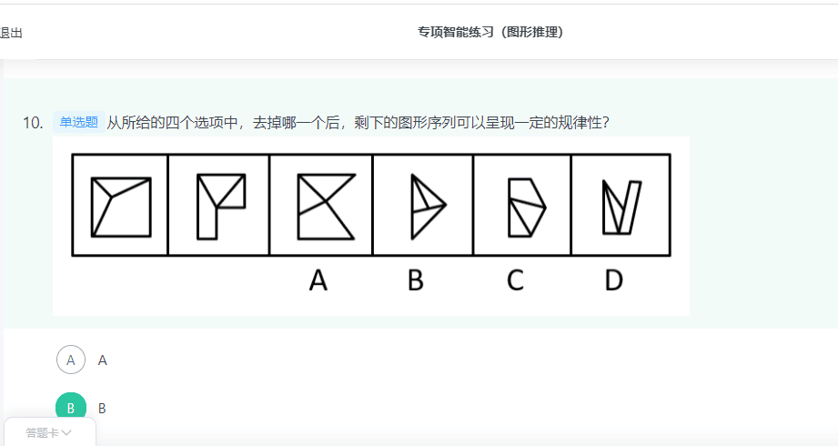

```
图形元素组成不同，且无属性规律，考虑数量规律。观察发现，图形被分割，封闭面明显，考虑数面，题干图形和选项都是3个面，无法排除，考虑面的细化。发现题干的两幅图都是由2个三角形的面和1个四边形的面组成，观察选项，只有B项是由3个三角形的面组成，没有四边形的面，不能和题干形成规律性，故只有B项不符合规律。

本题为选非题，故正确答案为B。
```
- 7

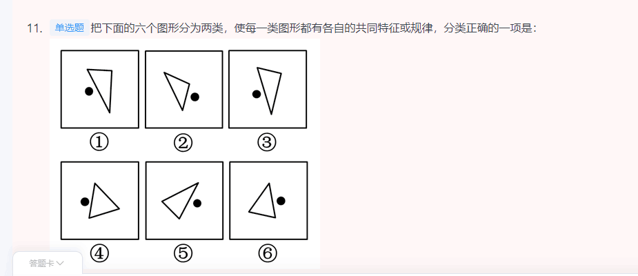

```
特殊考点，存在功能元素点，考虑点的相对位置关系，134点在左侧，②⑤⑥点在右侧。

故正确答案为D。

```

- 8（左下角那块，别的图形拼不出来。抓重点，用排除法）


- 9(题目看错了)

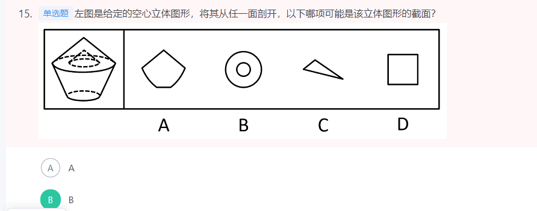


###  共15道，答对12道，正确率80%

- 1(图形元素组成不同，无明显属性规律，优先考虑数量规律)
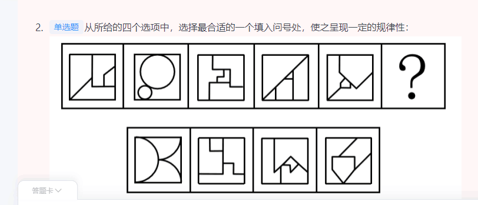

```
解析
图形元素组成不同，无明显属性规律，优先考虑数量规律。图形封闭面较多，优先考虑数面，但数面无规律。再观察发现题干图形存在明显最大面和最小面，且二者形状相同，按照此规律只有C项符合。
```

- 2(元素组成凌乱，考查属性。本题考查图形对称问题)

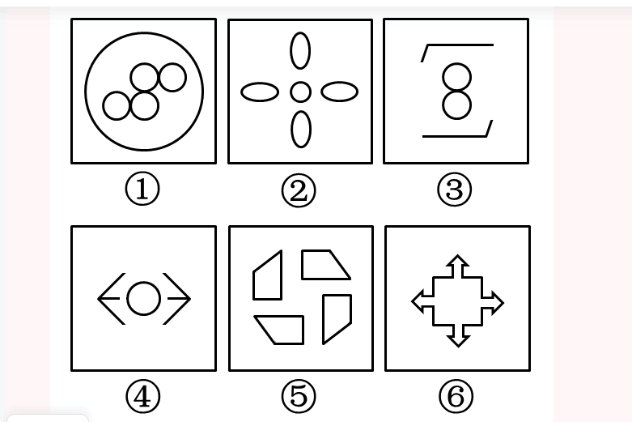

```
①③⑤均为中心对称图形，②④⑥均为既能满足轴对称，也可以满足中心对称图形。
```
- 3(描边法：找出一条边，并且找到一个相同面。顺时针在面上画边)

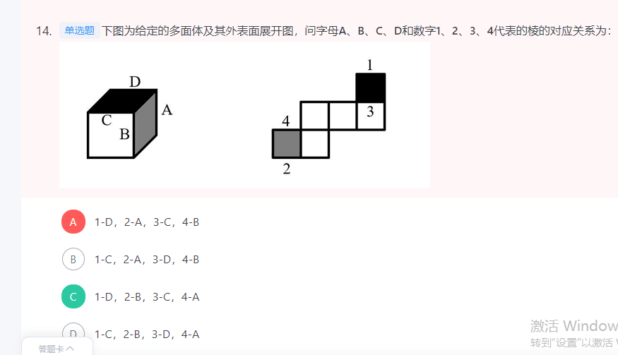


```
本题考查空间重构，如图2所示，标注棕色的边5为黑色面与灰色面的公共边，以该公共边为起点，顺时针依次画边，观察蓝色画边可知边4对应边A，边2对应边B，观察红色画边可知边3对应边C，边1对应边D。

故正确答案为C。
```

### test02

- 1 （数量规律：间隔1，2，3.以及顺移动）
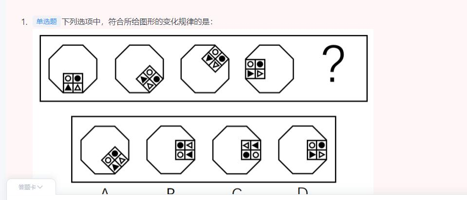


```

元素组成相同，优先考虑位置规律。题干八边形内部的田字形依次沿着八边形的边逆时针移动1、2、3条边，故？处应当在第4幅图的基础上逆时针移动4条边，排除A项。继续观察，田字形内部的小元素每幅图分别按照田字形的格子依次顺时针移动一格，只有B项符合规律。

故正确答案为B。

```

- 2
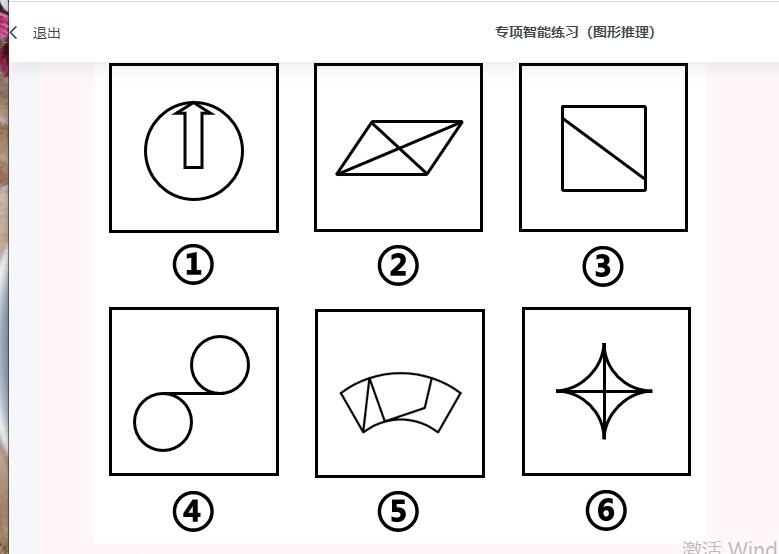


```
元素组成不同，且无明显属性规律，考虑数量规律。观察发现，图形被分割明显，考虑数面。图134均有2个面，图256均有4个面，即图①③④一组，图②⑤⑥一组。

故正确答案为C。
```
- 3


```
本题为分组分类题目。观察发现，题干每幅图形均由两个面相交而成，考虑图形间关系。图①⑤⑥中两个图形具有1条相交边，图②③④中两个图形具有2条相交边，即图①⑤⑥一组，图②③④一组。

故正确答案为D。
```
- 4(拼立体图问题)


```
群友解答：
1和2无论怎么凑，剩余那部分一定是两层。然后可以结合选项分析一下，CD都是3+2，不用完全拼起来，上边那层剩余的是两个连一起的，整体是9+6。
①是4+1
②是5

剩余部分3+2
①中的1和②中的5是一层的
```
- 5
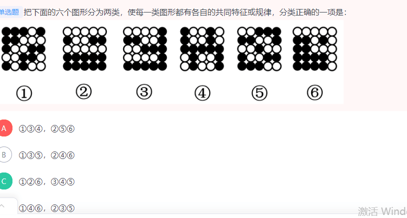


```
本题为分组分类题目，元素组成不同，优先考虑属性规律。观察发现，题干图形均由黑色部分和白色部分组成，图126中白色部分均为轴对称图形，图345中白色部分均为中心对称图形，故图①②⑥为一组，图③④⑤为一组。
```
- 6


```
解析
元素组成凌乱，首先考虑属性。每幅图均由3个元素构成，元素中有直有曲。其中图①②③每个图形都包含2条曲线；图④⑤⑥每个图形都包含1条曲线。

故正确答案为D。
```


- 7


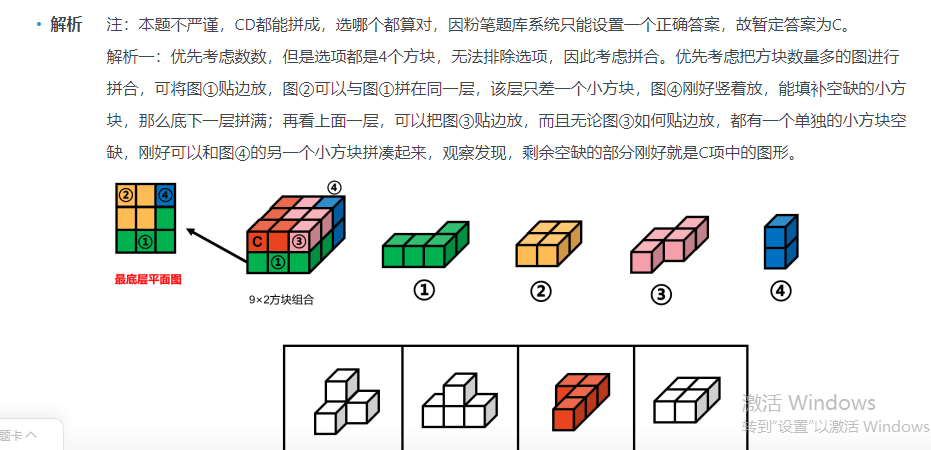


```
1. 先用多的图形拼凑，排除选项
2.实在不行就拼图


```

- 8(元素组成不同，无明显属性规律，考虑数量规律.考交点数)
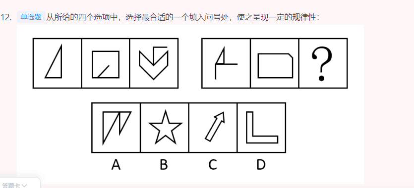


```
元素组成不同，无明显属性规律，考虑数量规律。题干每幅图都是由直线构成，且线条交叉明显，优先考虑数交点。第一组图交点数分别为3、5、7；第二组图应用此规律，交点数依次为3、5、？，故？处应该选择一个交点数为7的图形。A、B、C、D四项中图形的交点数分别为5、10、7、6，只有C项符合。

故正确答案为C。
```
