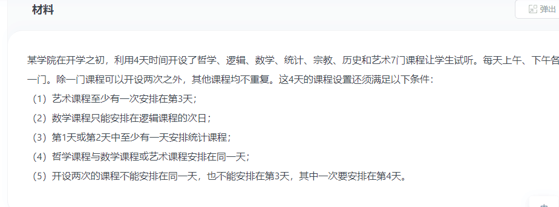

###  共15道，答对7道，正确率47%

- 1

```
该不该让小孩玩电脑游戏？这让很多家长困扰，因为有太多的报告指责游戏正摧毁着下一代，不过一项新的研究显示，玩游戏有益于小孩的阅读能力，甚至可帮助他们克服阅读障碍。

以下哪项如果为真，最不能支持上述结论：

A 研究发现，如果让孩子们玩体感游戏，即依靠肢体动作变化来操作的游戏，累计超过12小时，孩子的阅读速度及认字准确率会显著提升

B 长期玩游戏的儿童阅读游戏规则更容易，还会对游戏中出现的画面变得敏感，但对周围的事物表现冷漠

C 相比玩单机版游戏的儿童，玩网络互动游戏的儿童会更加注重相互交流，因此他们的阅读能力提高得更快

D 儿童阅读障碍主要与神经发育迟缓或出现障碍有关，游戏只能暂时提高阅读速度，却无法克服阅读障碍

第一步：读题干，找到论点和论据。

论点：玩游戏能够提高小孩的阅读能力，帮助孩子解决阅读障碍。

第二步：逐一分析选项。

A项通过研究发现的结果证明了题干的结论的正确性，可以加强，排除；B项“但”之前解释了为什么玩游戏能够提高小孩的阅读能力，说明玩游戏确实对阅读有帮助，“但”之后与题干讨论无关，整体上来讲属于可加强选项，排除；C项通过网络互动游戏的例子来说明玩游戏可以提高阅读能力，也可以加强，排除；D项表明阅读障碍主要与神经发育迟缓有关，同时否定了游戏能够克服阅读障碍，属于削弱。题干需选择不能支持的选项，当选。

本题为选非题，故正确答案为D。
```

- 2




7.以下哪门课程不能安排在第4天？

A 历史

B哲学

C艺术

D宗教

```
7. 
```
- 3


```

```
- 4


```

```
- 5


```

```
- 6


```

```