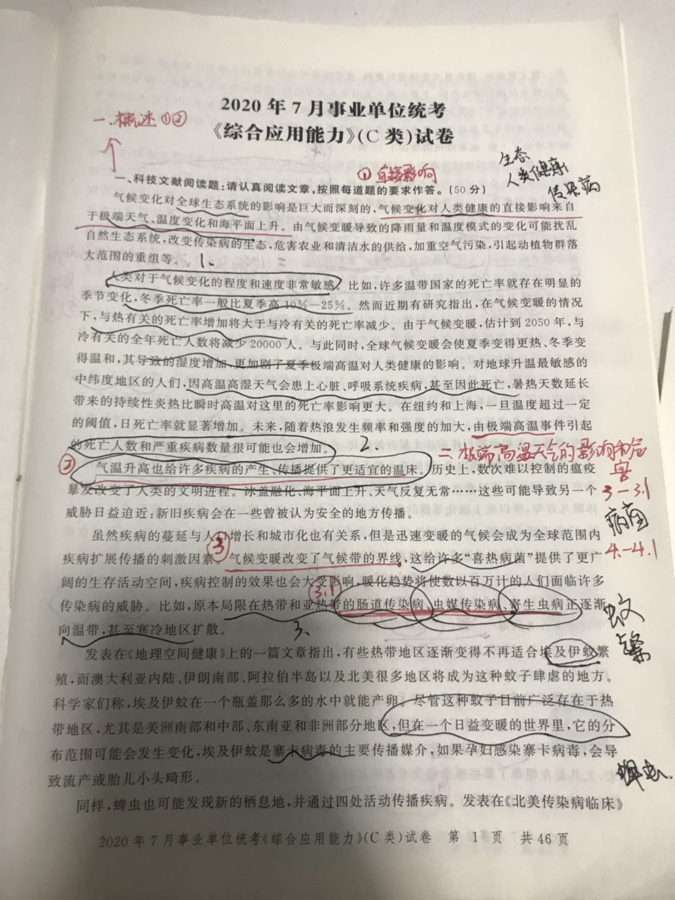
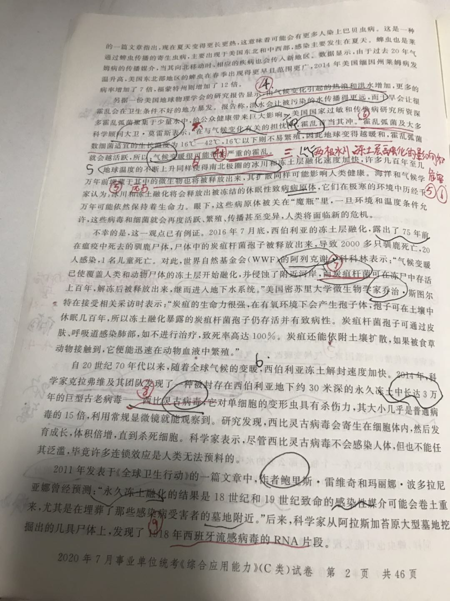
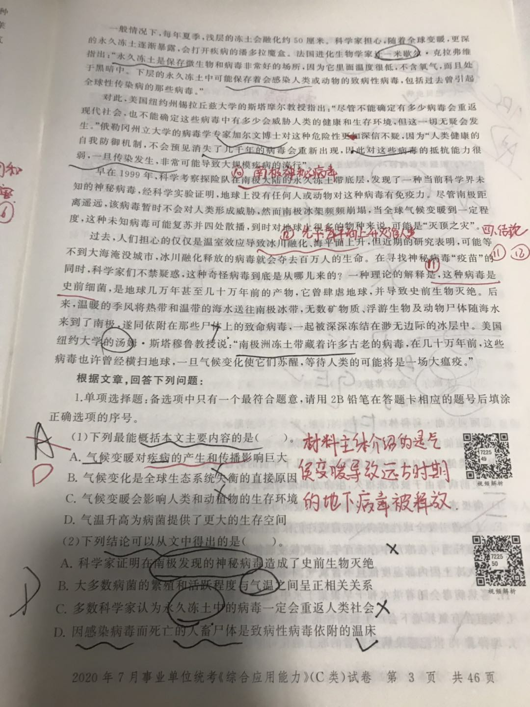
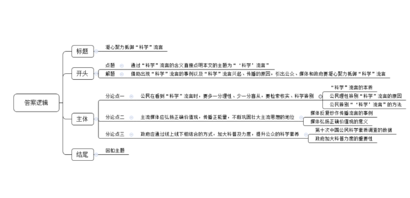

### 综合-材料

```
气候变化对全球生态系统的影响是巨大而深刻的，气候变化对人类健康的直接影响来自于极端天气、温度变化和海平面上升。由气候变暖导致的降雨量和温度模式的变化可能扰乱自然生态系统，改变传染病的生态，危害农业和清洁水的供给，加重空气污染，引起动植物群落大范围的重组等。

人类对于气候变化的程度和速度非常敏感。比如，许多温带国家的死亡率就存在明显的季节变化，冬季死亡率一般比夏季高10%-25%。然而近期有研究指出，在气候变暖的情况下，与热有关的死亡率增加将大于与冷有关的死亡率减少。由于气候变暖，估计到2050年，与冷有关的全年死亡人数将减少20000人。与此同时，全球气候变暖会使夏季变得更热、冬季变得温和，其导致的湿度增加，更加剧了夏季极端高温对人类健康的影响。对地球升温最敏感的中纬度地区的人们，因高温高湿天气会患上心脏、呼吸系统疾病，甚至因此死亡，暑热天数延长带来的持续性炎热比瞬时高温对这里的死亡率影响更大。在纽约和上海，一旦温度超过一定的阈值，日死亡率就显著增加。未来，随着热浪发生频率和强度的加大，由极端高温事件引起的死亡人数和严重疾病数量很可能也会增加。

气温升高也给许多疾病的产生、传播提供了更适宜的温床。历史上，数次难以控制的瘟疫暴发改变了人类的文明进程。冰盖融化、海平面上升、天气反复无常……这些可能导致另一个威胁日益迫近：新旧疾病会在一些曾被认为安全的地方传播。

虽然疾病的蔓延与人口增长和城市化也有关系，但是迅速变暖的气候会成为全球范围内疾病扩展传播的刺激因素。气候变暖改变了气候带的界线，这给许多“喜热病菌”提供了更广阔的生存活动空间，疾病控制的效果也会大受影响，暖化趋势将使数以百万计的人们面临许多传染病的威胁。比如，原本局限在热带和亚热带的肠道传染病、虫媒传染病、寄生虫病正逐渐向温带，甚至寒冷地区扩散。

发表在《地理空间健康》上的一篇文章指出，有些热带地区逐渐变得不再适合埃及伊蚊繁殖，而澳大利亚内陆、伊朗南部、阿拉伯半岛以及北美很多地区将成为这种蚊子肆虐的地方。科学家们称，埃及伊蚊在一个瓶盖那么多的水中就能产卵。尽管这种蚊子目前广泛存在于热带地区，尤其是美洲南部和中部、东南亚和非洲部分地区，但在一个日益变暖的世界里，它的分布范围可能会发生变化，埃及伊蚊是寨卡病毒的主要传播媒介，如果孕妇感染寨卡病毒，会导致流产或胎儿小头畸形。

同样，蜱虫也可能发现新的栖息地，并通过四处活动传播疾病。发表在《北美传染病临床》的一篇文章指出，现在夏天变得更长更热，这意味着可能会有更多人染上巴贝虫病。这是一种通过蜱虫传播的寄生虫病，主要出现于美国东北和中西部，感染主要发生在夏天。蜱虫也是莱姆病的传播媒介，当其向北移动时，相应的疾病也会传入新地区。数据显示，由于过去20年气温升高，美国东北部地区的蜱虫在春季出现得更早且范围更广，2014年美国缅因州莱姆病发病率增加了7倍，福蒙特州则增加了12倍。

另据一份美国地球物理学会的研究报告显示，由气候变化引起的热浪和洪水增加，更多的霍乱会在卫生条件不好的地方爆发。报告称，洪水会让被污染的水传播得更远，而干旱会让很多霍乱弧菌聚集于少量水中，给公众健康带来巨大影响。美国国家过敏和传染病研究所资深科学顾问大卫·莫雷斯表示：“在与气候变化有关的担忧中，霍乱首当其冲。”霍乱弧菌及大多数细菌适宜的生长温度为16℃～42℃，16℃以下则不易繁殖，因此地球变得越暖和，霍乱弧菌就会越活跃，所以，气候变暖很可能带来严重的霍乱。

地球温度的不断上升同样使得南北极圈的冰川和冻土层融化速度加快，许多几百年至几万年前埋藏于其中的微生物也将被释放出来，其扩散同样可能影响人类健康。海洋和气候学家认为：冰川和冻土融化将会释放出被冻结的休眠性致病病原体，它们在极寒的环境中历经千万年可能依然保持着生命力。眼下，这些病原体被关在“魔瓶”里，一旦环境和温度条件允许，这些病毒和细菌就会再度活跃、繁殖、传播甚至变异，人类将面临新的危机。

不幸的是，这一观点已有例证。2016年7月底，西伯利亚的冻土层融化，露出了75年前在瘟疫中死去的驯鹿尸体，尸体中的炭疽杆菌孢子被释放出来，导致2000多只驯鹿死亡，20人感染，1名儿童死亡。对此，世界自然基金会（WWF）的阿列克谢·科科林表示：“气候变暖已使覆盖人类和动物尸体的冻土层开始融化，并侵蚀了附近河岸，而炭疽杆菌可在冻尸中存活上百年，解冻后被释放出来，继而进入地下水系统。”美国密苏里大学微生物学家乔治·斯图尔特在接受相关采访时表示：“炭疽的生命力很强，在有氧环境下会产生孢子体，孢子可在土壤中休眠几百年，所以冻土融化暴露的炭疽杆菌孢子仍存活并有致病性。炭疽杆菌孢子可通过皮肤、呼吸道感染肺部，如不进行治疗，致死率高达100%。炭疽还能依附土壤扩散，如果被食草动物接触到，它便能迅速在动物血液中繁殖。”

自上个世纪70年代以来，随着全球气候的变暖，西伯利亚冻土解封速度加快。2014年，科学家克拉弗维及其团队发现了一种被封存在西伯利亚地下约30米深的永久冻土中长达3万年的巨型古老病毒——西比灵古病毒，它对单细胞的变形虫具有杀伤力，其大小几乎是普通病毒的15倍，利用常规显微镜就能观察到。研究发现，西比灵古病毒会寄生在细胞体内，然后发育成长，体积倍增，直到杀死细胞。科学家表示，尽管西比灵古病毒不会感染人体，但也不能任其泛滥，毕竟许多连锁效应是人类无法预料的。

2011年发表于《全球卫生行动》的一篇文章中，作者鲍里斯·雷维奇和玛丽娜·波多拉尼亚娜曾经预测：“永久冻土融化的结果是18世纪和19世纪致命的感染性媒介可能会卷土重来，尤其是在埋葬了那些感染病受害者的墓地附近。”后来，科学家从阿拉斯加苔原大型墓地挖掘出的几具尸体上，发现了1918年西班牙流感病毒的RNA片段。

一般情况下，每年夏季，浅层的冻土会融化约50厘米。科学家担心，随着全球变暖，更深的永久冻土逐渐暴露，会打开疾病的潘多拉魔盒。法国进化生物学家让-米歇尔·克拉弗维指出：“永久冻土是保存微生物和病毒非常好的场所，因为它里面温度很低，不含氧气，而且处于黑暗中。下层的永久冻土中可能保存着会感染人类或动物的致病性病毒，包括过去曾引起全球性传染病的那些病毒。”

对此，美国纽约州锡拉丘兹大学的斯塔摩尔教授指出：“尽管不能确定有多少病毒会重返现代社会，也不能确定这些病毒中有多少会威胁人类的健康和生存环境，但这一切无疑会发生。”俄勒冈州立大学的病毒学专家加尔文博士对这种危险性更加深信不疑，因为“人类健康的自我防御机制，不会预见消失了几千年的病毒会重新出现，因此对这些病毒的抵抗能力很弱，一旦传染发生，非常可能导致大规模疾病的流行”。

早在1999年，科学考察探险队在南极大陆的永久冻土带底层，发现了一种当前科学界未知的神秘病毒，经科学实验证明，地球上没有任何人或动物对这种病毒有免疫力。尽管南极距离遥远，该病毒暂时不会对人类形成威胁，然而南极冰架频频崩塌，当全球气候变暖到一定程度，这种未知病毒可能复苏并四处散播，到时对地球上成千上万的物种来说，可能是“灭顶之灾”。

过去，人们担心的仅仅是温室效应导致冰川融化、海平面上升，但近期的研究表明，可能等不到大海淹没城市，冰川融化释放的病毒就会夺去百万人的生命。在寻找神秘病毒“疫苗”的同时，科学家们不禁疑惑，这种奇怪病毒到底是从哪儿来的？一种理论的解释是，这种病毒是史前细菌，是地球几万年甚至几十万年前的产物，它曾肆虐地球，并导致史前生物灭绝。后来，温暖的季风将热带和温带的海水送往南极冰带，无数矿物质、浮游生物及动物尸体随海水来到了南极，遂同依附在那些尸体上的致命病毒，一起被深深冻结在渺无边际的冰层中。美国纽约大学的汤姆·斯塔穆鲁教授说：“南极洲冻土带藏着许多古老的病毒，在几十万年前，这些病毒也许曾经横扫地球，一旦气候变化使它们苏醒，等待人类的可能将是一场大瘟疫。”
```






```
1. 注意主次结构，分多层概括。
2. 有些重点句子没有找到。
3. 注意分为四部分

(当时做题画出重点句子，要注意概括它讲了什么。比如说是直接影响。)

```

### 问题八

- 

```

阅读给定材料2，指出其中存在的4处论证错误并分别说明理由。请在答题卡上按序号分条作答，每一条先将论证错误写在“A”处（不超过50字），再将相应理由写在“B”处（不超过50字）。（40分）
火星上是否存在生命？这个问题在科学界一直争论不休。最新观测和研究结果表明，这个问题已经有了明确答案。

火星大气、土壤演化探测器发回的最新数据表明，火星大气密度不到地球大气密度的1%，所以火星上即使有生命，也是非常低级的微生物。

探测器还记录到，近期太阳风曾高速剥离火星大气。每当太阳风暴发作，就刮来超强紫外辐射及高能气体、磁粒子。在没有大气层保护的火星地表，不可能有生命存在，即使是非常低级的微生物，因为地球上的任何生命在这样恶劣的环境中都不可能存活。

负责此项研究的弗雷格博士及其小组成员一直通过研究单个颗粒的火星土壤来更多地了解火星表层形成的历史，以及在显微镜下寻找岩石被击碎后形成的粘土颗粒，这种颗粒是液态水曾经存在的一个重要标志。然而，研究小组并没有发现这个标记，由此可见，火星上不曾有过液态水，即使在土壤中检测了极少的这种颗粒，比例还不到整个样本的50%，与地球上这种粘土的比例高达50%相比，显得微不足道。

弗雷格博士是国际著名的天体演化研究专家，他们的研究成果发表在国际顶级期刊《星际物理研究通讯》上，因此其研究结果是非常可靠的。

```

```

对了A,错了BCD，因为bc原因解释错了，但是D句子找错了

A火星大气密度不到地球大气密度的1%，所以火星上即使有生命，也是非常低级的微生物。
a 强加原因，没有必要联系
B 在没有大气层保护的火星地表，不可能有生命存在，即使是非常低级的微生物，因为地球上的任何生命在这样恶劣的环境中都不可能存活。
b 论点过于绝对(偷换了概念，地球和火星上生命概念不同)
C 这种颗粒是液态水曾经存在的一个重要标志。然而，研究小组并没有发现这个标记，由此可见，火星上不曾有过液态水，
c 因果矛盾，不能由研究小组并没有发现这个标记，由此可见，火星上不曾有过液态水，（否定性论据推不出肯定性结论，属于诉诸无知。 ）
D 即使在土壤中检测了极少的这种颗粒，比例还不到整个样本的50%，与地球上这种粘土的比例高达50%相比，显得微不足道。
d 统计学谬误

(D 第五段由“弗雷格博士是著名研究专家，其成果发表在顶级期刊上”推出“其研究结果非常可靠”存在论证错误。

B：因为研究专家和顶级期刊看似具有权威性，但没有进行科学论证，研究结果也不定就是可靠的，属于诉诸权威。)

```

```
答案：
1.A：第二段由“火星大气密度不到地球的1%”推出“火星上即使有生命，也是非常低级的微生物”存在论证错误。 

     B：论据论述火星和地球大气密度的对比，论点说明生命等级，二者话题不同，无必然因果关系，属于强拉因果。 

     2.A：第三段由“地球上的生命在这样恶劣环境中都不可能存活”推出“在火星地表不可能有生命存在”存在论证错误。 

      B：因为论点中的生命与地球上的任何生命二者概念不同，不能将二者简单等同，属于偷换概念。

     3.A：第四段由“研究小组在火星土壤中没有发现检测水的标记颗粒”推出“火星上不曾有过液态水”存在论证错误。 

     B：因为没有发现标记并不代表标记不存在，否定性论据推不出肯定性结论，属于诉诸无知。 

     4.A：第五段由“弗雷格博士是著名研究专家，其成果发表在顶级期刊上”推出“其研究结果非常可靠”存在论证错误。

     B：因为研究专家和顶级期刊看似具有权威性，但没有进行科学论证，研究结果也不定就是可靠的，属于诉诸权威。

```

### 问题九

```
阅读下列材料3，按要求作答。（60分）

围绕“‘科学’流言”这一现象，自选角度，自拟题目，写一篇议论文。

要求：观点鲜明，论证充分，条理清晰，语言流畅，字数800-1000字。

由中国科协、人民日报社共同揭晓的“2017十大‘科学’流言终结榜”上，有9条流言与人类健康密切相关，其中6条与日常饮食相关：“紫菜是黑色塑料袋做的”“肉松是棉花做的”“微波炉加热食物致癌”“多吃主食会缩短寿命”“长期喝豆浆会致乳腺癌”“同时吃螃蟹和柿子会中毒”。这些流言或是凭空捏造，或是忽视剂量标准夸大某种物质对人体的危害，涉及的都是科学常识问题，略加检索核实就很容易判断。

“微波炉加热食物致癌”最早可追溯到某媒体2002年刊发的一篇题为《莫忽视微波炉的危害》的简讯。此后，另一家媒体发表同类文章，某社交平台变换标题再次传播，虽经科普学者、中央电视台数次辟谣，都未能从根本上阻止网络媒体对其反复炒作传播。

第十次中国公民科学素质调查结果显示，截至2018年，我国具备科学素质的公民比例为8.47%，城镇居民具备科学素质的比例为11.55%，农村居民仅为4.93%，公民科学素质水平发展仍存在不平衡、不充分的问题。

```

```

1. 题目总结，可以用对策-凝心聚力抵御“科学”流言

2. 对于带引号的主题词应该，首段先解释引号内容的含义。

3. 
背景：网络媒体科学流言泛滥，屡禁不止，公众识别能力较弱。

媒体不加辨别

网络媒体力量太大

公民科学素质不足以识别流言

科普学者，中央电视台影响力不足

需要加大对流言的控制能力。需要媒体有责任心，需要公民加强科学素养。

```

```
- 第一段解释 ： 所谓“科学”流言或是凭空捏造，或是夸大某种物质对人体的危害，他们是假借“科学”之名以混淆视听的“伪科学”。“紫菜是黑色塑料袋做的”“肉松是棉花做的”等类似流言的风靡会严重损害公民的利益，让公众对科学常识产生质疑，甚至危及整个科学界的稳固发展。为了抵御“科学”流言，需要公众、媒体和政府凝心聚力，让崇尚科学在全社会蔚然成风。
- 第二段 对策引入下文
- 第三段 主流媒体应弘扬正确价值观，传播正能量，不断巩固壮大主流思想的地位。2002年某媒体刊发一篇题为《莫忽视微波炉的危害》的简讯，随后被多家媒体反复传播，中央电视台等主流媒体虽多次辟谣，仍无法根除流言纷扰。为了从根源上抵御流言传播，一方面，主流媒体要树立正确的价值观，以真正的科学研究为依据来约束自己的言论，传播科学真理，为科学代言、为公众服务，让公众对科学重获信任；另一方面，主流媒体要发挥模范带头作用，严格遵守相关的法律法规，不触碰舆论底线和红线，为其他媒体树立正确的舆论风向，逐步巩固并壮大主流思想的地位。

- 第四段不仅说了现象和影响，还提出了对策  政府应通过线上线下相结合的方式，加大科普及力度，提升公众的科学素养。第十次中国公民科学素质调查结果显示，截至2018年，我国具备科学素质的公民比例为8.47%，城镇居民具备科学素质的比例为11.55%，农村居民仅为4.93%。根据数据可知，我国公民整体科学素质较低，而且存在发展不平衡、不充分的问题。因此，政府需要借助互联网和通过举办社区、自然村的科普活动，拓宽科普渠道、普及科学常识；同时也要提高科普质量，创新科普理念和服务模式，唤起公众积极参与科普的热情，提升我国公民的科学素质水平。

- 总结 流言止于智者而流于愚者。面对“科学”流言我们要充分汇聚各方力量，筑起牢固的抵御“科学”流言的屏障，营造风清气正的科学氛围。

```

