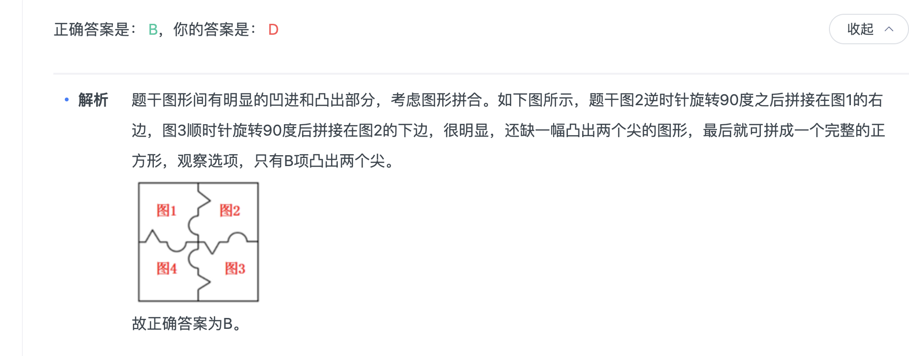

###  言语共35道，答对26道，正确率74%，用时44分钟

 #### 阅读理解(共12道，答对9道，正确率75%)
1. 中心理解

  (1) 关联词-转折(共3道，答对2道，正确率67%)

  ```
    主要文章的层次。重点讲什么，此外的那种就不是重点。

  ```  
  (2) 关联词-对策(共2道，答对1道，正确率50%)

  ```
    主要文章的层次。重点讲什么，此外的那种就不是重点。

  ```  
  (3) 关联词-并列(共1道，答对0道，正确率0%)

  ```
    主要文章的层次。重点讲什么，此外的那种就不是重点。

  ```  
  (4) 关联词-分总(共4道，答对3道，正确率75%)

  ```
    主要文章的层次。重点讲什么，此外的那种就不是重点。

  ```  


 #### 语句表达(共5道，答对4道，正确率80%)
1. 语句排序(2,1)

```

```
 #### 逻辑填空(共18道，答对13道，正确率72%)
1. 实词填空(共9道，答对5道，正确率56%)

  ```


  ```

  3. 混搭填空((共6道，答对5道，正确率83%))
  4. 词的辨析(共13道，答对8道，正确率62%)
    (1)词义侧重(共5道，答对2道，正确率40%)
    (2)固定搭配(共11道，答对6道，正确率55%)
    (3)感情色彩(共2道，答对0道，正确率0%)
 
  5. 语境分析
    (1)对应关系：解释类对应(共13道，答对11道，正确85%)
    1.1 转折关系
    ```
  
    ```
    1.2 解释类对应
    ```
  
    ```
    1.3 重点词语对应
    ```
  
    ```
 

###  判断共35道，答对22道，正确率63%，用时53分钟

  #### 图形推理（共5道，答对4道，正确率80%，用时9分钟）！！！！
    1. 特殊规律
    1.1(四张图可以拼合成一张图)

    
    
   
  #### 定义判断（共10道，答对6道，正确率60%，用时16分钟）！！

  1. 单定义（共8道，答对5道，正确率63%，用时13分钟）
    （1） 方式目的 
    （2） 其他 （共1道，答对0道，正确率0%，）

     2.1(这道题错还是因为没有看到大前提，困难任务。而睹物兴悲，睹物兴悲”是指见到与故人有关的东西而引起悲伤，是一种触景生情，没有任何任务时，也可以发生)

```
      自我效能感是个体对自己能否成功操作某一行为达到某种预期效果的主观预期和推断。当面临困难任务时，低自我效能感的人比高自我效能感的人更集中于问题存在的障碍、失败影响以及个人缺陷上。

     根据上述定义，下列选项属于低自我效能感表现的是：

A

破釜沉舟

B

画饼充饥

C

心急如焚

D

睹物兴悲


正确答案是： C，你的答案是： D收起
解析
第一步：找出定义关键词。

“能否成功操作某一行为达到某种预期效果的主观预期和推断”、“当面临困难任务时”、“低自我效能感的人……更集中于问题存在的障碍、失败的影响以及个人缺陷上”。

第二步：逐一分析选项。

A项：“破釜沉舟”比喻不留退路，非打胜仗不可，下决心不顾一切地干到底。这是决心很大的表现，不符合关键词“更集中于问题存在的障碍、失败的影响以及个人缺陷上”，不符合定义，排除；

B项：“画饼充饥”比喻用空想来安慰自己。当面对困难时，采取了“画饼”，虽然不能解决实际问题，但可以给人一定程度的心理安慰，东汉末年也有曹操“望梅止渴”的典故，与画饼充饥类似，都可以提振士气，没有将问题只集中到障碍和个人的缺陷上，不符合定义，排除；

C项：“心急如焚”形容非常着急，比喻当面临困难任务时，急于克服，一味地关注现状的问题和自身的缺陷，符合关键词“更集中于问题存在的障碍、失败的影响以及个人缺陷上”，符合定义，当选；

D项：“睹物兴悲”是指见到与故人有关的东西而引起悲伤，是一种触景生情，没有任何任务时，也可以发生，所以不能体现“面临困难任务”，也不是对“达到某种预期效果的主观预期和推断”，不符合定义关键词“更集中于问题存在的障碍、失败的影响以及个人缺陷上”，不符合定义，排除。

故正确答案为C。
```
   
  2. 多定义（共2道，答对1道，正确率50%，用时3分钟）
     
      （1） 常规问法 （共5道，答对2道，正确率40%，用时6分钟）

  #### 逻辑判断（共10道，答对8道，正确率80%，用时12分钟）
   1. 加强题型（共5道，答对4道，正确率80%，用时6分钟）
     1.1 补充论据 

  2. 削弱题型（共2道，答对1道，正确率50%，用时3分钟）
     
      （1） 削弱论点
   

  #### 类比推理（共10道，答对6道，正确率60%，用时9分钟）

  2. 逻辑关系（共8道，答对4道，正确率50%）
     
    
      （1） 包容 （共2道，答对0道，正确率0%，）
      （1） 对应 (共6道，答对4道，正确率67%)
###  资料共20道，答对15道，正确率75%，用时42分钟 