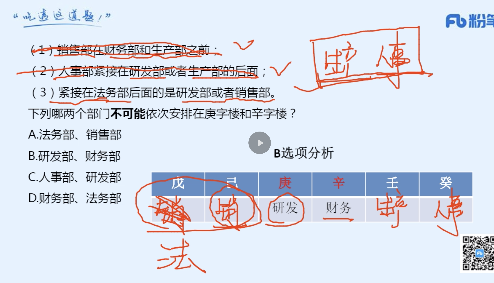

## 图形推理
### 经典真题一(70%)

|  错误类型   | 统计次数  |
|  ----  | ----  |
| 没想到还有整体顺时针移动，以及整体的黑色部分顺时针移动  | 1 |
| 对文段的翻译没有思维，比如：抓住定义中的关键词。(1)归谬法其实就是假定命题正确，(2)然后推出错误的结论，从而否定命题的错误。 | 1 |
| 种类和数量，可能1,1,2,1,1，3,1,1,2,1,1,3循环 | 1 |
| 种类和数量，可能1,1,2,1,1，3,1,1,2,1,1,3循环 | 1 |


- 没想到还有整体顺时针移动，以及整体的黑色部分顺时针移动 


```

```
### 经典真题二(70%)
### 经典真题三70%)
### 经典真题四(70%)
## 定义判断

|  错误类型   | 统计次数  |
|  ----  | ----  |
| 要把定义，一个一个列出来对比。  | 1 |
| 要把选项一个一个分别找出，对用哪个关系词。不要到D就不看了  | 1 |
| 觉得对比题目123信息，不能从选项从下往上对比，而是应该把题目1，2，3分别带着目的在选项里面找，这样才不容易被蒙蔽  | 4|
| 觉这道题错，是因为我没有对着题目信息123，结合选项一个一个看，是否都符合.不同商品，商务车和网约车是两种商品  | |
| 觉这道题错，是因为对题目的给定的主体，根本没好好对应，因为人的主观精神（如目的、意志、感觉、经验、心灵等）括号里面的才是最重要的，你可以拿出括号里面比对选项，它是否是本源  | |
| 说找特色那就去找特色，特色最重要没，双管齐下，也没有凸出特色的不要选。不要脑补。  | |
| 错是因为选项设置坑了，选项里面有不明确选项。不确定故意丢失电子地图，满足了电子设备要求，也满足了欺骗地方电子侦查要求。| 1 |
| 脑补过多，购买就是购买了，为什还要脑补会被退货所以不算购买，被退货那也是已经购买了不符合文中要求。并且租房的时候又脑补，看了很多套，不一定是签字的那套。说签字就够了，只要激发购买欲望就行了，不要脑补  | 1 |


### 经典真题一(73%)

- 1(错选D,选错的原因还是因为没有对比文章的：不让他人擅自使用其产权时.买卖合同争议，不脑补就没有。但是自家栅栏就是为了防止别人用自家的庭院)

```
排他成本是人们在想要确保不让他人擅自使用其产权时发生的成本。

根据上述定义，下列属于排他成本的是：

A

张某为自家庭院安装栅栏所支出的费用

B

李某为保护自己的名誉权聘请律师而支付的费用

C

王某在与外商谈判过程中支付的交通和住宿费用

D

田某就买卖合同争议向人民法院起诉赵某时支付的诉讼费用


正确答案是： A收起
解析
第一步：找出定义关键词。

“确保不让他人擅自使用其产权时发生的成本”。

第二步：逐一分析选项。

A项：张某为自家院子安装栅栏，是为了不让他人擅自使用自己的院子，符合“确保不让他人擅自使用其产权时发生的成本”，符合定义，当选； 

B项：李某为保护自己的名誉权而支付费用，但名誉权不是产权，不符合“确保不让他人擅自使用其产权时发生的成本”，不符合定义，排除；

C项：王某在谈判过程中支付的费用，没有体现他人擅自使用自己的产权，不符合“确保不让他人擅自使用其产权时发生的成本”，不符合定义，排除；

D项：田某就买卖合同争议向法院起诉赵某时支付的费用，没有体现他人擅自使用自己的产权，不符合“确保不让他人擅自使用其产权时发生的成本”，不符合定义，排除。

故正确答案为A。

```

- 2(这道题错，是因为看错了D项目，它属于，认为符合公正、平等、尊严等人类最一般原则的行为就是正确的)

```
个人道德判断能力的发展经历了六个阶段：一是避罚服从取向阶段，为避免惩罚而服从权威或规则；二是相对功利取向阶段，评定行为好坏主要看是否符合自己的利益；三是寻求认可取向阶段，顺从传统要求，谋求大家的赞赏和认可；四是遵守法规取向阶段，服从社会规范，遵守法律权威；五是社会法制取向阶段，看重法律的效力，但认为法律可以应大多数人的要求而改变；六是普遍伦理取向阶段，认为符合公正、平等、尊严等人类最一般原则的行为就是正确的。

根据上述定义，如果一个人认为公司员工都参加了聚餐，所以自己也应该参加聚餐，则他的个人道德判断能力所处的发展阶段是：

A

避罚服从取向阶段

B

相对功利取向阶段

C

寻求认可取向阶段

D

普遍伦理取向阶段


正确答案是： C收起
解析
第一步：找出定义关键词。

“避免惩罚而服从权威或规则”、“评定行为好坏主要看是否符合自己的利益”、“顺从传统要求，谋求大家的赞赏和认可”、“服从社会规范，遵守法律权威”、“看重法律的效力，但认为法律可以应大多数人的要求而改变”、“符合公正、平等、尊严等人类最一般原则的行为就是正确的” 

第二步：逐一分析选项。

A项：参加公司员工聚餐，不符合“避免惩罚而服从权威或规则”，不符合定义，排除； 

B项：参加公司员工聚餐，不符合“评定行为好坏主要看是否符合自己的利益”，不符合定义，排除；

C项：参加公司员工聚餐，符合“顺从传统要求，谋求大家的赞赏和认可”，符合定义，当选；

D项：参加公司员工聚餐，不符合“符合公正、平等、尊严等人类最一般原则的行为就是正确的”，不符合定义，排除。

故正确答案为C。

```
- 3(
归谬法是指对一错误论题不直接否定，而是先假定其真，然后据此导出荒谬的结果，由结果的荒谬推出该论题的荒谬，从而直接地否定错误论题的论证手法.这道题的翻译就是，先认定错误论题为真，然后得出混谬的结论。)

```

归谬法是指对一错误论题不直接否定，而是先假定其真，然后据此导出荒谬的结果，由结果的荒谬推出该论题的荒谬，从而直接地否定错误论题的论证手法。

根据上述定义，下列不属于归谬法的是：

A

有个病人对住院处的护士说：“请把我安排在三等病房，我很穷。”“没有人能帮助您吗？”“没有，我只有一个姐姐，她是修女，也很穷。”护士听了生气地说： “修女富得很，因为她和上帝结婚。”“好，您就把我安排在一等病房吧，以后把账单寄给我姐夫就行了。”

B

甲向乙解释：“我演奏的是高雅的流行乐曲。”乙反问一句：“流行的乐曲就是高雅的吗？”甲听了很是吃惊：“不高雅的东西怎么能够流行呢?”乙笑着说：“那么，流行感冒也是高雅的了？”

C

某人坚决反对杀生，他劝告人们说：“你如果在世时杀了一头猪，来生就要变成一头猪；你在世时杀一头牛，来生就要变成一头牛。”这时一个听众说：“那不如去杀人吧。”

D

有一次，一位英国女记者读了文学大师钱钟书的作品，对钱钟书很仰慕，非要见他，在电话中钱钟书对该女士说：“假如你吃了个鸡蛋，觉得味道不错，就够了，何必非要认识那只下蛋的母鸡呢？”


正确答案是： D收起
解析
第一步：抓住定义中的关键词。

归谬法其实就是假定命题正确，然后推出错误的结论，从而否定命题的错误。

第二步：逐一判断选项。

A项“不可能收到账单的上帝姐夫”，B项“高雅的流行感冒”，C项“为了下辈子成为人而杀人”都是错误的结论，从而可以得出其命题也是错误的，均符合定义，排除；

D项不存在错误命题，不符合定义，当选。

本题为选非题，故正确答案为D。
```
- 4(一定要把题目的信息，一个一个比对选项的。比如B选项，题目是借用自身的权力获得某些特殊信息.但是C选项是私自使用秘密窃取的某资格考试试卷)

```
信息腐败指的是手中掌握有公共权力的人，借用自身的权力获得某些特殊信息，然后由自己或其代理人利用这些垄断信息从事某些牟利活动的一种违法乱纪行为。

根据上述定义，下列涉及信息腐败的是：

A

市政府某局干部为了个人升迁，贿赂有关人员，多次修改个人档案信息

B

某法学院教授为了将其负责的研究生班办成品牌，私自使用秘密窃取的某资格考试试卷对该班学生进行辅导

C

省科技厅王处长离职后到某公司就职，他将自己研究的某项技术加以创新，为该公司开发出极具市场竞争力的新产品

D

副区长龙某将工程招标报名情况、投标企业业绩要求、中标方式等秘密信息泄露给某投标企业，并收受该企业50余万元


正确答案是： D收起
解析
第一步：找出定义关键词。

“手中掌握有公权力的人”、“借用自身权利获得某些特殊信息，从事某些牟利活动”。

第二步：逐一分析选项。

A项：市政府某局干部贿赂有关人员改档案信息，并没有获得特殊信息，不符合“借用自身权力获得某些特殊信息，从事某些牟利活动”，不符合定义，排除； 

B项：某法学院教授是用窃取的试卷辅导学生，不符合“借用自身权力获得某些特殊信息，从事某些牟利活动”，不符合定义，排除；

C项：省科技厅王处长离职后将自己的技术创新，并没有利用权力获得信息，不符合“借用自身权力获得某些特殊信息，从事某些牟利活动”，不符合定义，排除；

D项：副区长将工程投标秘密信息泄露给投标企业，并获得50万余元，符合“借用自身权力获得某些特殊信息，从事某些牟利活动”，符合定义，当选。

故正确答案为D。

```

### 经典真题二(80%)

- 1(这道题A错是因为，A选项故意丢失伪造的电子作战地图.其实就是丢失地图，不确定是否和电子通讯设备有关。但是C就肯定是和电子通讯设备有关系的，方式：利用电子设备对己方的相关信息进行伪装或者虚假模拟。目的：欺骗敌方的电子侦察、迷惑和扰乱敌方。)

```
军事上的电子欺骗指的是利用电子设备对己方的相关信息进行伪装或者虚假模拟，欺骗敌方的电子侦察，使敌方对己方部署、作战能力和作战企图等产生错误判断，从而达到迷惑和扰乱敌方的目的。根据上述定义，下列涉及电子欺骗的是（    ）。

A

军事演习时蓝军故意丢失伪造的电子作战地图，佯装泄露己方情报

B

某国将无人机藏匿于敌国领空，冒充敌国领导人编制、发布虚假命令

C

二战中盟军虚设了一个司令部，用通讯设备源源不断地发送各种“指挥命令”

D

驻扎在太平洋小岛的某部为其计算机系统设置了数量庞大的仿真数据库


正确答案是： C收起
解析
第一步：判断题干中的关键词。

方式：利用电子设备对己方的相关信息进行伪装或者虚假模拟。

目的：欺骗敌方的电子侦察、迷惑和扰乱敌方。

第二步：逐一分析选项。

A 项， “故意丢失地图”没有满足利用电子设备的方式要件，也没体现“欺骗敌方的电子侦察”的目的，不符合定义；

B 项，“冒充敌国领导人编制、发布虚假命令”是利用敌方干扰，不满足“对己方的相关信息进行伪装或虚假模拟”的方式，不符合定义；

C 项，“虚设了一个司令部，用通讯设备发送各种‘指挥命令’”同时满足方式和目的的关键词，符合定义；

D 项，“设置了数量庞大的仿真数据库”没有体现“欺骗敌方的电子侦察、扰乱敌方”的目的，不符合定义。

第三步：再次标注答案。

故正确答案为C。

```


- 2(这道题错，是因为我没有对着题目信息123，结合选项一个一个看，是否都符合。A选项错是因为这是两种服务，对公司的商务车 和自己的网约车是两种服务，不是同一种服务)

```

大数据“杀熟”：指商家在提供相同的商品或服务时，根据大数据的甄别结果，对有多次消费记录或消费能力较高的客户，以偏高标准收费的销售策略。

下列属于大数据“杀熟”的是

A

小李负责单位的接待工作，经常要预约商务车接送。后来只要他打车，网约平台就直接推送高价的商务车，无奈之下小李只好注册一个新号供自己日常出行

B

经常在网上预订酒店的老张在预订某酒店的单人间时，价格一直为380元。他的侄子暑假来看望他，也在网上预定了该酒店同样的房间，价格却便宜四分之一

C

位于市中心金融服务区的某超市由于环境优越，客户购买力强，某品牌饮料在这里售价高达15元，而这种饮料在居民小区便利店只需要10元

D

某购物网站推出新用户推广活动，每位新注册用户都可免费获赠抵用券，算下来买同样的商品新会员比老会员还要便宜好多，这让老会员们郁闷不已


正确答案是： B收起
解析
第一步：找出定义关键词。

“相同的产品或服务”、“大数据甄别结果”、“多次消费记录或消费能力较高的顾客”、“偏高标准收费”。

第二步：逐一分析选项。

A项：经常预约商务车符合“多次消费记录或消费能力较高的顾客”，但单位的接送服务和日常的出行服务不属于“相同的产品或服务”，不符合定义，排除；

B项：老张经常在网上预订酒店符合“多次消费记录或消费能力较高的顾客”，在网上预订符合“大数据”，侄子预订该酒店同样的房间符合“相同的产品或服务”，老张380元，侄子价格便宜了四分之一符合“偏高标准收费”，符合定义，当选；

C项：金融服务区同品牌饮料比居民小区便利店高，符合“相同的产品或服务”、“偏高标准收费”，但不符合“大数据甄别结果”，不符合定义，排除；

D项：新用户买同样商品比老用户便宜符合“相同的产品或服务”，但不属于针对“多次消费记录或消费能力较高的顾客”，是因为为了推广而赠送抵用券所以便宜，不符合定义，排除。

故正确答案为B。
```

- 3(理解题目，就是初识的第一个字母，后移一个位置，初识第二个字母在现有的基础上后移两个。以此类推)





### 经典真题三(70%)

- 01 这种题错是因为对题目的给定的主体，根本没好好对应，因为人的主观精神（如目的、意志、感觉、经验、心灵等）括号里面的才是最重要的，你可以拿出括号里面比对选项，它是否是本源。

```
主观唯心主义认为人的主观精神（如目的、意志、感觉、经验、心灵等）是世界的本原，客观唯心主义认为上帝、理念等客观精神是先于物质世界并独立于物质世界而存在的本体，而物质世界不过是这种客观精神的外化，前者是本原的、第一性的，后者是派生的、第二性的。

根据上述定义，下列思想属于客观唯心主义的是：

A

相由心生，境由心转

B

一花一世界，一草一灵魂

C

一切事物的存在是因为它们被我们所感知到

D

理是世界万事万物存在的根据


正确答案是： D收起
解析
第一步：找出定义关键词。

主观唯心主义：“人的主观精神（目的、意志、感觉、经验、心灵等）是世界的本原”、“本原的、第一性”；

客观唯心主义：“上帝、理念等客观精神是先于物质世界并独立于物质世界”、“派生的、第二性”。

第二步：逐一分析选项。

A项：“相由心生，境由心转”的意思是环境的美好与恶劣是由心境的快乐与否而决定的，符合主观精神中的“心灵”为世界的本原，符合主观唯心主义，不符合客观唯心主义，排除；

B项：“一花一世界，一草一灵魂”的意思是每个自我都有一个世界，而且每个世界都是平等且相对独立的，每个世界都互相影响，每个世界的发展方向都取决于其意识体本身，符合“人的主观精神（目的、意志、感觉、经验、心灵等）是世界的本原”，符合主观唯心主义，不符合客观唯心主义，排除；

C项：一切事物的存在是因为被我们所感知到，符合主观精神中的“感觉”为世界的本原，符合主观唯心主义，不符合客观唯心主义，排除；

D项：理是世界万事万物存在的根据，符合“理念是先于物质世界并独立于物质世界”，符合客观唯心主义定义，当选。

故正确答案为D。
```

- 02(这道题错，是因为1.写上自己的名字 2 购买欲望。我当时觉得A确实，是因为它已经够买了，但是我有脑补了会退货，所以不算购买。但是其实不应该脑补，购买就是购买了。 然后D是满足的，当时我不选，是因为我觉得它可能不知道购买哪一个，因为她可以看很多套。但是这里又脑补了，只要去购买就行了。)

```
签名效应是指当人们在纸上写上自己名字时，大脑中的自我意识会加强，此时看到喜欢的东西，更容易把物品和自己联系起来，产生“这个东西真适合我”等想法，从而激发购买欲望。

根据上述定义，下列现象可用签名效应解释的是：

A

快递公司坚持“先签字后验货”的做法

B

采取实名捐款的办法能够募捐到更多善款

C

手术前，患者被要求在《知情同意书》上签字

D

中介公司要求租客在看房前签订《看房协议书》


正确答案是： D收起
解析
定义关键词1条件：签名；关键词2结果：激发购买欲望。A项购买在签名之前，不符合；B项捐款不符合购买意愿；C项显然与购买无关；D项中定义的两个要素“有签名”“产生购买认同感，产生购买欲望”，D项满足两个条件。

故正确答案为D。

```


### 经典真题四(85%)

- 01(这道题，最重要的是要找到特色。C选项只是说双管齐下，没有说哪种是最特色的。还是b特色凸现)
## 类比推理

|  错误类型   | 统计次数  |
|  ----  | ----  |
| 要把定义，一个一个列出来对比。  | 1 |
| 要把选项一个一个分别找出，对用哪个关系词。不要到D就不看了  | 1 |
| 觉得对比题目123信息，不能从选项从下往上对比，而是应该把题目1，2，3分别带着目的在选项里面找，这样才不容易被蒙蔽  | 4|
| 觉这道题错，是因为我没有对着题目信息123，结合选项一个一个看，是否都符合.不同商品，商务车和网约车是两种商品  | |
| 觉这道题错，是因为对题目的给定的主体，根本没好好对应，因为人的主观精神（如目的、意志、感觉、经验、心灵等）括号里面的才是最重要的，你可以拿出括号里面比对选项，它是否是本源  | |
| 说找特色那就去找特色，特色最重要没，双管齐下，也没有凸出特色的不要选。不要脑补。  | |
| 错是因为选项设置坑了，选项里面有不明确选项。不确定故意丢失电子地图，满足了电子设备要求，也满足了欺骗地方电子侦查要求。| 1 |
| 脑补过多，购买就是购买了，为什还要脑补会被退货所以不算购买，被退货那也是已经购买了不符合文中要求。并且租房的时候又脑补，看了很多套，不一定是签字的那套。说签字就够了，只要激发购买欲望就行了，不要脑补  | 1 |

### 经典真题一(70%)
### 经典真题二(70%)
### 经典真题三70%)
### 经典真题四(70%)
## 逻辑填空
### 经典真题一(70%)
### 经典真题二(70%)
### 经典真题三70%)
### 经典真题四(70%)