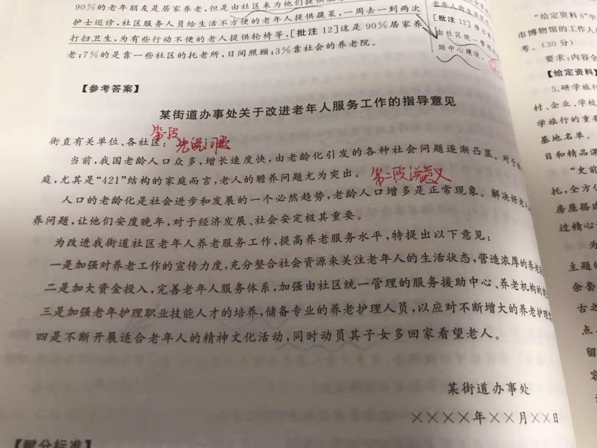

## 上篇最新真题

## 下篇经典真题

-----

### 归纳概括题

- 特点：答案来自材料

- 归纳题概括分类

```
问题、危害、表现、原因、影响、作用、对策、特点、理由等等（有的问题涉及一个，有的涉及多个）
```
#### 第一节 单一概括

- 一般格式

```
总括词+具体信息

```
#### 第二节 综合式概括

### 综合分析题

- 综合分析题一般包括：观点分析，影响分析，原因分析，社会现象、社会事件分析题，对比分析题，词句概念解析题

- 特点：对问题进行深入挖掘是分析问题不同于概括问题的观点所在。

- 分析方法

```
1. 多主体分析法

政府（尤其注意材料中领导干部，工作人员的行为和观点。）企业，社会组织，民众个人。

2. 多领域分析法

政治，经济，文化，社会，生态

3. 多角度分析法

从“问题，原因，影响，对策”宏观角度分析，也可以从“意识，法律，法规，制度机制，投入，监督，教育宣传，国内外经验”等微观角度分析

4. 辩证分析法

指的是，全面分析问题的方法。积极，消极，经验，教训，优点，缺点，我们看到其中一方面的时候也要注意看到另一方面的问题。
```

#### 第一节 观点分析题

- 提问方法

```
提到某种观点、态度，情结合给定材料谈谈对这一观点的见解。/反驳这一观点。
```

- 解题技巧

```

1. 亮明自己的观点看法，即指出题干的观点是正确的还是错误的还是片面的

2. 从不同主体，领域，角度分析题干为什么正确，错误或者片面

3. 总结提升，给出对策或者评价
```

#### 第二节 影响分析题

- 关键词：意义，必要性，重要性，危害，影响等

- 解题技巧

```
从不同主体，领域，角度分析。

因为可能不一定是（政治，经济，文化，社会，生态）

像是例题劳动的意义，它就是结合文段多领域，主体，角度，分成1. 促进学生成长 2，符合教育要求 3. 推动国家发展。总之，要结合文段多领域，角度，主体分析。
```
#### 第三节 原因分析题

- 解题技巧：结合文段多领域，主体，角度进行分析。找出原因。

- 注意：要透过表面挖掘出问题的本质。

- 例子（分析过度包装，这一原因和危害。）

```
1. 作答：就是原因：12345，危害：12345

2. 原因有时候文章将两个方面写成一句话。如果题目要求字数比较多，则要分类并写成两条和合理扩充。
```
#### 第四节 社会现象、社会事件分析题

- 提问方式

```
给定资料提到、谈到某种现象，请你谈谈看法。又或者问这个事件折射出什么问题

```

- 解题技巧

```
1. 可以遵照：概括问题- 挖掘原因- 分析影响-提出对策

2. 根据文段，侧重点不同，不要生搬硬套。

3. 我觉得这个自己概括全文有些不是重点的文段，比较全面，
```

- 例子(谈谈对低头族的看法)

```

1. 注意找关键词，并对关键词进行延生概括

2. 如果整段没有关键词，则对现象进行概括

3.文段有些不是原因，但是不代表它不重要。它可能是现象或者对策。注意概括。

4. 答案。第一段现象。原因：。。。危害：。。。最后对策。
```

#### 第五节 对比分析题

- 题型： 关系对比题，异同点对比题，优劣势对比题

- 关系对比题解题思路

```
1. 首先指明比较对象之间存在怎么样的关系

2. 在材料中寻找论据，为何会存在这样的关系

3. 可总结提升，分析处理好各对象关系的重要性。比较常见的关系有：相互影响，相互促进，相互制约。
```

1. 例子（什么是城市的面子，什么是城市的里子，二者是什么关系）
```
1. 分别对面子和里子做出解释

2. 指明二者的关系，相辅相成，缺一不可

3. 分别论证二者的重要性。

4. 得出结论，兼顾发展。

```

- 异同点对比题解题思路
```
1. 首先分别概括需要比较的对象

2. 分条列出对比对象的共同点和不同点


```

1. 例子(总结赵家村发生的变化)

```
1. 变化要找之前的做对比，才能知道变化了什么

2. 生活条件，生产方式，生产收入，文化生活，思想认识这些领域

```
- 优劣势对比题解题思路

```
1. 首先也要分别概括对比对象

2. 分析对比对象各自的优势和劣势

3. 有的题目需要进行总结会给出对策
```

#### 第六节 词句、概括解释题

- 提问方式

```
谈谈你对某个句子或者词语的解释等
```

- 得分技巧

```
1. 不应该只分析概括文章的段落

2. 还得概括每段将什么，文章分为几部分，答题顺序几部分

3. 根据那几部分，扩充答案
```
- 例子(解释山寨一词的含义，并且分析山寨和创新之间的关系)


```

答题要素：

1. 对山寨一词进行解释

2. 分析山寨与创新之间的关系：创新对山寨的影响。山寨对创新的作用。两者相互影响。

3. 提出对策。


```


### 提出对策题

- 题型

```
结合给定资料，就如何提出建议，提出具体措施
```

- 找对策

```
1. 根据隐含线索找对策（政策，法规，领导，部门，专家，正面实例）

2. 根据问题提对策

3. 根据原因提对策


```

#### 第一节 常规对策题

1. 单一类

- 例子(完善公共自行车服务)

```
1. 分点作答

2. 一句话概括 + 具体措施 +意义

比如：科学规划，合理增设非机动车道，保障居民出行安全。
```

2. 综合类

- 问法

```
如果文章是就什么问题提出对策，那应该是单一题

但是如果问法是，分析XX的主要原因并提出相应对策之类的问法，就得将原因和对策一并写下


```

- 例子（分析部分城市马拉松存在的主要问题并提出相应对策）

```
1. 解题，要找问题和原因，有时候提出了问题，你要自己去添加一些文字，提出对策。

2. 带了引号的一些词，有时候会是关键词

3. 对策并不一定跟问题一一对应的。你要具体分析。对策可以分为几部分。而且就我的做这道题的答案，我感觉，很多词句都是自己添加的。但是具体哪个方面是你要从文章中概括出来的。

```

#### 第二节 案例启示题

- 提问

```
从...中受到哪些启发，从...中受到那些启示
```

- 例子（谈谈你从中国高铁，中兴和中国装备制造业发展受到哪些启示）

```
1. 注意别人的话，词语引号很重要，有时候有关键词在里面

2. 也是分三个方面，分别论述，受到的启示

3.启示，其实是优点，还有原因。这两个方面都是启示的来源。
```

#### 第三节 验证对策题
- 这种题考试的比较少

```
1. 明确指出存在的问题

2. 相关修改意见或者或补充
```
### 公文写作题

- 做题规范

```
1. 公文的内容侧重点虽然不同，但在结构和格式上是基本相同的。

2. 标题、称谓、正文、落款
```


#### 第一节 意见

- 例子(拟写一份，某街道办事处关于改进老年人服务工作的指导意见)

```
1. 先找出问题

2. 问题推出意见

3. 成功的经验也可以推出意见

4.有些意见需要用你自己的话语扩展。

5.社会的有关职业政策也可以在意见中

6. 作答格式

称谓：

第一段：先说问题

第二段：说有什么意义

第三段：提出意见，需要你自己分类建议，并用你自己的话概括以及扩展

最后 落署名以及年月日

```



#### 第二节 通知
#### 第三节 报告
#### 第四节 建议
#### 第五节 宣传稿
#### 第六节 发言稿
#### 第七节 讲解稿
#### 第八节 倡议书
#### 第九节 公开信
#### 第十节 调查问卷
#### 第十一节 编者按
#### 第十二节 短品

### 文章写作题