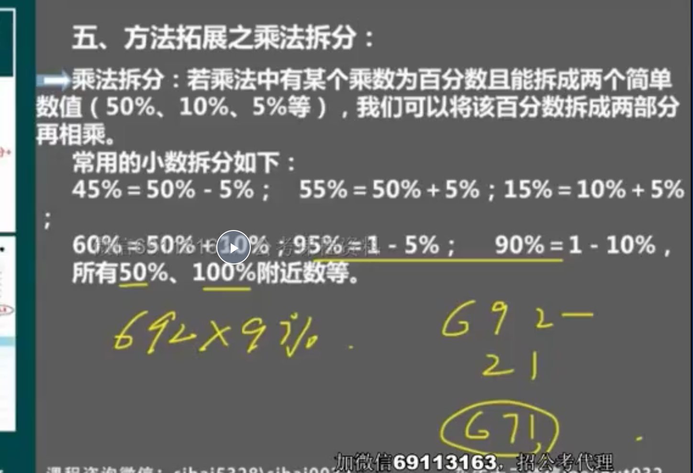
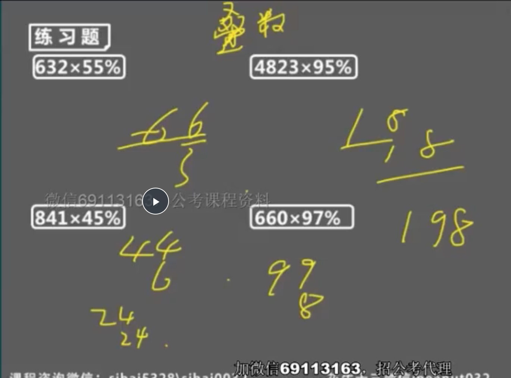
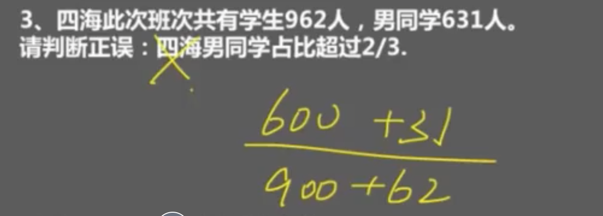
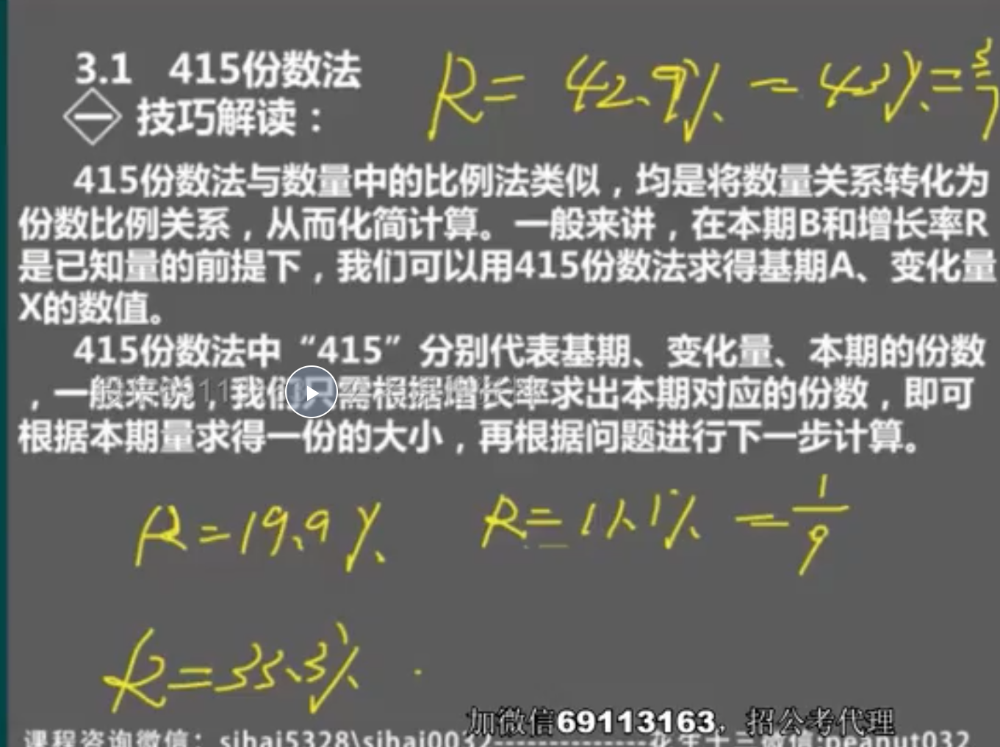
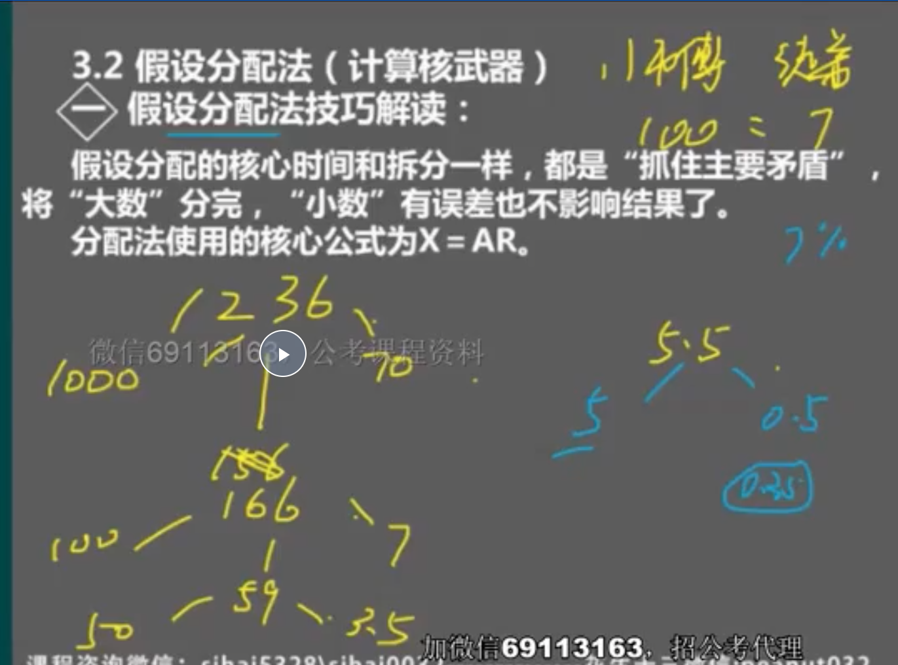
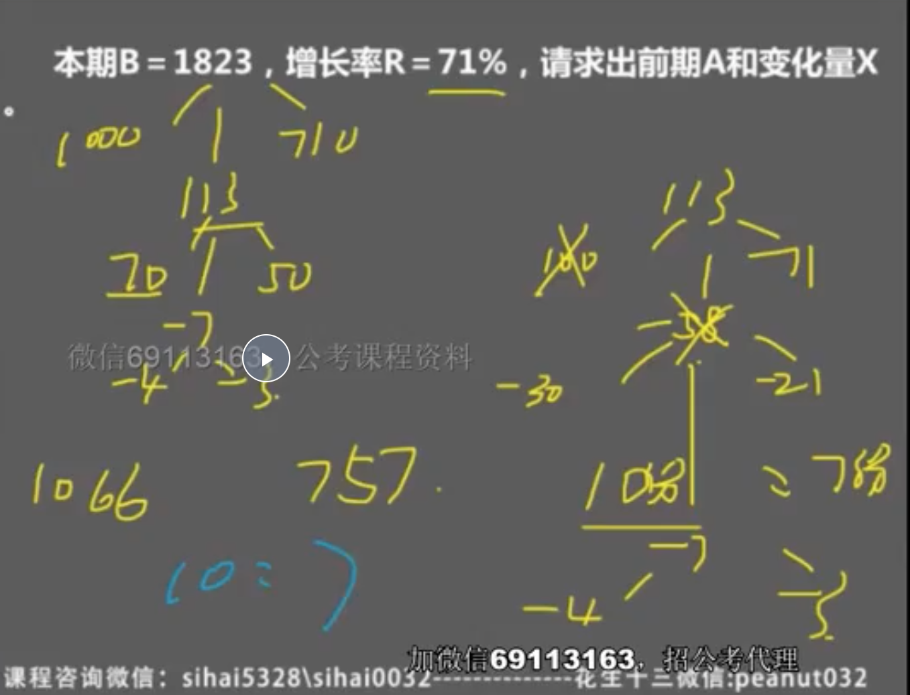

### 方法扩展之乘法拆分

> 692 100% 是100个包子。1个包子是6.92 三个包子（3%） 就是 21约等于

> 叠数相乘，错位相加

> 复杂一点的计算，提取公因子，并且速算

> 盐水法，比较大小（右边的1/12 小于 50%），分子，分母同时拆分

### 415份数法（求增量是最方便的）

> 33.3% 1/3-》 3 1 4 ，43% 3/7 -》7 3 10 ，-1/4 -》4 -1 3， -3/8 -》 8 -3 5

> 需记忆的小数

> 估大，则一份变大。比如 1/4 估成1/3

### 假设分配法

> 假设

- 当R大的话：假设分配法 和 415 一起用 42 （3份 1份 ） -》 32 10

- 当R为负值的时候（分配时候，500正，-25负。-25负，2正书，两边符号要相反。 X = ar r为负数）最好增长率负值比较少

