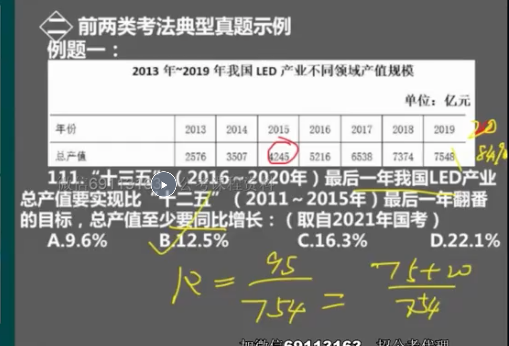
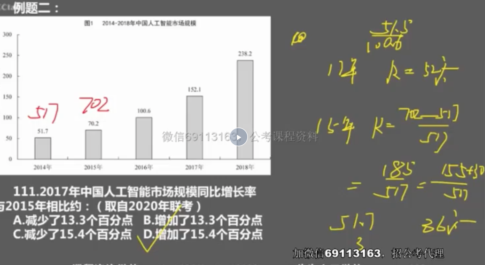
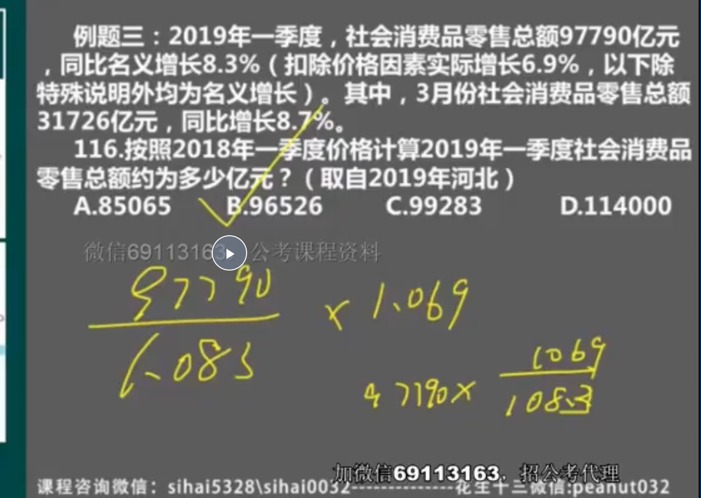
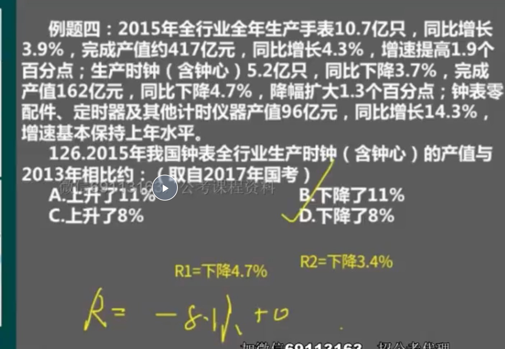
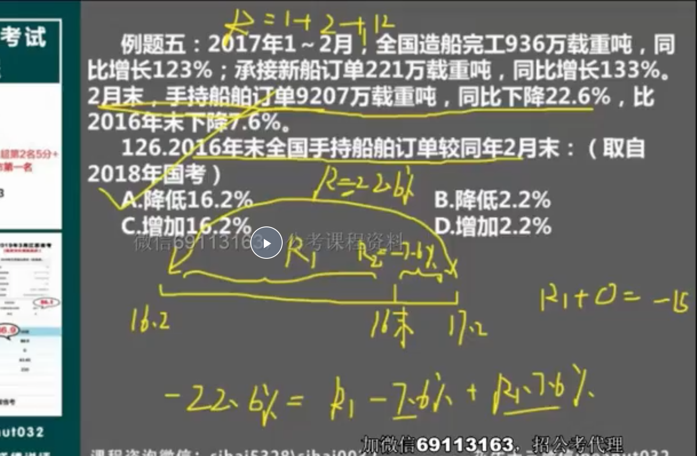
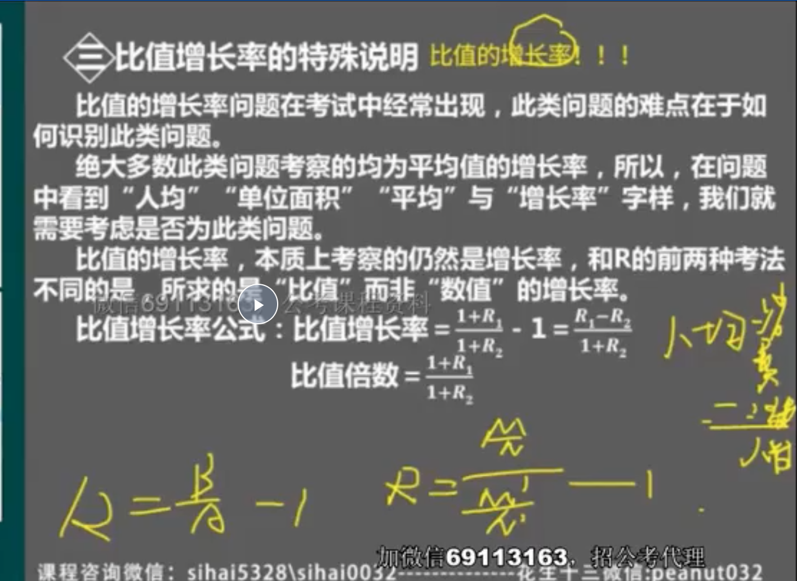
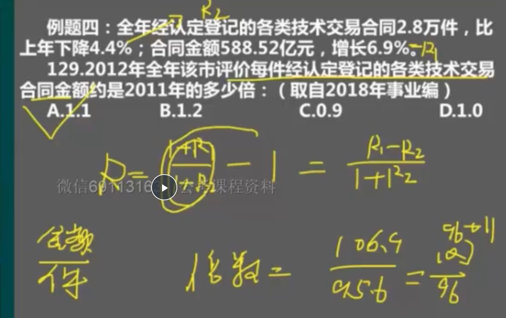

### 高频考点-ABRX

- 题型


- 注意


```
1. 能用假设分配法，用假设分配法。如果用x = a r = b/1+r * r 又很麻烦

2. 如果r特别小，用假设分配法，最后算得最右边的数应该是1或者2
```

### 例题1





```
1. 翻翻倍，2倍
2. r = x/a
3 拆分
```
### 例题2




```
1. 按照实际增长去算2019总额
2. 先按照名义的算回去，再算实际的。

```
### 例题3-隔年增长率

- 套公式



```
告诉2015年 r1 = - 4.7
求得2014年 r2 = -3.4

求2013年到2015年的隔年增长率


```
- 画图



```
列出 如图算式后 发现 r1 约等于15%


我没想到，用公式，死算的。
```

### 比值增长率（除了平均数还有很多比值）



```
计算时候，可以先一眼看直除，直除不行再用花生十三的方法。

做题时候，标记r1 ， r2
```
- 如果不是问比值增长率而是问，比值倍数。1+r1/1+r2



### 乘积增长率


```
（1+r1）（1+r1） - 1

= 1+r1*r2+r1+r2-1
= r1*r2+r1+r2

```
