### 比重

> 知识点-本期比重

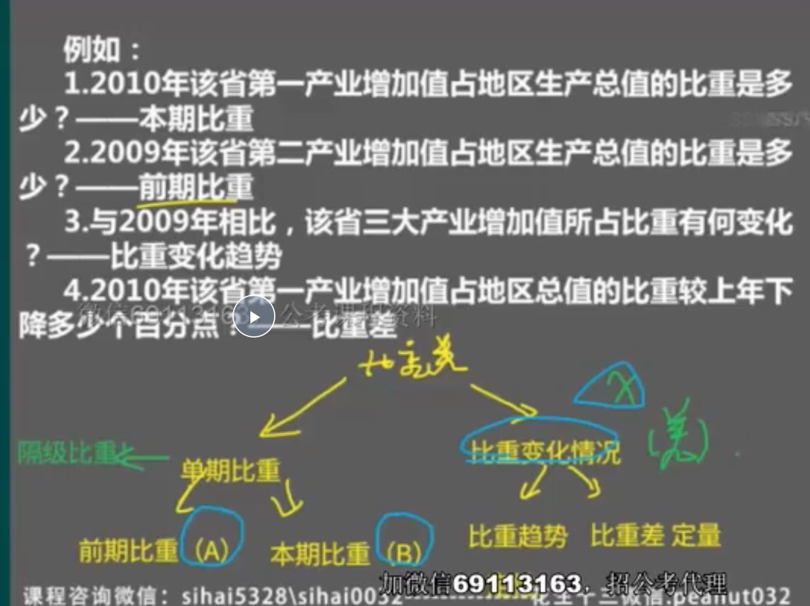
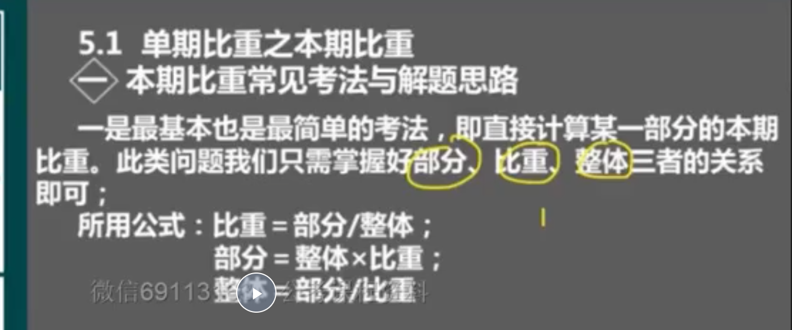

- 例题1


- 注意


> 知识点-前期比重

```

这种也可以用算法：
1+3% / 1-6% = 103/94 = 1+ 10%

```


> 知识点-隔级比重
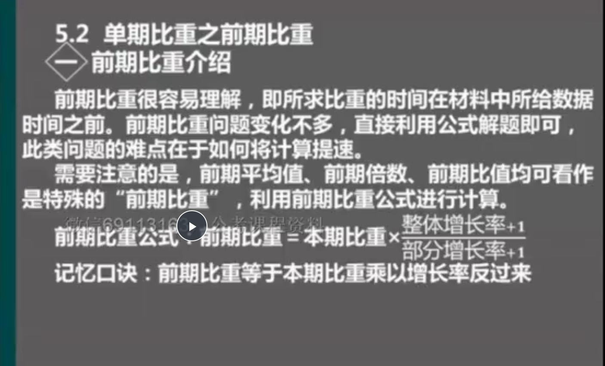


```

这种也可以用算法：
1+3% / 1-6% = 103/94 = 1+ 10%

```
- 例题1（选D）


- 注意

```

116/（1200*100）去掉100 相当于 1%

116/（120*10） 去掉10 相当于 0.1%

116/120 约等于 1

所以约等于 1* 0.1% = 0.1 % 也就是千分之一 1%。

16% * 1%。 = 0.16 %。
```


> 知识点-比重变化趋势（注意负数增长率 带符号比较 -4% 最后的R1 》 -6% 的 r2）


```

这种也可以用算法：
1+3% / 1-6% = 103/94 = 1+ 10%

```
- 例题1


- 例题2

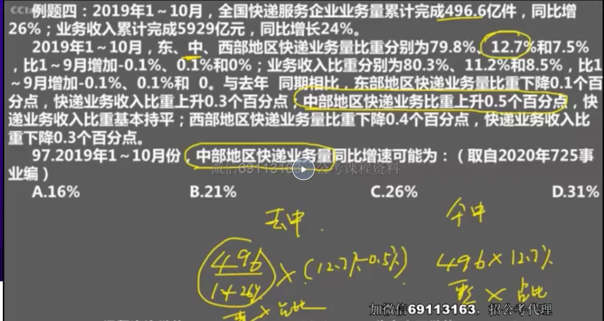

```

分别求 去年中部 和  今年中部

但是这样求解，太过繁琐

所以根据题目说的 比重上升所以

R1（中部） 》R2（全国 = 26%）

因为比重与去年同期相比，比重升上升。


```

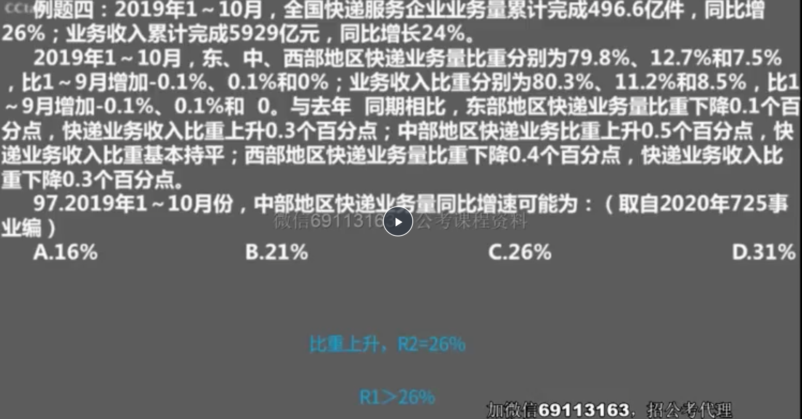

- 例三（这道题一开始不会做。因为题目给的是，问比重多少，别的题目一般问是上升还是下降。但是我们可以，先看一下a选项。因为选项给的是前期环比，然后我们找到总体的环比增长R2 = 7.56%），然后看到交叉型比三月份增长3.62.r1《 r2 ，说明比重下降。所以A选项，三月份是下降到四月份的21%，三月份比21%大。


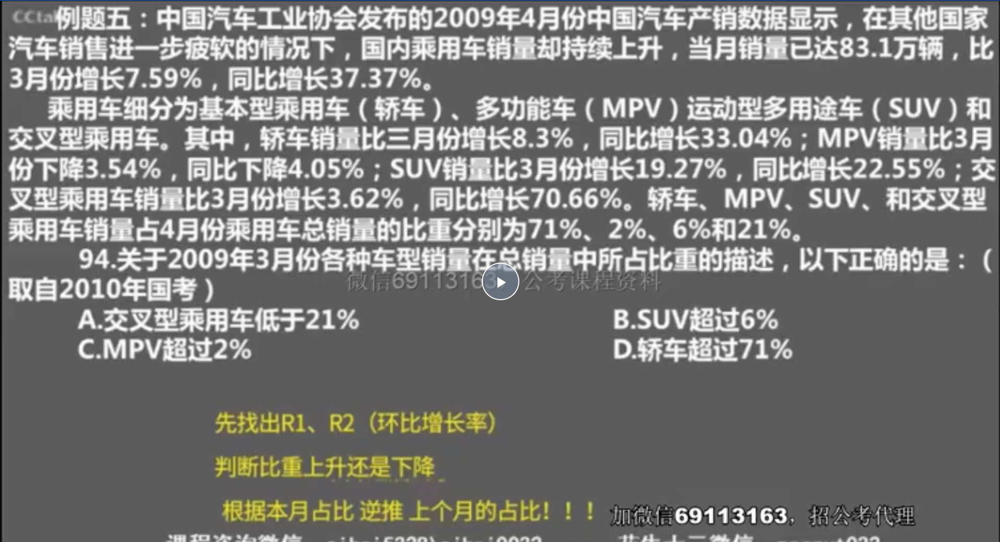

> 知识点-比较分数大小


```
分子 长得快 则A，B两个数，B大于 A
```
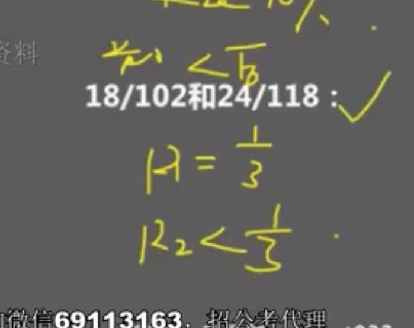

> 知识点-比重差


- 比重差 小于 增速差（a/B * （r1 - r2））（a是前期。B是现期）
（粉笔的公式是：（A/B *（r1 - r2）/（1+r2）））
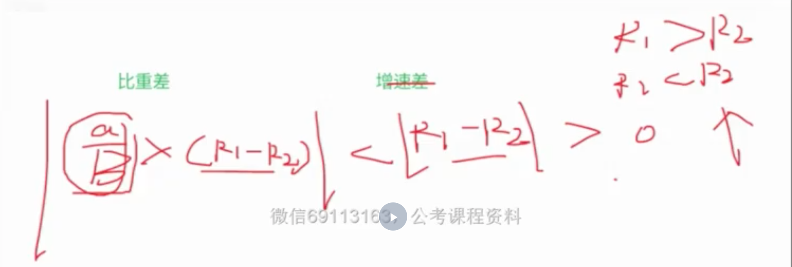


- 例子

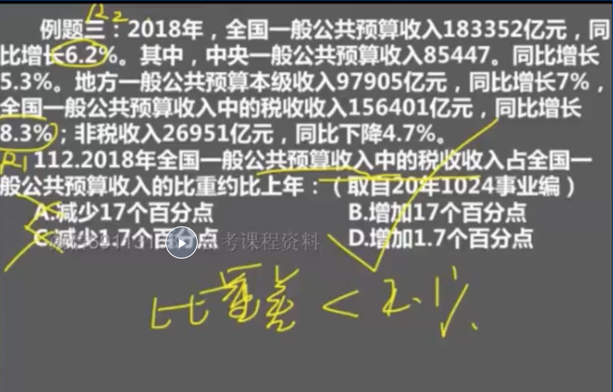

- 秒题（8.3-6.2 = 2.1 而比重差小于增速差，所以小于2.1直接选D）

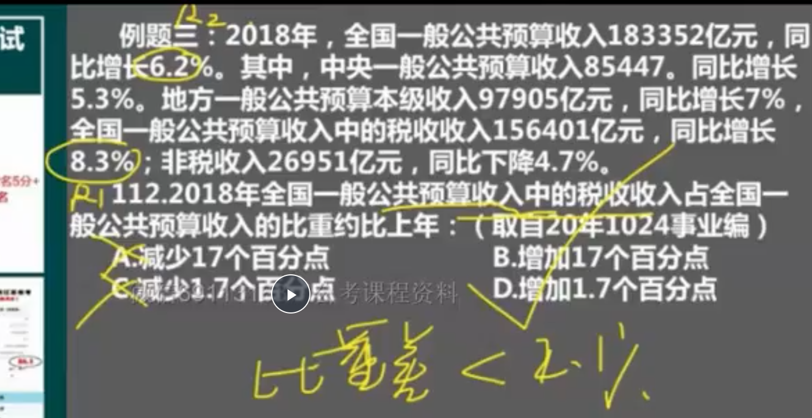

- 如果题型是比值差。那么，套用的是比重差公式。但是你不能秒杀了。因为你不知道 a/b是大于1还是小于1的。只能老老实实计算了。


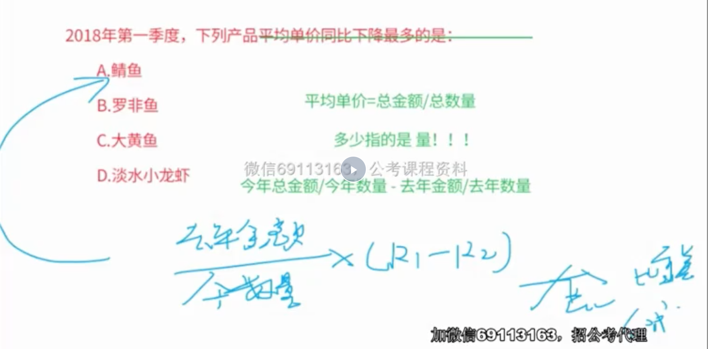
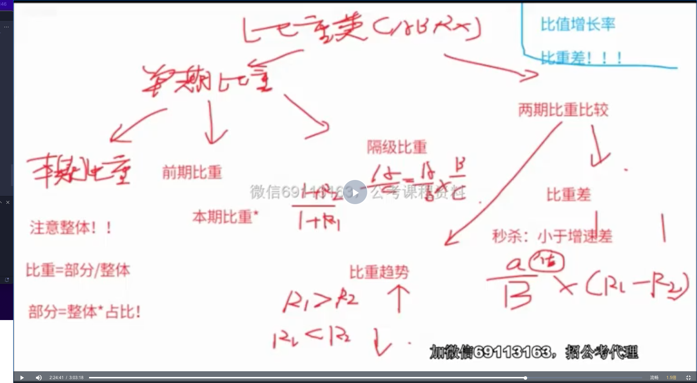

- 盐水类题型
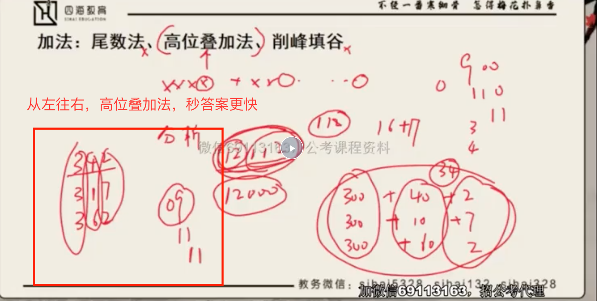